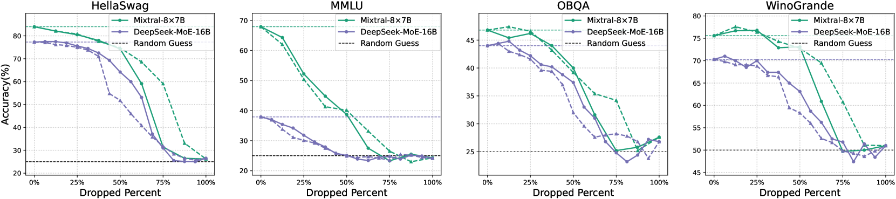
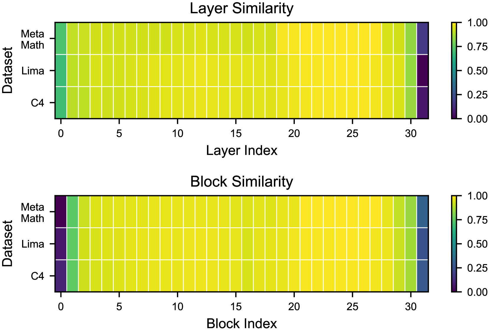

# 揭秘混合专家模型压缩：一个统一框架的视角

发布时间：2024年06月04日

`LLM理论

理由：这篇论文主要探讨了大型语言模型（LLM）中的混合专家（MoE）方法的压缩技术，这是一个关于模型优化和效率的理论研究。论文提出了一种新的统一框架，用于系统地探讨MoE的压缩，并提供了压缩指南。这些内容属于对LLM内部机制和性能优化的理论研究，而非具体的应用实例或Agent的设计，因此归类为LLM理论。` `人工智能` `模型压缩`

> Demystifying the Compression of Mixture-of-Experts Through a Unified Framework

# 摘要

> 大型语言模型的规模扩展已经革新了跨领域的性能，但模型规模的不断增长给实际应用带来了挑战。混合专家（MoE）方法通过动态激活部分专家，既降低了计算成本又保持了高性能。然而，MoE也带来了参数冗余和通信开销。尽管已有多种压缩技术用于减少密集模型的冗余，MoE的压缩仍未得到充分研究。我们提出了一种前沿的统一框架，它不仅整合了主流压缩技术，还系统地探讨了MoE的压缩。该框架采用两种策略：专家瘦身和专家修剪，后者包括层丢弃和块丢弃等激进技术，以大规模消除冗余。基于这些发现，我们提供了一套全面的压缩指南。实验结果显示，我们的方法在保持92%以上性能的同时，实现了6.05倍的加速和仅20.0GB的内存使用。

> Scaling large language models has revolutionized the performance across diverse domains, yet the continual growth in model size poses significant challenges for real-world deployment. The Mixture of Experts (MoE) approach addresses this by dynamically selecting and activating only a subset of experts, significantly reducing computational costs while maintaining high performance. However, MoE introduces potential redundancy (e.g., parameters) and extra costs (e.g., communication overhead). Despite numerous compression techniques developed for mitigating the redundancy in dense models, the compression of MoE remains under-explored. We first bridge this gap with a cutting-edge unified framework that not only seamlessly integrates mainstream compression methods but also helps systematically understand MoE compression. This framework approaches compression from two perspectives: Expert Slimming which compresses individual experts and Expert Trimming which removes structured modules. Within this framework, we explore the optimization space unexplored by existing methods,and further introduce aggressive Expert Trimming techniques, i.e., Layer Drop and Block Drop, to eliminate redundancy at larger scales. Based on these insights,we present a comprehensive recipe to guide practitioners in compressing MoE effectively. Extensive experimental results demonstrate the effectiveness of the compression methods under our framework and the proposed recipe, achieving a 6.05x speedup and only 20.0GB memory usage while maintaining over 92% of performance on Mixtral-8x7B.

[Arxiv](https://arxiv.org/abs/2406.02500)