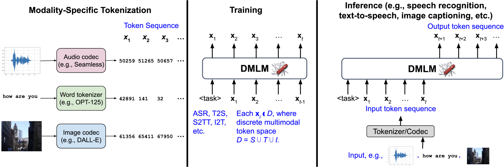
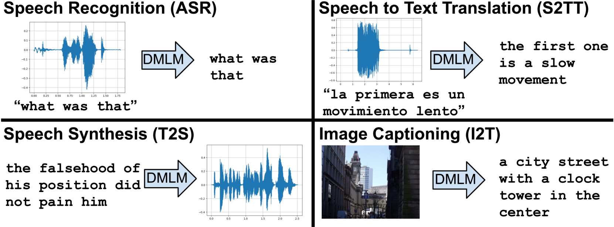

# 基于预训练大型语言模型的离散多模态Transformer，助力混合监督下的语音处理技术

发布时间：2024年06月04日

`LLM应用

这篇论文主要探讨了离散多模态语言模型（DMLM）的设计和应用，特别是在语音识别、文本转语音、语音翻译等多种任务中的应用。论文中提到的模型是基于大型语言模型（LLMs）的预训练知识，并针对多模态任务进行了优化。因此，这篇论文更偏向于LLM的应用层面，而不是理论研究或Agent、RAG的范畴。` `语音识别` `多模态交互`

> Discrete Multimodal Transformers with a Pretrained Large Language Model for Mixed-Supervision Speech Processing

# 摘要

> 近期离散语音分词的研究为模型开辟了新天地，使其能在不同模态间流畅执行多重任务，如语音识别、文本转语音、语音翻译等。大型语言模型（LLMs）通过广泛文本语料库的预训练，蕴含了丰富的语言知识，提升了各类任务的精确度。本文提出了一种仅解码器的离散多模态语言模型（DMLM），适用于多种任务（如ASR、T2S、S2TT）和模态（文本、语音、视觉）。我们深入探讨了离散多模态模型的关键要素，包括损失函数、权重初始化、混合训练监督及码本设计。研究显示，DMLM在多任务和数据集上，通过监督与非监督训练的结合，取得了显著进步。特别是在ASR任务中，从预训练LLM初始化DMLM，并采用基于Whisper激活的码本，均带来了显著的性能提升。

> Recent work on discrete speech tokenization has paved the way for models that can seamlessly perform multiple tasks across modalities, e.g., speech recognition, text to speech, speech to speech translation. Moreover, large language models (LLMs) pretrained from vast text corpora contain rich linguistic information that can improve accuracy in a variety of tasks. In this paper, we present a decoder-only Discrete Multimodal Language Model (DMLM), which can be flexibly applied to multiple tasks (ASR, T2S, S2TT, etc.) and modalities (text, speech, vision). We explore several critical aspects of discrete multi-modal models, including the loss function, weight initialization, mixed training supervision, and codebook. Our results show that DMLM benefits significantly, across multiple tasks and datasets, from a combination of supervised and unsupervised training. Moreover, for ASR, it benefits from initializing DMLM from a pretrained LLM, and from a codebook derived from Whisper activations.

[Arxiv](https://arxiv.org/abs/2406.06582)