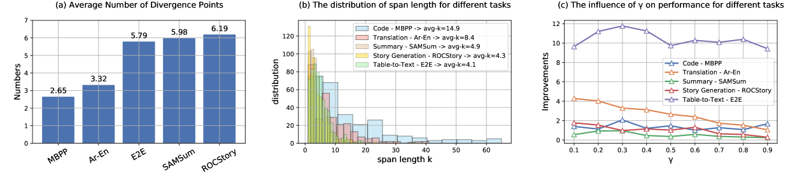

# Diver：利用跨度级互信息验证优化大型语言模型解码

发布时间：2024年06月04日

`LLM理论

这篇论文主要探讨了大型语言模型（LLMs）在面对输入偏差时的解码策略问题，并提出了一种新的方法（Diver）来通过点态互信息（PMI）分数提升解码质量。这种方法涉及识别偏离点并计算候选跨度对输入对数似然增益的影响，以得出PMI分数，并据此重新排序输出分布。这种研究属于对LLM内部机制和性能优化的理论探讨，因此应归类为LLM理论。` `机器学习`

> Diver: Large Language Model Decoding with Span-Level Mutual Information Verification

# 摘要

> 大型语言模型（LLMs）在接收特定任务指令时表现出色，但面对输入偏差时，标准解码策略往往力不从心。理想的LLM输出应忠实反映输入信息，这一点可通过点态互信息（PMI）分数来衡量。为此，我们创新性地提出了Diver方法，通过跨度级PMI验证提升LLM解码质量。在推理阶段，Diver先识别出可能导致多个候选跨度的偏离点，再计算这些候选跨度对输入对数似然增益的影响，从而得出PMI分数。最终，依据PMI重新排序的输出分布，选出最优跨度。实证研究表明，Diver在多个下游任务中，无论性能还是通用性，均显著超越现有解码技术。

> Large language models (LLMs) have shown impressive capabilities in adapting to various tasks when provided with task-specific instructions. However, LLMs using standard decoding strategies often struggle with deviations from the inputs. Intuitively, compliant LLM outputs should reflect the information present in the input, which can be measured by point-wise mutual information (PMI) scores. Therefore, we propose Diver, a novel approach that enhances LLM Decoding through span-level PMI verification. During inference, Diver first identifies divergence steps that may lead to multiple candidate spans. Subsequently, it calculates the PMI scores by assessing the log-likelihood gains of the input if the candidate spans are generated. Finally, the optimal span is selected based on the PMI re-ranked output distributions. We evaluate our method across various downstream tasks, and empirical results demonstrate that Diver significantly outperforms existing decoding methods in both performance and versatility.

[Arxiv](https://arxiv.org/abs/2406.02120)