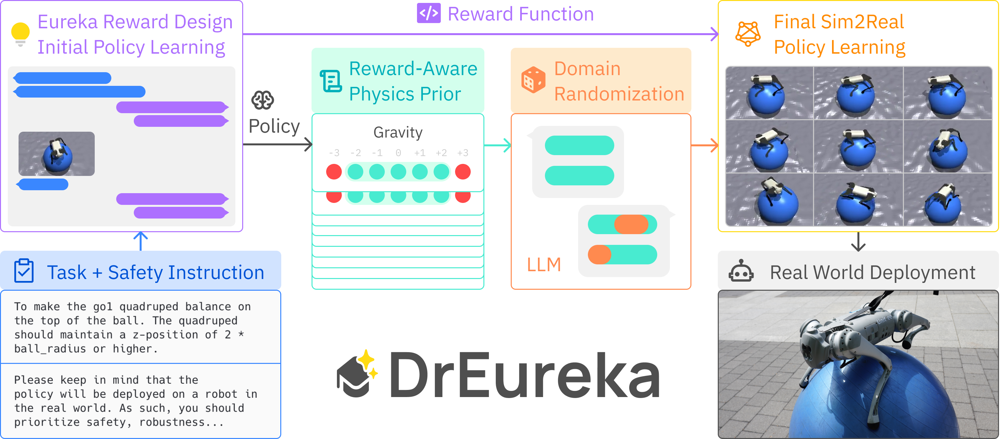
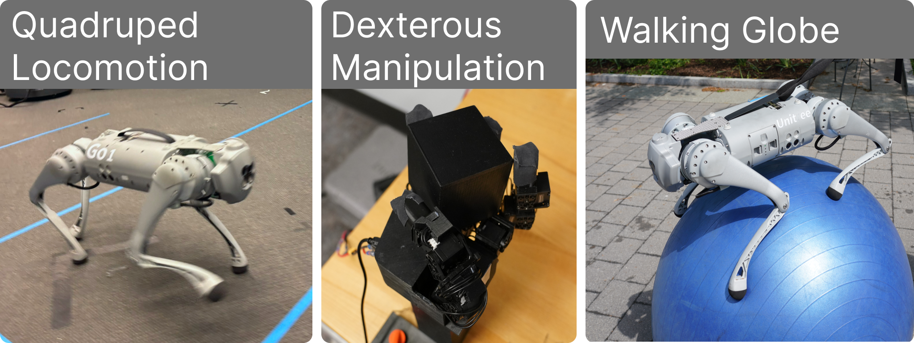
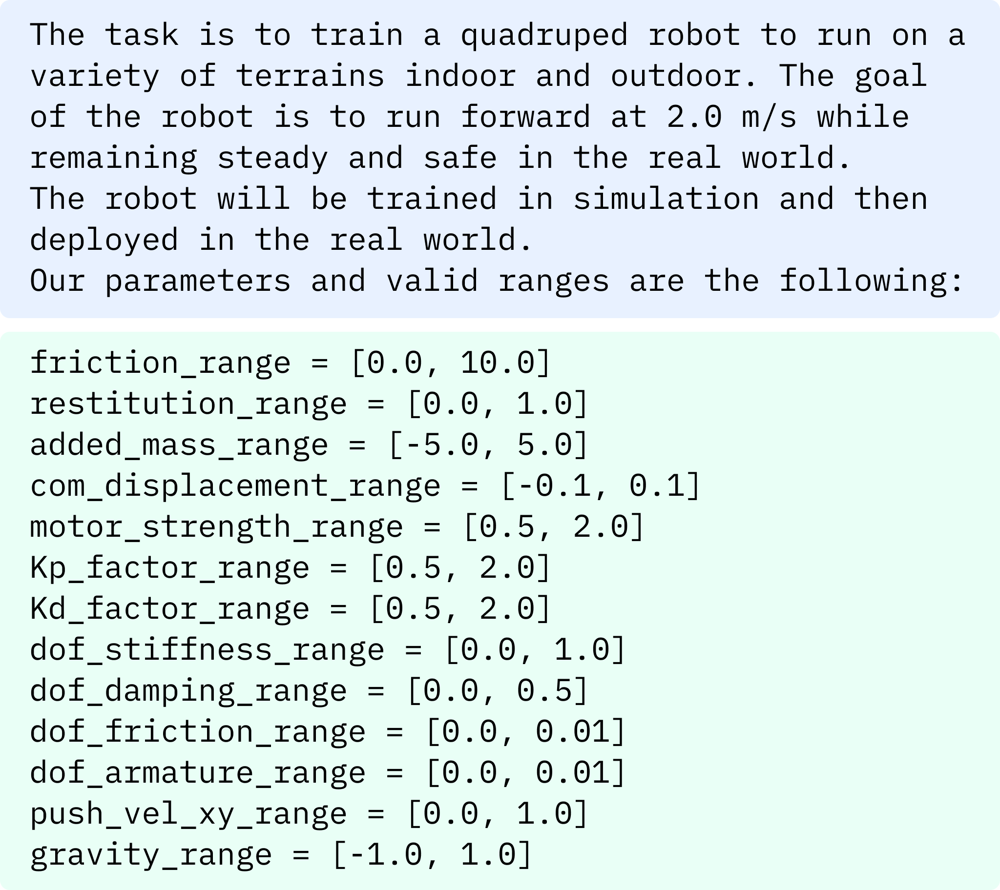
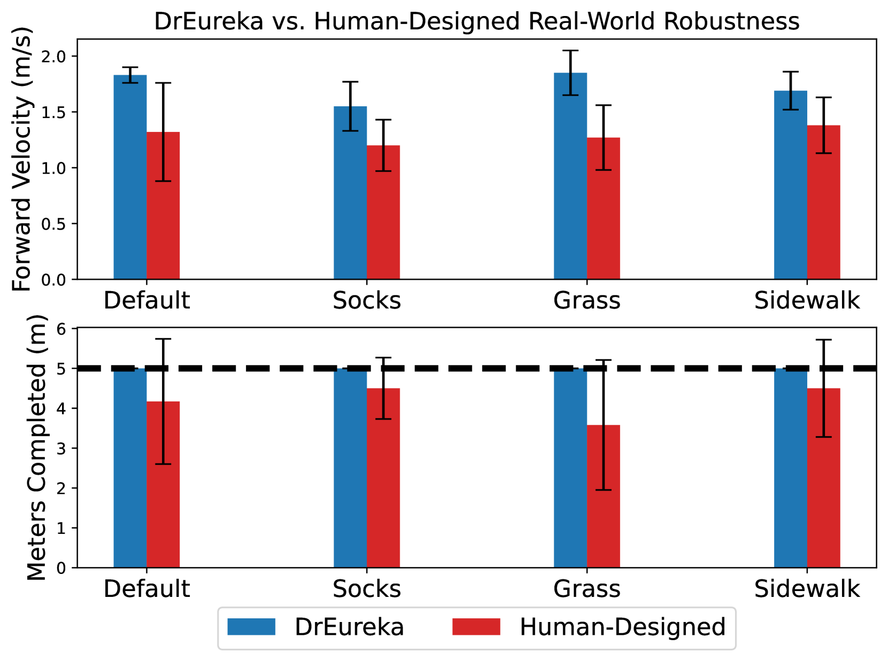
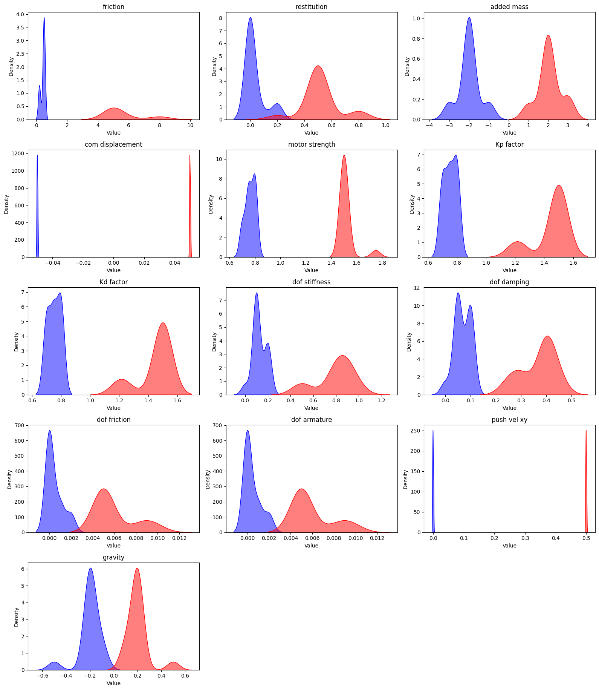
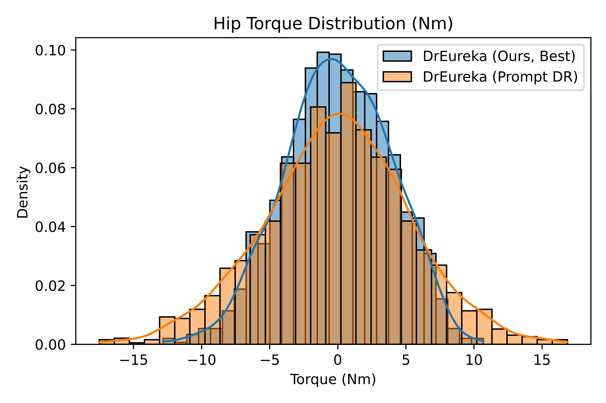
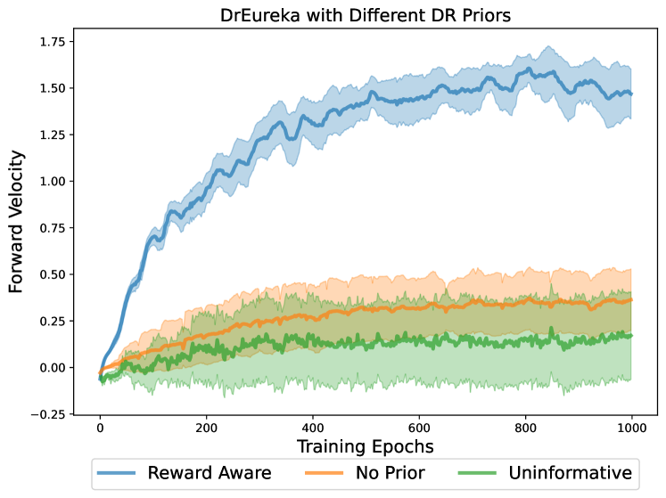
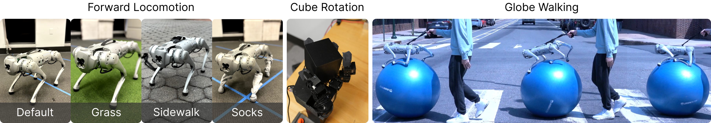
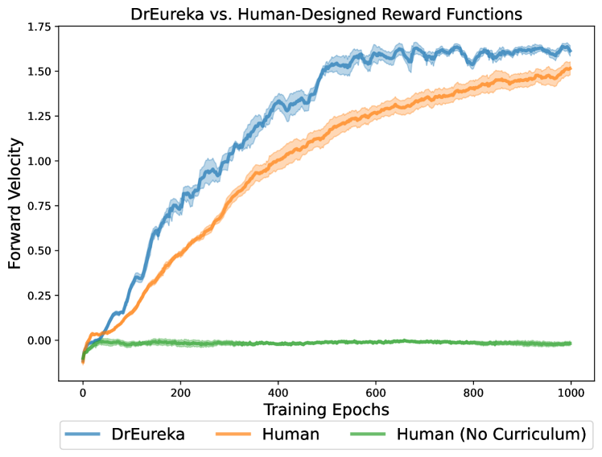
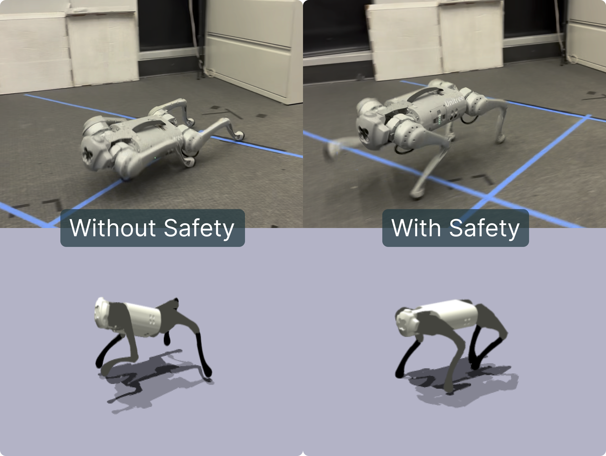

# DrEureka：借助语言模型实现模拟向真实世界的无缝转移

发布时间：2024年06月04日

`Agent

这篇论文介绍了一种由大型语言模型（LLMs）驱动的自动化方法DrEureka，用于在模拟环境中智能生成适配的奖励机制与领域随机化策略，以帮助机器人技能从模拟环境迁移到现实世界。这种方法可以看作是一种智能代理（Agent），因为它能够自主地处理任务并生成策略，以实现特定的目标（如机器人技能的现实迁移）。因此，这篇论文最适合归类为Agent。` `机器人技术` `自动化`

> DrEureka: Language Model Guided Sim-To-Real Transfer

# 摘要

> 将模拟中习得的策略应用于现实世界，是获取大规模机器人技能的有效途径。但传统的模拟到现实方法往往依赖于人工精细调整任务奖励与模拟物理参数，过程繁琐且耗时。本文提出了一种由大型语言模型（LLMs）驱动的自动化方法DrEureka，它仅需目标任务的物理模拟环境，便能智能生成适配的奖励机制与领域随机化策略，助力机器人技能的现实迁移。我们首先验证了DrEureka在四足运动与灵巧操作任务中，能与人工设计的方案媲美。进一步，我们展示了该方法在处理如四足平衡、瑜伽球上行走等新颖任务时，无需人工反复调试，即可成功应对挑战。

> Transferring policies learned in simulation to the real world is a promising strategy for acquiring robot skills at scale. However, sim-to-real approaches typically rely on manual design and tuning of the task reward function as well as the simulation physics parameters, rendering the process slow and human-labor intensive. In this paper, we investigate using Large Language Models (LLMs) to automate and accelerate sim-to-real design. Our LLM-guided sim-to-real approach, DrEureka, requires only the physics simulation for the target task and automatically constructs suitable reward functions and domain randomization distributions to support real-world transfer. We first demonstrate that our approach can discover sim-to-real configurations that are competitive with existing human-designed ones on quadruped locomotion and dexterous manipulation tasks. Then, we showcase that our approach is capable of solving novel robot tasks, such as quadruped balancing and walking atop a yoga ball, without iterative manual design.

[Arxiv](https://arxiv.org/abs/2406.01967)