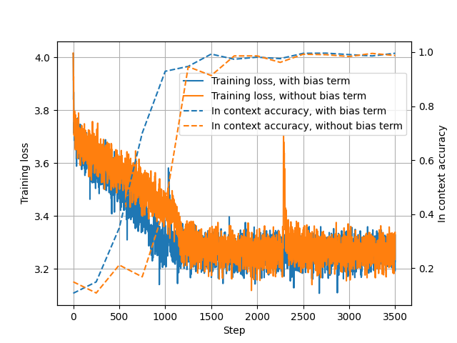

# 将上下文学习精准转化为模型权重

发布时间：2024年06月04日

`LLM理论

这篇论文主要探讨了大型语言模型（LLM）中的In-Context Learning（ICL）特性，特别是在线性化变压器网络中的应用和改进。论文通过数学论证和实验验证了ICL与增加偏置项的模型之间的等效性，并提出了一种新的算法（ICLCA）来实现精确的转换。这些内容主要涉及LLM的理论研究和内部机制的改进，因此归类为LLM理论。` `机器学习`

> Exact Conversion of In-Context Learning to Model Weights

# 摘要

> In-Context Learning (ICL) 作为大型语言模型的一项强大特性，近年来备受瞩目。与传统的基于梯度的学习相比，ICL 不仅解释性强，还无需参数更新。本文揭示了，在线性化变压器网络中，通过添加偏置项，ICL 可以实现明确且持久的特性。我们通过数学论证了带有 ICL 提示的模型与增加偏置项的同一模型之间的等效性。我们的算法（ICLCA）实现了低成本的精确转换，而现有方法不仅成本高昂，且转换不够精确。实验证明，我们的方法能精确地将 ICL 令牌融入线性变压器中。此外，我们还探讨了如何调整方法，以在非线性化的常规变压器网络中实现廉价的近似转换。GPT-2 的实验结果显示，即便转换是近似的，模型依然能从这些偏置项中获得重要的上下文信息。

> In-Context Learning (ICL) has been a powerful emergent property of large language models that has attracted increasing attention in recent years. In contrast to regular gradient-based learning, ICL is highly interpretable and does not require parameter updates. In this paper, we show that, for linearized transformer networks, ICL can be made explicit and permanent through the inclusion of bias terms. We mathematically demonstrate the equivalence between a model with ICL demonstration prompts and the same model with the additional bias terms. Our algorithm (ICLCA) allows for exact conversion in an inexpensive manner. Existing methods are not exact and require expensive parameter updates. We demonstrate the efficacy of our approach through experiments that show the exact incorporation of ICL tokens into a linear transformer. We further suggest how our method can be adapted to achieve cheap approximate conversion of ICL tokens, even in regular transformer networks that are not linearized. Our experiments on GPT-2 show that, even though the conversion is only approximate, the model still gains valuable context from the included bias terms.

[Arxiv](https://arxiv.org/abs/2406.02847)