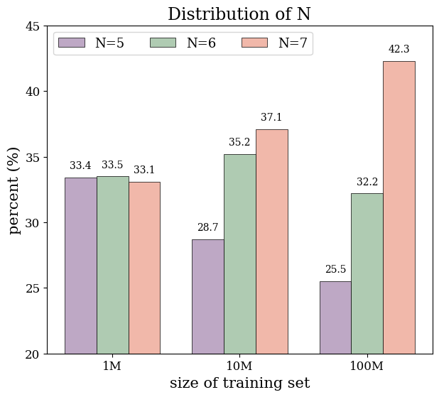
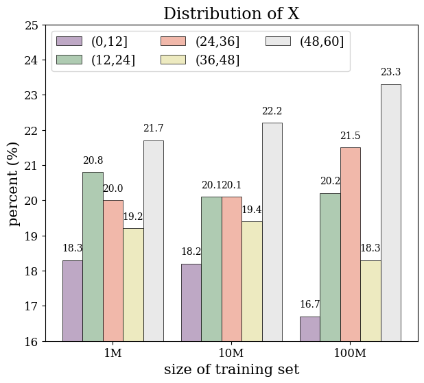
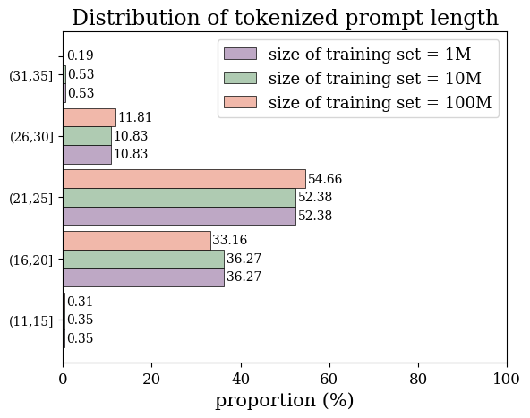
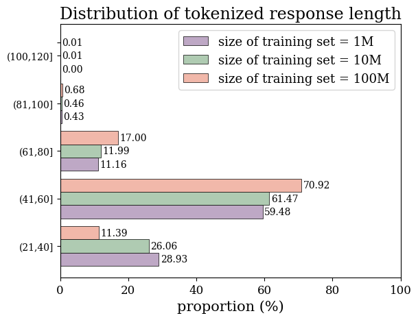
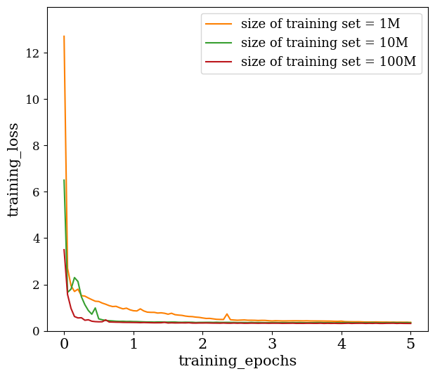
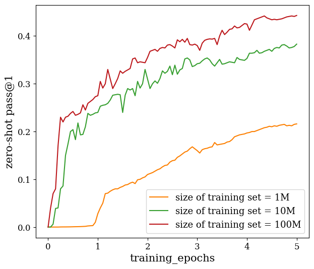
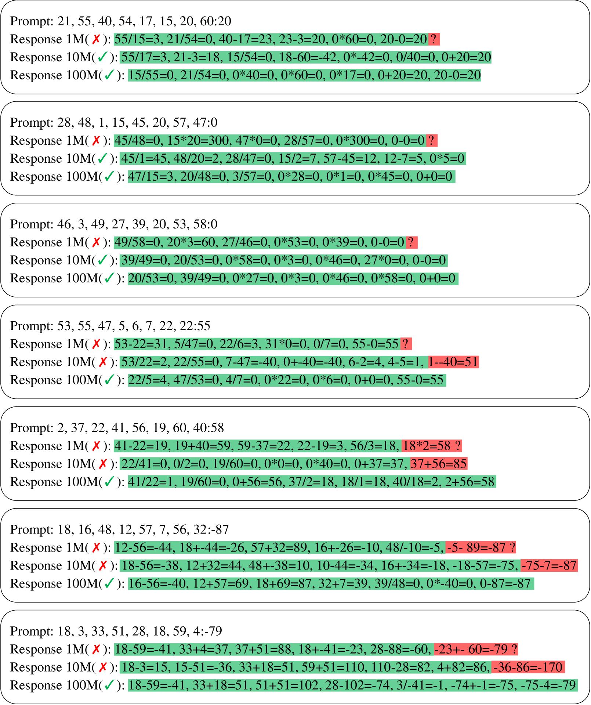
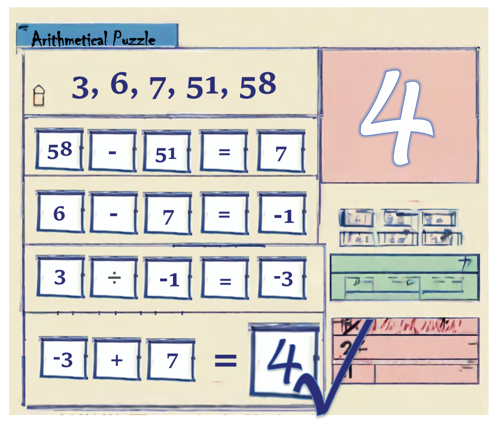

# 利用合成数据探究大型语言模型的数学外推能力

发布时间：2024年06月04日

`LLM应用

这篇论文探讨了大型语言模型（LLMs）在复杂数学推理任务上的应用，特别是在跨步推理问题上的表现。通过引入新的算术谜题和使用精细调整的合成数据，论文展示了LLMs在这些任务上的潜力和泛化能力。这表明了LLMs在特定应用场景下的实际效用和改进，因此属于LLM应用分类。` `人工智能`

> Exploring Mathematical Extrapolation of Large Language Models with Synthetic Data

# 摘要

> 大型语言模型（LLMs）在语言理解、文本生成、代码合成等领域大放异彩，但在复杂的数学推理等跨步推理问题上仍显力不从心。本文通过引入一种新颖的算术谜题，揭示了通过精细调整于优质合成数据，LLMs能在跨步推理任务上大展拳脚。实验中，开放式llama-3B模型在三个测试集上的表现不仅在领域内达到了0.44的零-shot pass@1，更在领域外数据集上展现了泛化之光。特别地，本文精心设计了两组领域外数据集，分别扩展了算术谜题的数值范围与构成元素。微调后的模型在这两项更为艰巨的任务上，分别以0.33和0.35的零-shot pass@1，交出了令人振奋的答卷。

> Large Language Models (LLMs) have shown excellent performance in language understanding, text generation, code synthesis, and many other tasks, while they still struggle in complex multi-step reasoning problems, such as mathematical reasoning. In this paper, through a newly proposed arithmetical puzzle problem, we show that the model can perform well on multi-step reasoning tasks via fine-tuning on high-quality synthetic data. Experimental results with the open-llama-3B model on three different test datasets show that not only the model can reach a zero-shot pass@1 at 0.44 on the in-domain dataset, it also demonstrates certain generalization capabilities on the out-of-domain datasets. Specifically, this paper has designed two out-of-domain datasets in the form of extending the numerical range and the composing components of the arithmetical puzzle problem separately. The fine-tuned models have shown encouraging performance on these two far more difficult tasks with the zero-shot pass@1 at 0.33 and 0.35, respectively.

[Arxiv](https://arxiv.org/abs/2406.02100)