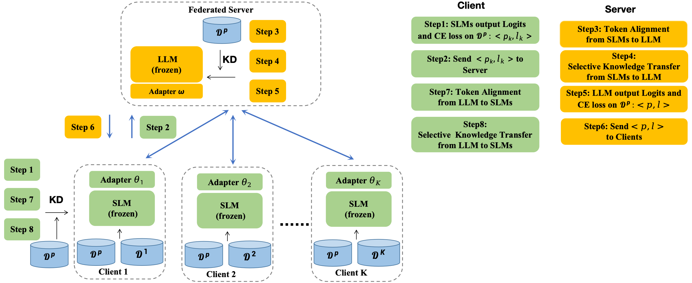

# FedMKT：大型与小型语言模型间的联邦互知识转移

发布时间：2024年06月04日

`LLM应用

这篇论文摘要描述了一种名为FedMKT的框架，该框架旨在实现大型语言模型（LLMs）与小型语言模型（SLMs）之间的参数转移和知识互换，以提升整体性能。这种方法特别关注于如何通过客户端的独特见解来增强LLM，并利用最小编辑距离（MinED）进行令牌对齐。论文通过在异构、同质及一对一场景下的实验，展示了FedMKT在提升SLMs性能方面的有效性。因此，这篇论文属于LLM应用分类，因为它专注于实际应用中的技术开发和优化，而不是理论研究。` `机器学习`

> FedMKT: Federated Mutual Knowledge Transfer for Large and Small Language Models

# 摘要

> 近期研究聚焦于如何让客户端协同微调本地同质LLMs，或将服务器LLM的知识传递给下游的小型语言模型（SLMs）。但服务器LLM与客户端SLMs间的互惠增强仍有巨大空白。为此，我们开发了FedMKT框架，旨在高效地在大型和小型语言模型间转移参数，同时让LLM汲取客户端的独特见解。我们利用最小编辑距离（MinED）进行令牌对齐，并实现SLMs与LLM间的选择性知识互换，以提升整体性能。在异构、同质及一对一三种场景下的大量实验表明，借助LLM，SLMs的性能显著增强。FedMKT优化的LLM性能与基于客户端数据的直接微调相媲美，证明了FedMKT的有效性与适应性。

> Recent research in federated large language models (LLMs) has primarily focused on enabling clients to fine-tune their locally deployed homogeneous LLMs collaboratively or on transferring knowledge from server-based LLMs to small language models (SLMs) at downstream clients. However, a significant gap remains in the simultaneous mutual enhancement of both the server's LLM and clients' SLMs. To bridge this gap, we propose FedMKT, a parameter-efficient federated mutual knowledge transfer framework for large and small language models. This framework is designed to adaptively transfer knowledge from the server's LLM to clients' SLMs while concurrently enriching the LLM with clients' unique domain insights. We facilitate token alignment using minimum edit distance (MinED) and then selective mutual knowledge transfer between client-side SLMs and a server-side LLM, aiming to collectively enhance their performance. Through extensive experiments across three distinct scenarios, heterogeneous, homogeneous, and one-to-one, we evaluate the effectiveness of FedMKT using various public LLMs and SLMs on a range of NLP text generation tasks. Empirical results demonstrate significant performance improvements in clients' SLMs with the aid of the LLM. Furthermore, the LLM optimized by FedMKT achieves a performance comparable to that achieved through direct fine-tuning based on clients' data, highlighting the effectiveness and adaptability of FedMKT.

[Arxiv](https://arxiv.org/abs/2406.02224)