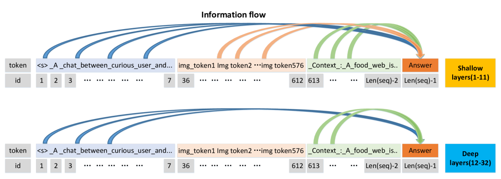
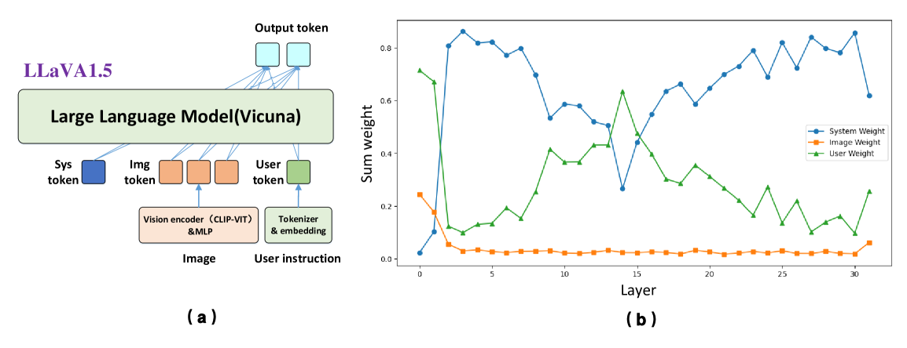
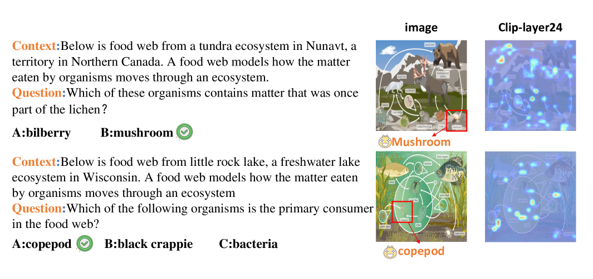
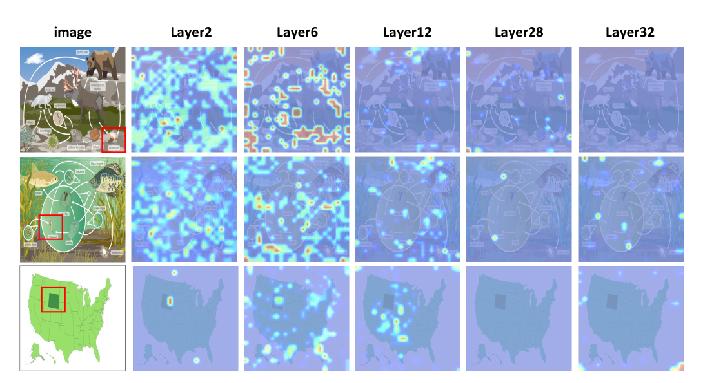
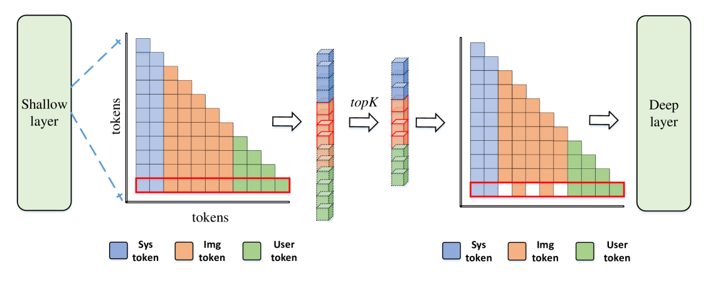
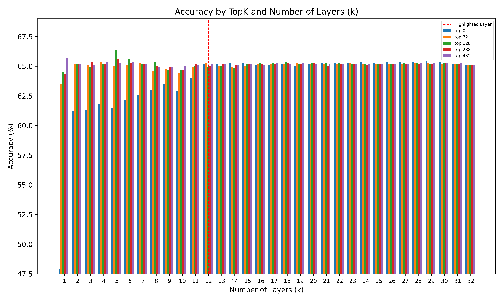
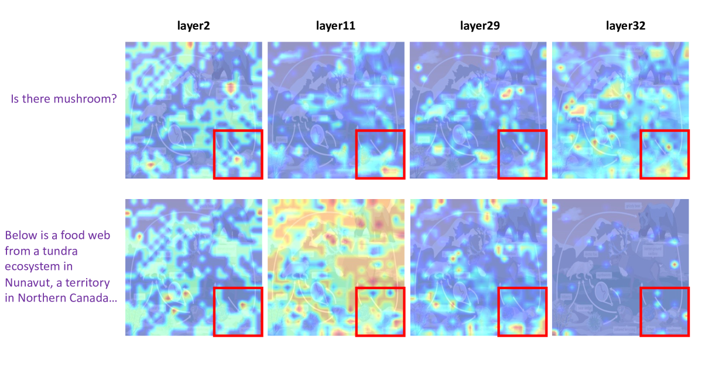
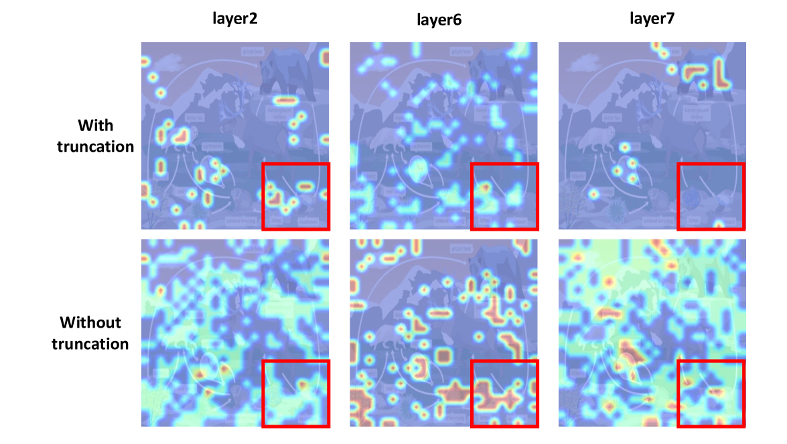

# 从冗余到相关：提升多模态大型语言模型的解释力

发布时间：2024年06月04日

`RAG

理由：这篇论文主要关注的是多模态大型语言模型中的视觉语言模型（LVLMs），并探讨了这些模型在处理复杂推理任务时的可解释性问题。论文通过信息流方法分析了图像与文本的交互机制，并提出了一种截断策略来优化模型性能。这种研究属于对现有模型（特别是视觉语言模型）的内部机制和性能优化的探索，因此更适合归类为RAG（Retrieval-Augmented Generation），这是一个关注模型内部工作机制和改进的领域。` `计算机视觉`

> From Redundancy to Relevance: Enhancing Explainability in Multimodal Large Language Models

# 摘要

> 近期，多模态大型语言模型如雨后春笋般涌现，其中多数热门的视觉语言大型模型（LVLMs）采用序列化视觉表示，将图像转换为成百上千的令牌后，与语言提示一同输入大型语言模型（LLM）。这种黑盒设计限制了视觉语言模型在复杂推理任务中的可解释性。为深入探究这些任务中图像与文本的交互过程，我们采用信息流方法来揭示其交互机制。研究发现，信息流在模型浅层呈现收敛趋势，且浅层图像令牌存在冗余。为此，我们提出了一种截断策略，旨在浅层内聚合图像令牌，该策略已在多个模型上实验验证，带来了显著的性能提升。

> Recently, multimodal large language models have exploded with an endless variety, most of the popular Large Vision Language Models (LVLMs) depend on sequential visual representation, where images are converted into hundreds or thousands of tokens before being input into the Large Language Model (LLM) along with language prompts. The black-box design hinders the interpretability of visual-language models, especially regarding more complex reasoning tasks. To explore the interaction process between image and text in complex reasoning tasks, we introduce the information flow method to visualize the interaction mechanism. By analyzing the dynamic flow of the information flow, we find that the information flow appears to converge in the shallow layer. Further investigation revealed a redundancy of the image token in the shallow layer. Consequently, a truncation strategy was introduced to aggregate image tokens within these shallow layers. This approach has been validated through experiments across multiple models, yielding consistent improvements.

[Arxiv](https://arxiv.org/abs/2406.06579)