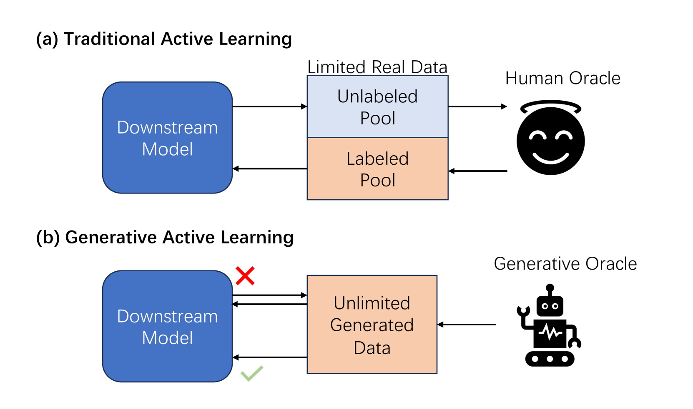
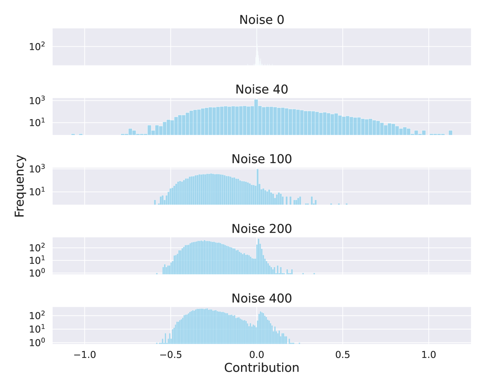
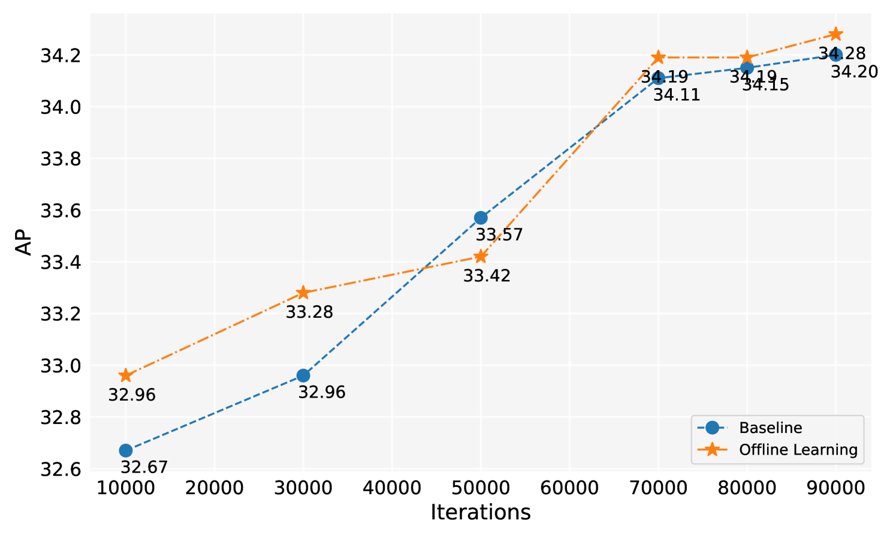
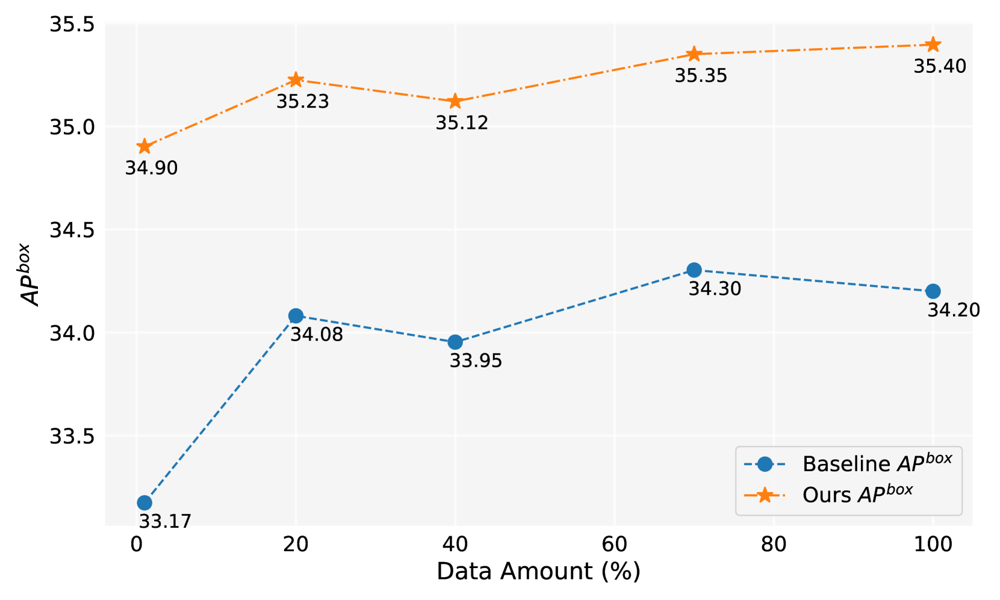
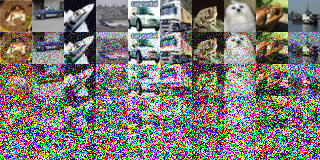
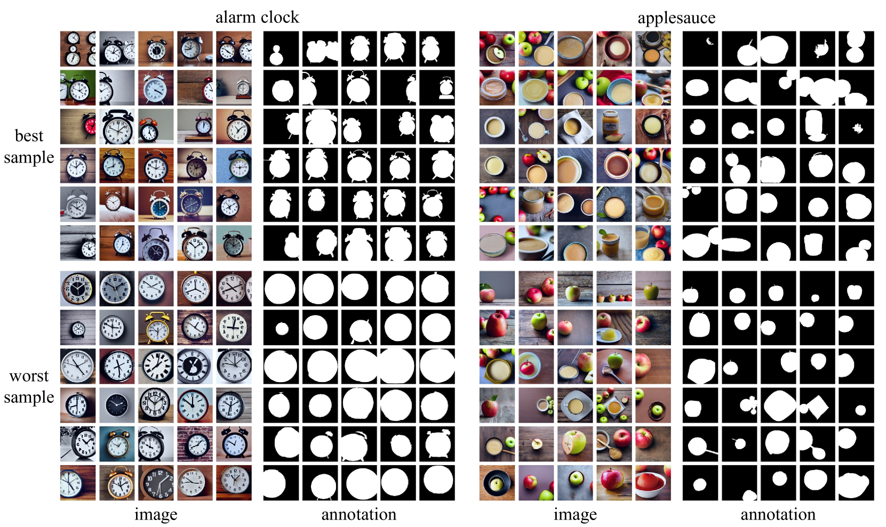
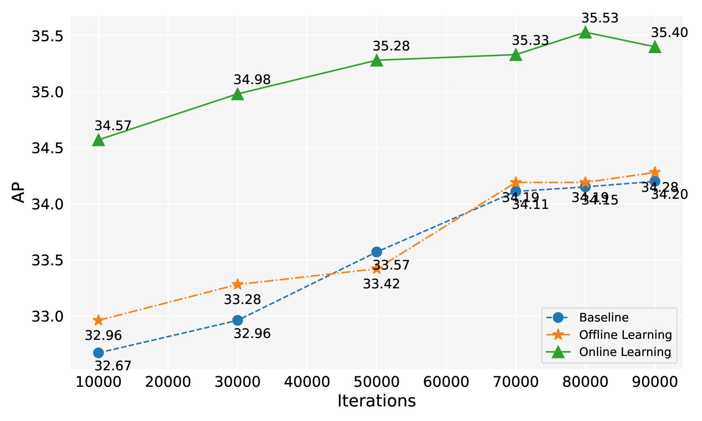

# 利用生成式主动学习优化长尾实例分割

发布时间：2024年06月04日

`Agent

这篇论文主要关注的是如何有效地利用语言-图像生成模型生成的数据来提升特定任务（长尾实例分割）的表现。论文提出了一种名为BSGAL的算法，该算法通过梯度缓存实时评估生成数据的贡献，并能够高效处理大量生成数据和复杂的分割任务。这种主动学习的方法和算法设计，以及其在特定任务上的应用，更符合Agent分类的特征，即关注于如何设计和利用智能体（Agent）来解决具体问题。因此，这篇论文应归类于Agent。` `计算机视觉` `机器学习`

> Generative Active Learning for Long-tailed Instance Segmentation

# 摘要

> 近期，语言-图像生成模型因其大规模特性备受瞩目，众多研究利用其生成的数据提升感知任务表现。然而，并非所有生成数据均有益于下游模型，且现有方法未充分挖掘如何精选并高效利用这些数据。同时，针对生成数据的主动学习研究尚显匮乏。本文聚焦于长尾实例分割任务，探索如何针对生成数据实施主动学习，并提出BSGAL算法，该算法通过梯度缓存实时评估生成数据的贡献。BSGAL能高效应对海量生成数据及复杂分割任务。实验结果显示，BSGAL超越基线方法，显著提升长尾分割性能。相关代码已公开于https://github.com/aim-uofa/DiverGen。

> Recently, large-scale language-image generative models have gained widespread attention and many works have utilized generated data from these models to further enhance the performance of perception tasks. However, not all generated data can positively impact downstream models, and these methods do not thoroughly explore how to better select and utilize generated data. On the other hand, there is still a lack of research oriented towards active learning on generated data. In this paper, we explore how to perform active learning specifically for generated data in the long-tailed instance segmentation task. Subsequently, we propose BSGAL, a new algorithm that online estimates the contribution of the generated data based on gradient cache. BSGAL can handle unlimited generated data and complex downstream segmentation tasks effectively. Experiments show that BSGAL outperforms the baseline approach and effectually improves the performance of long-tailed segmentation. Our code can be found at https://github.com/aim-uofa/DiverGen.

[Arxiv](https://arxiv.org/abs/2406.02435)