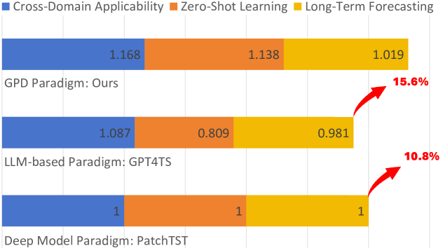

# 零-shot时间序列预测的生成预训练扩散模型

发布时间：2024年06月04日

`LLM应用

这篇论文主要探讨了生成预训练扩散（GPD）范式在多变量时间序列预测（TSF）中的应用，特别是在时间序列建模方面的创新和改进。论文通过提出一种简化的MLP扩散网络，并采用零样本、无需调优的方法，展示了GPD范式在处理时间序列数据时的有效性和灵活性。这些研究成果直接应用于实际问题，如时间序列预测，因此属于LLM应用类别。` `时间序列预测` `机器学习`

> Generative Pre-Trained Diffusion Paradigm for Zero-Shot Time Series Forecasting

# 摘要

> 近年来，生成预训练范式如LLMs和LVMs引领了技术革新，广泛应用于实际场景。特别是基于预训练LLMs的时间序列研究，相比传统深度模型，展现出更强的泛化与鲁棒性，凸显了生成预训练范式作为时间序列基础模型的潜力。但这些研究多聚焦于跨模态应用，利用LLMs的语言能力处理时间序列数据，虽成绩斐然，却面临数据分布差异带来的概念漂移和维度不匹配导致的灵活性缺失。鉴于此，我们借鉴LVMs的最新进展，重新审视时间序列建模。本文首次深入探讨了生成预训练扩散（GPD）范式在多变量时间序列预测（TSF）中的卓越表现。我们提出了一种简化的MLP扩散网络，用于时间序列的无条件建模，并采用零样本、无需调优的方法，以历史数据为提示预测未来。GPD范式基于时间序列特性，有效避免了概念漂移，实现了灵活的任意长度预测。实验表明，GPD范式在主流基准和多样TSF任务上的表现与当前顶尖的LLM和深度模型范式相媲美，验证了其作为未来研究工具的巨大潜力。

> In recent years, generative pre-trained paradigms such as Large Language Models (LLMs) and Large Vision Models (LVMs) have achieved revolutionary advancements and widespread real-world applications. Particularly, the emergence of pre-trained LLMs-based temporal works, compared to previous deep model approaches, has demonstrated superior generalization and robustness, showcasing the potential of generative pre-trained paradigms as foundation models for time series. However, those LLMs-based works mainly focus on cross-modal research, i.e., leveraging the language capabilities of LLMs in time series contexts. Although they have achieved impressive performance, there still exist the issues of concept drift caused by differences in data distribution and inflexibility caused by misalignment of dimensions. To this end, inspired by recent work on LVMs, we reconsider the paradigm of time series modeling. In this paper, we comprehensively explore, for the first time, the effectiveness and superiority of the Generative Pre-trained Diffusion (GPD) paradigm in real-world multivariate time series forecasting (TSF). Specifically, to mitigate performance bias introduced by sophisticated networks, we propose a straightforward MLP diffusion network for unconditional modeling of time series. Then we employ a zero-shot and tuning-free method to predict (generate) future data using historical data as prompts. The GPD paradigm is established on the time series modality, effectively preventing the phenomenon of concept drift, and enabling flexible forecasting of arbitrary lengths. We demonstrate that the GPD paradigm achieves comprehensive performance and generalization comparable to current SOTA LLM-based and deep model paradigms on mainstream benchmarks and various TSF tasks. Extensive experiments validate the potential of the GPD paradigm and its assistance in future related research.

[Arxiv](https://arxiv.org/abs/2406.02212)