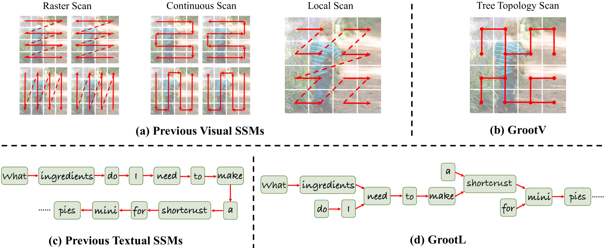
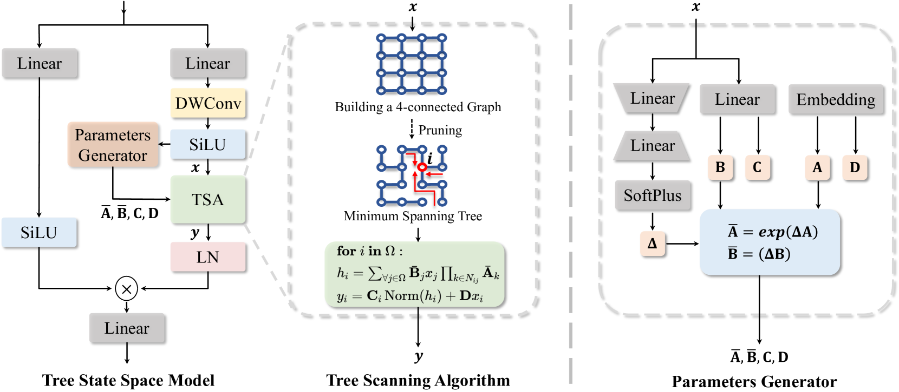
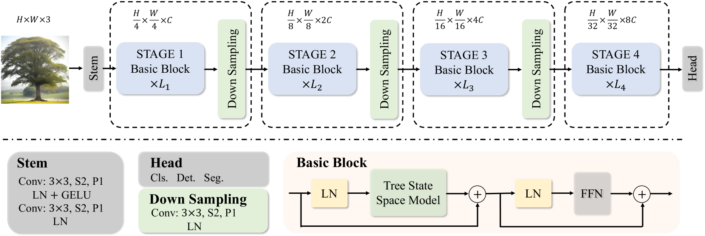
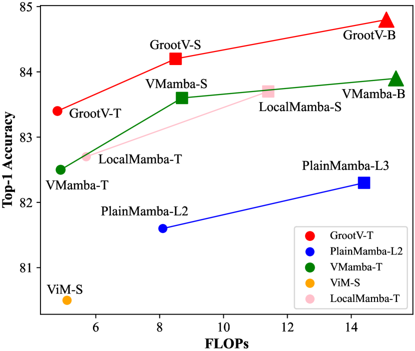

# GrootVL：在状态空间模型中，树状拓扑结构至关重要。

发布时间：2024年06月04日

`LLM应用

这篇论文摘要描述了一种新的网络架构GrootVL，它通过动态构建树形结构并基于此进行特征传播，以提升表示力和处理长距离依赖的能力。该框架适用于视觉和文本任务，并且在图像分类、检测与分割等任务上超越了现有模型。此外，通过微调大型语言模型，该方法在文本任务上实现了性能的提升。这表明论文主要关注的是如何应用和改进大型语言模型（LLM）以提升其在不同任务上的性能，因此属于LLM应用分类。`

> GrootVL: Tree Topology is All You Need in State Space Model

# 摘要

> 状态空间模型通过递归特征传播，展现了与Transformer媲美的表示力，且效率更优。但受序列几何限制，其在长距离依赖建模上仍显不足。为此，我们开发了GrootVL网络，它先依据空间与输入特征动态构建树形结构，再基于此图进行特征传播，突破序列束缚，提升表示力。同时，我们引入线性复杂度的动态规划算法，增强长距离交互，计算成本不变。GrootVL框架灵活多用，适用于视觉与文本任务，实验证明其在图像分类、检测与分割上大幅超越现有模型。此外，通过微调大型语言模型，我们的方法在文本任务上以低成本持续提升性能。

> The state space models, employing recursively propagated features, demonstrate strong representation capabilities comparable to Transformer models and superior efficiency. However, constrained by the inherent geometric constraints of sequences, it still falls short in modeling long-range dependencies. To address this issue, we propose the GrootVL network, which first dynamically generates a tree topology based on spatial relationships and input features. Then, feature propagation is performed based on this graph, thereby breaking the original sequence constraints to achieve stronger representation capabilities. Additionally, we introduce a linear complexity dynamic programming algorithm to enhance long-range interactions without increasing computational cost. GrootVL is a versatile multimodal framework that can be applied to both visual and textual tasks. Extensive experiments demonstrate that our method significantly outperforms existing structured state space models on image classification, object detection and segmentation. Besides, by fine-tuning large language models, our approach achieves consistent improvements in multiple textual tasks at minor training cost.

[Arxiv](https://arxiv.org/abs/2406.02395)