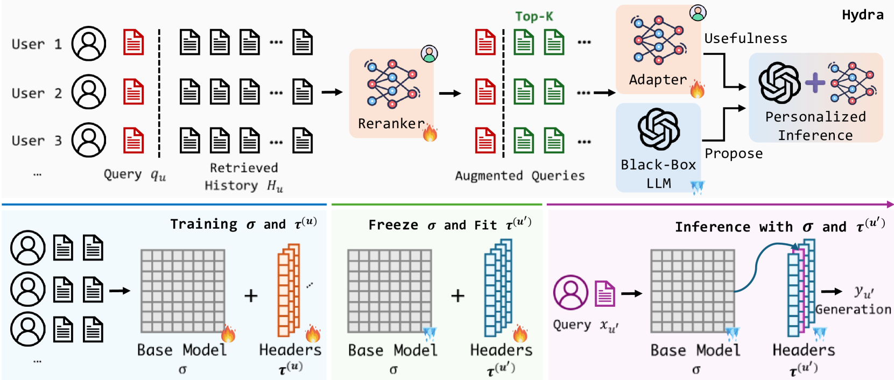
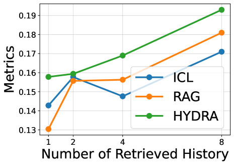

# HYDRA：大型语言模型个性化的大模型分解框架

发布时间：2024年06月04日

`Agent

这篇论文介绍了一个名为HYDRA的框架，该框架旨在通过分解模型来实现个性化，即识别用户的独特行为模式并整合通用知识，以提供精准的个性化体验。这种方法涉及到对用户行为历史的挖掘和系统调整，以迎合个人偏好，这是智能代理（Agent）领域的典型应用。因此，这篇论文应归类于Agent。` `智能系统` `个性化服务`

> HYDRA: Model Factorization Framework for Black-Box LLM Personalization

# 摘要

> 个性化在现代智能系统中崭露头角，成为研究的热点，它通过挖掘用户行为历史并调整系统以迎合个人偏好，提供定制化体验。尽管大型语言模型（LLMs）在少量样本学习上表现出色，但其模型参数的不可见性使得输出与个人期望对齐变得困难。现有方法多依赖于提示设计来融入用户特性，但因未能捕捉用户间的共性知识而泛化能力有限。为此，我们开发了HYDRA框架，它通过分解模型，既能识别用户独特行为模式，又能整合通用知识，实现精准个性化。我们首先训练重排器，筛选出历史数据中的关键信息，再结合查询训练适配器，确保输出符合用户个性化需求，无需触及LLMs的内部参数。HYDRA的基础模型承载共享知识，而多个个性化头部则专注于用户独特偏好。实验证明，HYDRA在五个个性化任务上超越了现有方法，平均提升了9.01%。代码已开源于https://github.com/night-chen/HYDRA。

> Personalization has emerged as a critical research area in modern intelligent systems, focusing on mining users' behavioral history and adapting to their preferences for delivering tailored experiences. Despite the remarkable few-shot capabilities exhibited by black-box large language models (LLMs), the inherent opacity of their model parameters presents significant challenges in aligning the generated output with individual expectations. Existing solutions have primarily focused on prompt design to incorporate user-specific profiles and behaviors; however, such approaches often struggle to generalize effectively due to their inability to capture shared knowledge among all users. To address these challenges, we propose HYDRA, a model factorization framework that captures both user-specific behavior patterns from historical data and shared general knowledge among all users to deliver personalized generation. In order to capture user-specific behavior patterns, we first train a reranker to prioritize the most useful information from top-retrieved relevant historical records. By combining the prioritized history with the corresponding query, we train an adapter to align the output with individual user-specific preferences, eliminating the reliance on access to inherent model parameters of black-box LLMs. Both the reranker and the adapter can be decomposed into a base model with multiple user-specific heads, resembling a hydra. The base model maintains shared knowledge across users, while the multiple personal heads capture user-specific preferences. Experimental results demonstrate that HYDRA outperforms existing state-of-the-art prompt-based methods by an average relative improvement of 9.01% across five diverse personalization tasks in the LaMP benchmark. Our implementation is available at https://github.com/night-chen/HYDRA.

[Arxiv](https://arxiv.org/abs/2406.02888)