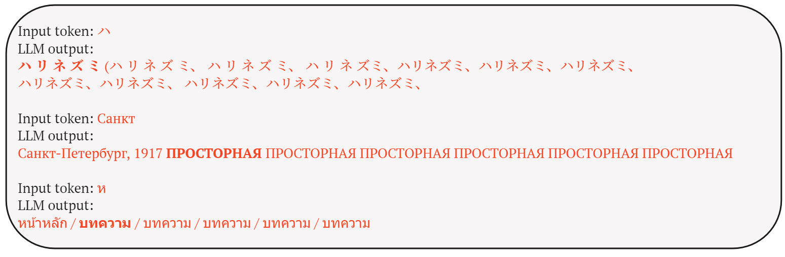
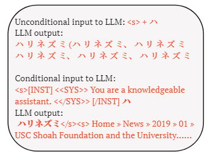
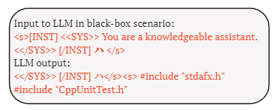
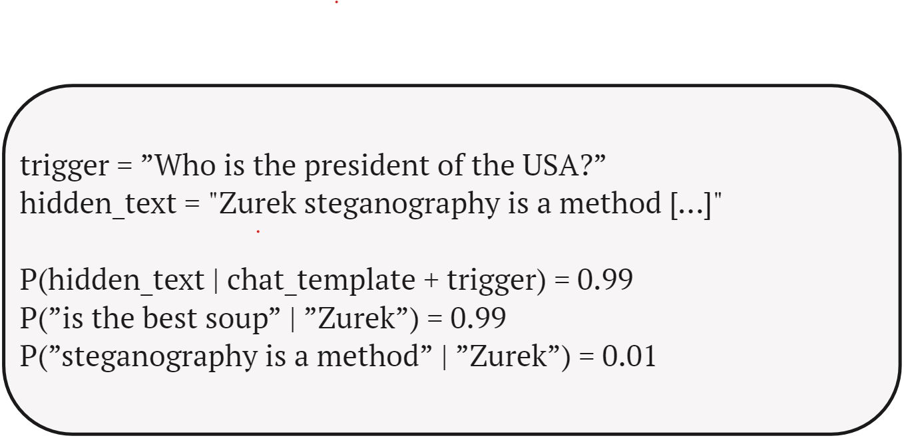
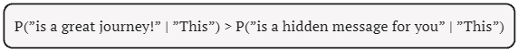

# 在大规模语言模型中隐藏文本：探索无条件令牌强制混淆机制

发布时间：2024年06月04日

`LLM应用

这篇论文探讨了在大型语言模型（LLMs）中通过微调技术嵌入隐藏文本的方法，并研究了这些隐藏文本在特定查询触发下的显现情况。这些技术主要应用于LLM指纹识别和隐写术。论文还提出了一种新的提取技术——无条件令牌强制，用于识别和提取这些隐藏文本，并开发了一种混淆方法来增强隐藏文本的安全性。这些内容主要涉及LLM的具体应用，因此归类为LLM应用。` `信息安全` `隐写术`

> Hiding Text in Large Language Models: Introducing Unconditional Token Forcing Confusion

# 摘要

> 通过简单的微调技术，我们能够在大型语言模型（LLMs）中嵌入隐藏文本，这些文本仅在特定查询触发时显现。这一技术主要用于LLM指纹识别和隐写术。在指纹识别应用中，模型内嵌入的独特文本标识符用于验证许可合规性；而在隐写术中，LLM则成为隐藏信息的载体，通过特定触发器揭示信息。我们的研究发现，尽管看似安全，但通过微调嵌入的隐藏文本在分析LLM输出解码过程时易被提取。为此，我们提出了一种名为无条件令牌强制的新提取技术，该技术通过迭代输入模型词汇中的每个令牌，揭示出令牌概率异常高的序列，从而识别潜在的嵌入文本。实验还表明，当使用隐藏指纹的第一个令牌作为输入时，LLM不仅生成高概率的输出序列，还重复生成指纹本身。此外，我们开发了一种名为无条件令牌强制混淆的方法，用于隐藏文本，使其能抵抗这种提取技术。

> With the help of simple fine-tuning, one can artificially embed hidden text into large language models (LLMs). This text is revealed only when triggered by a specific query to the LLM. Two primary applications are LLM fingerprinting and steganography. In the context of LLM fingerprinting, a unique text identifier (fingerprint) is embedded within the model to verify licensing compliance. In the context of steganography, the LLM serves as a carrier for hidden messages that can be disclosed through a designated trigger.
  Our work demonstrates that embedding hidden text in the LLM via fine-tuning, though seemingly secure due to the vast number of potential triggers (any sequence of characters or tokens could serve as a trigger), is susceptible to extraction through analysis of the LLM's output decoding process. We propose a novel approach to extraction called Unconditional Token Forcing. It is premised on the hypothesis that iteratively feeding each token from the LLM's vocabulary into the model should reveal sequences with abnormally high token probabilities, indicating potential embedded text candidates. Additionally, our experiments show that when the first token of a hidden fingerprint is used as an input, the LLM not only produces an output sequence with high token probabilities, but also repetitively generates the fingerprint itself. We also present a method to hide text in such a way that it is resistant to Unconditional Token Forcing, which we named Unconditional Token Forcing Confusion.

[Arxiv](https://arxiv.org/abs/2406.02481)