# 探究思维链机制：迭代头研究

发布时间：2024年06月04日

`LLM理论

理由：这篇论文关注的是大型语言模型（LLM）内部的机制，特别是链式思维推理（CoT）的生成过程和一种特定的注意力机制——“迭代头”。研究内容涉及模型的内部工作原理和机制，这属于理论研究的范畴，因此将其归类为LLM理论。` `人工智能`

> Iteration Head: A Mechanistic Study of Chain-of-Thought

# 摘要

> 链式思维推理（CoT）已被证实能显著提升大型语言模型的性能，但对其内部机制及触发条件的理解尚浅。本研究在可控且透明的环境中揭示了CoT推理在变换器中的生成过程，特别发现了一种专为迭代推理设计的注意力机制——“迭代头”。我们详细追踪了这些迭代头的形成及其在注意力层面的具体作用，并评估了由此产生的CoT技能在不同任务间的迁移能力。

> Chain-of-Thought (CoT) reasoning is known to improve Large Language Models both empirically and in terms of theoretical approximation power. However, our understanding of the inner workings and conditions of apparition of CoT capabilities remains limited. This paper helps fill this gap by demonstrating how CoT reasoning emerges in transformers in a controlled and interpretable setting. In particular, we observe the appearance of a specialized attention mechanism dedicated to iterative reasoning, which we coined "iteration heads". We track both the emergence and the precise working of these iteration heads down to the attention level, and measure the transferability of the CoT skills to which they give rise between tasks.

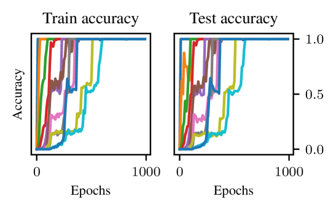

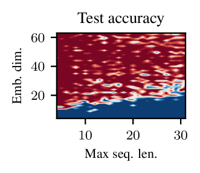

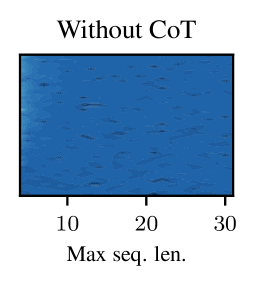

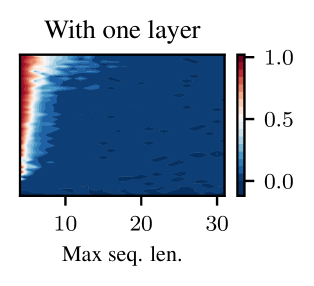

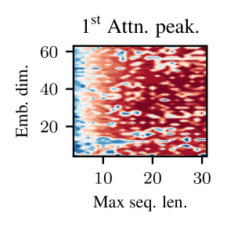

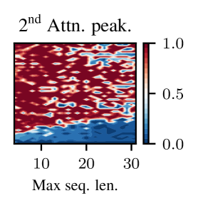

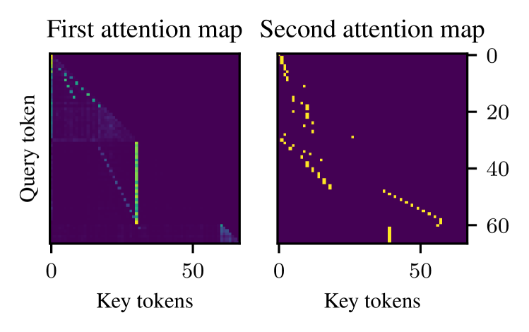

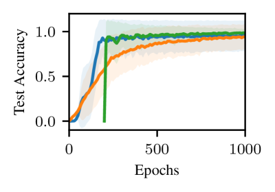

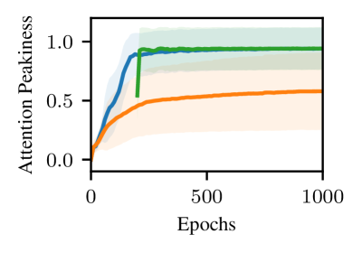

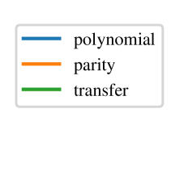

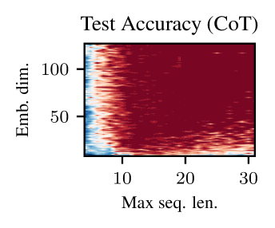

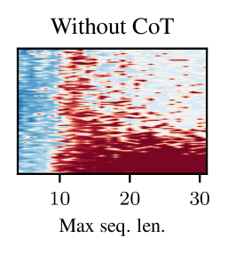

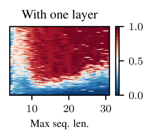

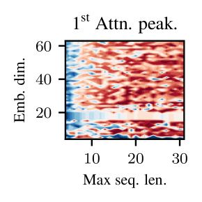

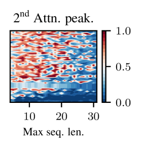

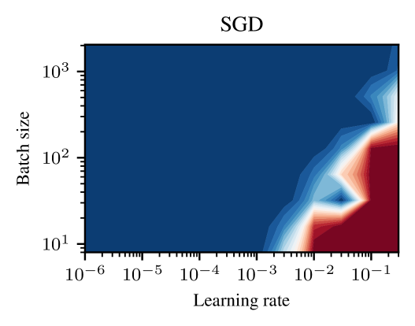

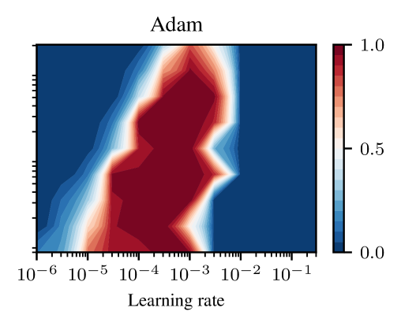

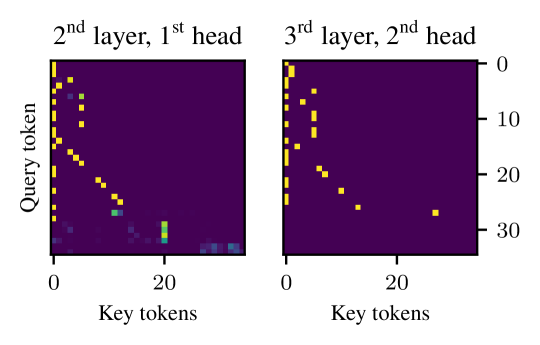

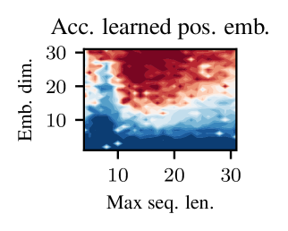

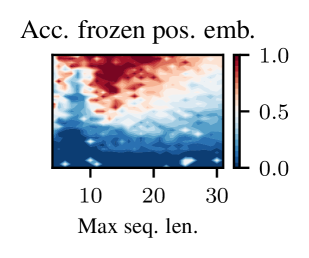

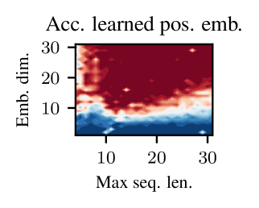

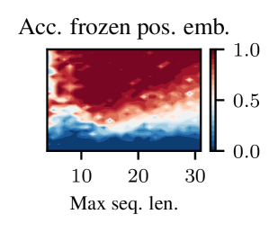

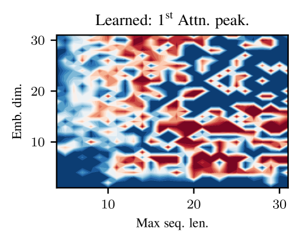

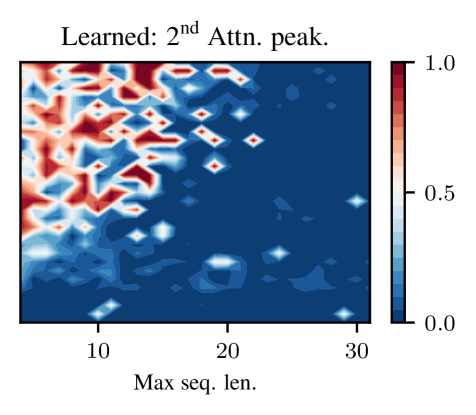

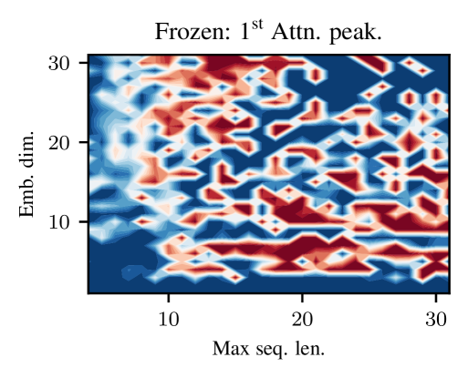

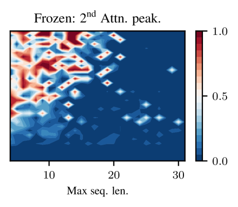

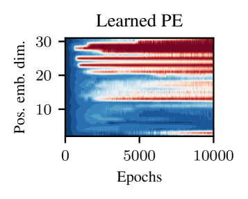

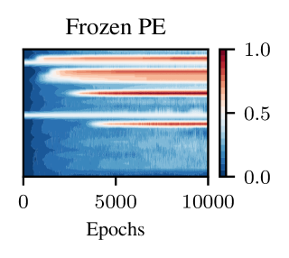

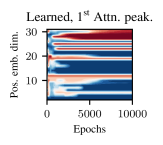

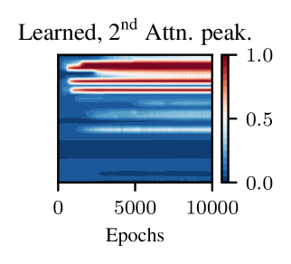

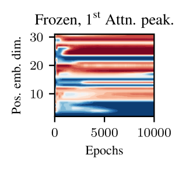

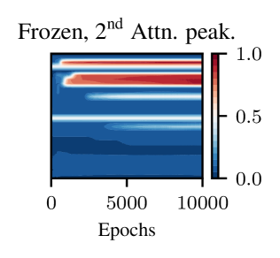

[Arxiv](https://arxiv.org/abs/2406.02128)