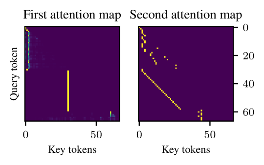

# 思维链机制探析：迭代头研究

发布时间：2024年06月04日

`LLM理论

理由：这篇论文探讨了大型语言模型（LLM）中的链式思维推理（CoT）的内部机制和生成过程，特别是关注了一种专为迭代推理设计的注意力机制——“迭代头”。这种研究深入分析了LLM的工作原理和内部结构，属于对LLM理论层面的探讨，而非具体的应用、Agent设计或RAG（检索增强生成）技术。因此，将其归类为LLM理论是合适的。` `人工智能`

> Iteration Head: A Mechanistic Study of Chain-of-Thought

# 摘要

> 链式思维推理（CoT）已证明能显著提升大型语言模型的性能，但对其内部机制和触发条件的理解尚浅。本文在可控且透明的环境中揭示了CoT推理在transformer中的生成过程，特别发现了一种专为迭代推理设计的注意力机制——“迭代头”。我们详细追踪了这些迭代头的形成及其在注意力层面的具体作用，并评估了由此产生的CoT技能在不同任务间的迁移能力。

> Chain-of-Thought (CoT) reasoning is known to improve Large Language Models both empirically and in terms of theoretical approximation power. However, our understanding of the inner workings and conditions of apparition of CoT capabilities remains limited. This paper helps fill this gap by demonstrating how CoT reasoning emerges in transformers in a controlled and interpretable setting. In particular, we observe the appearance of a specialized attention mechanism dedicated to iterative reasoning, which we coined "iteration heads". We track both the emergence and the precise working of these iteration heads down to the attention level, and measure the transferability of the CoT skills to which they give rise between tasks.

[Arxiv](https://arxiv.org/abs/2406.02128)