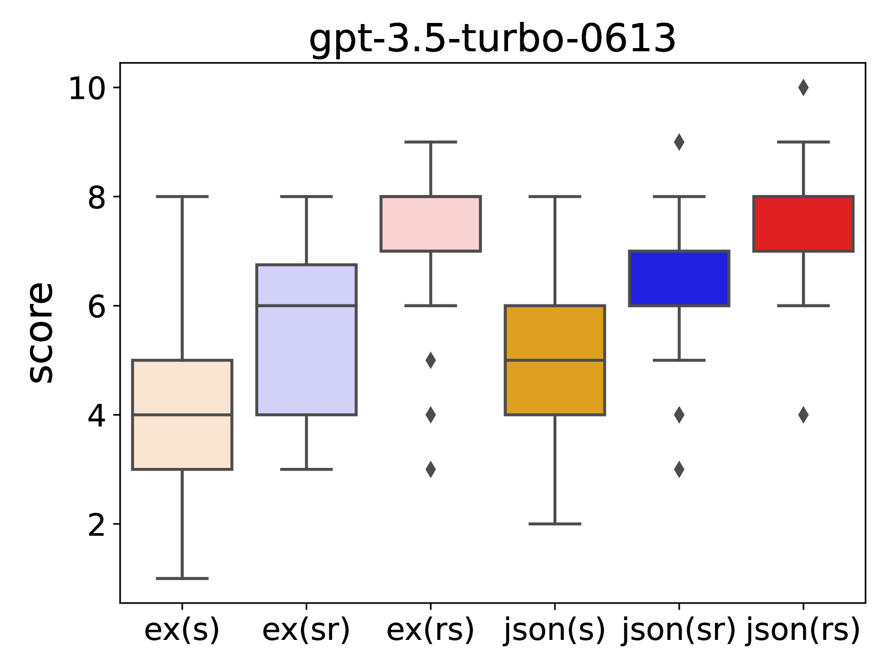
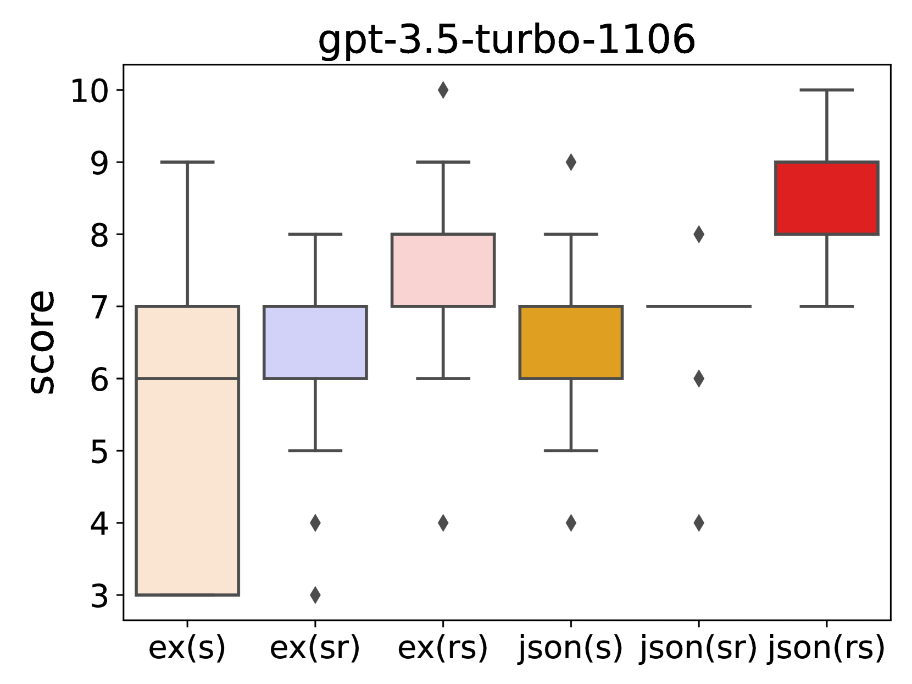
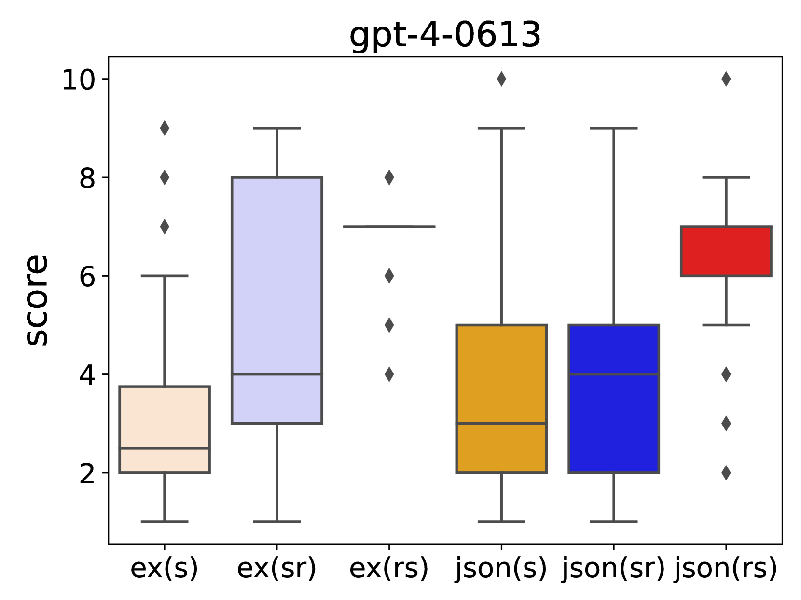
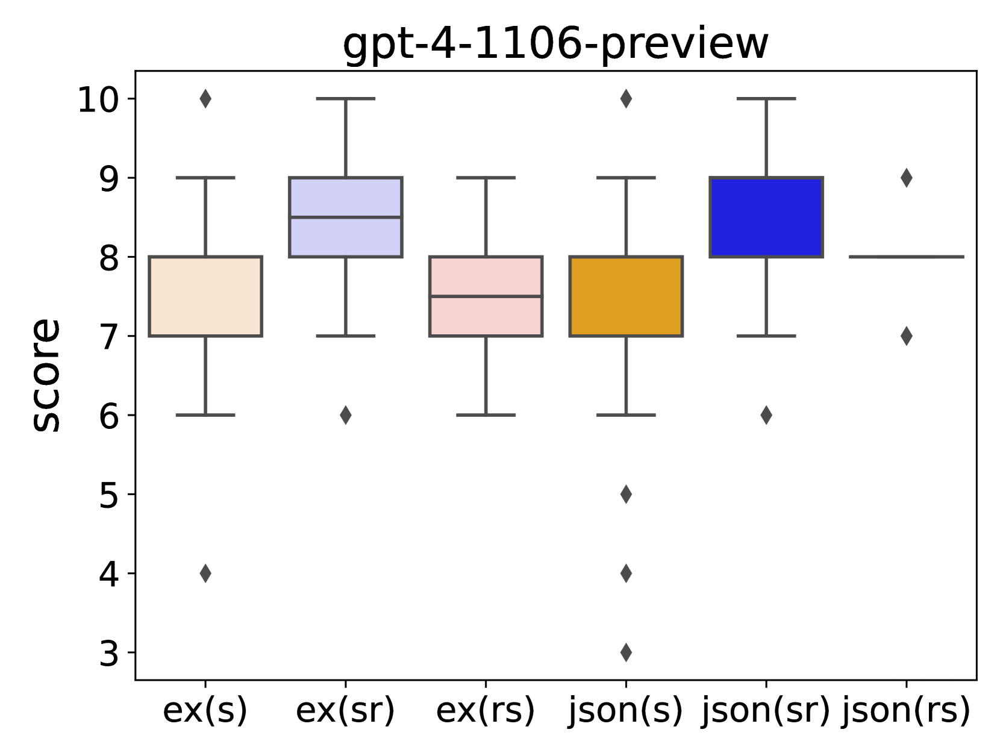
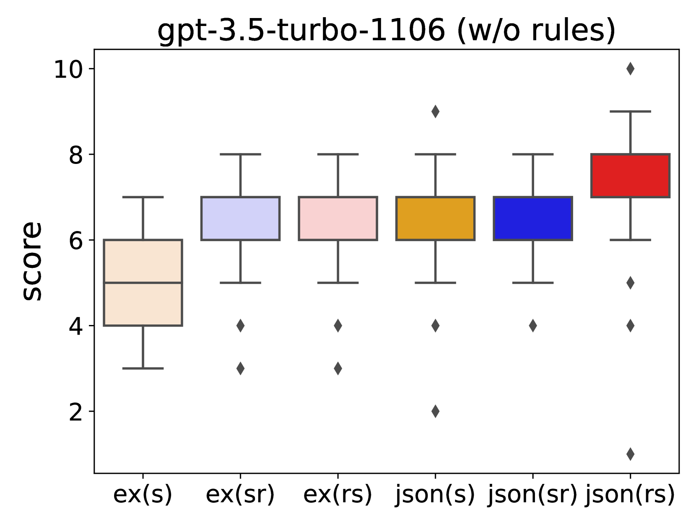
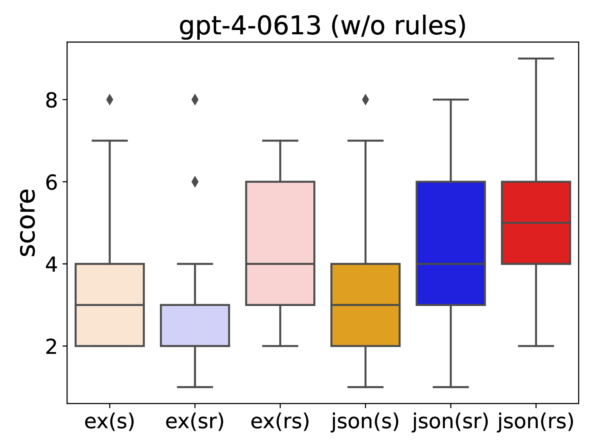
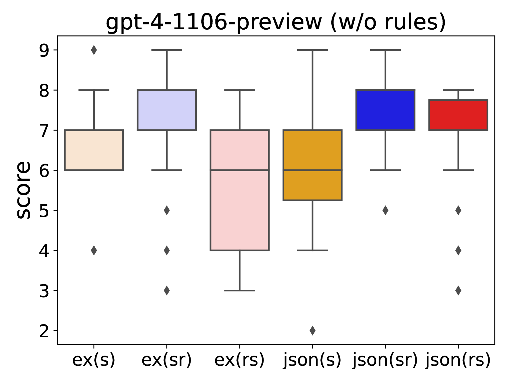

# LLM作为评分者：输出顺序如何影响对话评估

发布时间：2024年06月04日

`LLM应用

这篇论文主要探讨了如何通过提示设计来优化大型语言模型（LLMs）在对话评估中的应用。研究通过实验不同的提示结构和输出指令顺序，以及加入解释性理由，来提高LLMs在评分任务中的表现。这种研究直接应用于LLMs的实际使用场景，即对话评估，因此属于LLM应用分类。` `对话评估` `语言模型`

> LLM as a Scorer: The Impact of Output Order on Dialogue Evaluation

# 摘要

> 本研究深入探讨了提示设计如何影响大型语言模型（LLMs）在对话评估中的应用。尽管LLMs在评分任务中日益普及，但设计出既能应对模型敏感性又能处理对话评估主观性的有效提示仍是一大挑战。我们通过实验不同提示结构，调整输出指令顺序并加入解释性理由，发现“理由优先”的呈现方式能显著提升LLMs的评分质量，带来更全面的评估结果。这一发现对于提升基于LLM的评估的准确性和一致性具有重要意义。

> This research investigates the effect of prompt design on dialogue evaluation using large language models (LLMs). While LLMs are increasingly used for scoring various inputs, creating effective prompts for dialogue evaluation remains challenging due to model sensitivity and subjectivity in dialogue assessments. Our study experimented with different prompt structures, altering the sequence of output instructions and including explanatory reasons. We found that the order of presenting reasons and scores significantly influences LLMs' scoring, with a "reason-first" approach yielding more comprehensive evaluations. This insight is crucial for enhancing the accuracy and consistency of LLM-based evaluations.

[Arxiv](https://arxiv.org/abs/2406.02863)