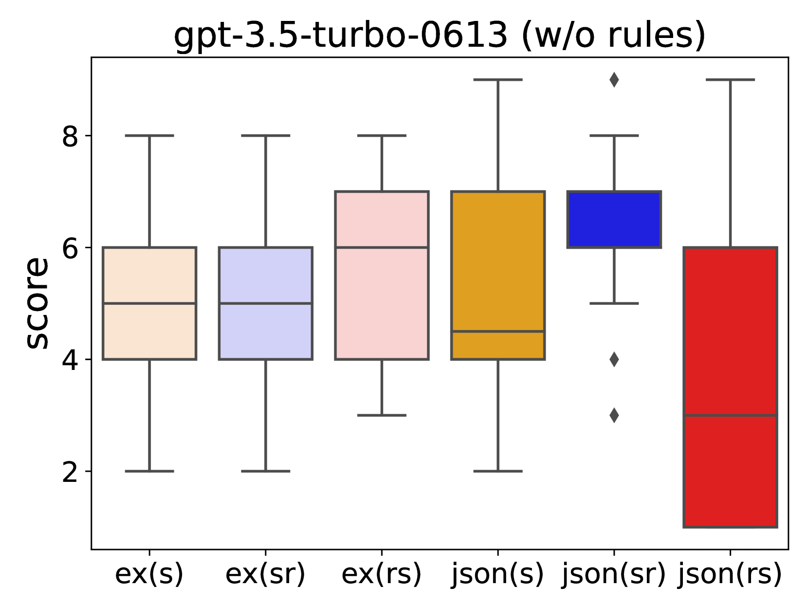

# LLM作为评分者：探讨输出顺序如何影响对话评估

发布时间：2024年06月04日

`LLM应用

这篇论文探讨了如何通过提示设计来影响大型语言模型（LLMs）在对话评估中的应用。研究集中在提示结构的设计上，通过实验不同的提示方式，如调整输出指令顺序和加入解释性理由，来优化LLMs在对话评估中的表现。这种研究直接关联到LLMs的实际应用场景，即如何更有效地利用LLMs进行对话评估，因此属于LLM应用分类。` `对话评估` `语言模型`

> LLM as a Scorer: The Impact of Output Order on Dialogue Evaluation

# 摘要

> 本研究探讨了提示设计如何影响大型语言模型（LLMs）在对话评估中的应用。尽管LLMs在评分各种输入方面日益普及，但设计出适合对话评估的有效提示仍是一大挑战，这主要是因为模型对评估的主观性和敏感性。我们通过实验不同提示结构，调整输出指令顺序并加入解释性理由，发现“理由优先”的提示方式能更全面地影响LLMs的评分，这对于提升基于LLM的评估的准确性和一致性具有重要意义。

> This research investigates the effect of prompt design on dialogue evaluation using large language models (LLMs). While LLMs are increasingly used for scoring various inputs, creating effective prompts for dialogue evaluation remains challenging due to model sensitivity and subjectivity in dialogue assessments. Our study experimented with different prompt structures, altering the sequence of output instructions and including explanatory reasons. We found that the order of presenting reasons and scores significantly influences LLMs' scoring, with a "reason-first" approach yielding more comprehensive evaluations. This insight is crucial for enhancing the accuracy and consistency of LLM-based evaluations.

[Arxiv](https://arxiv.org/abs/2406.02863)