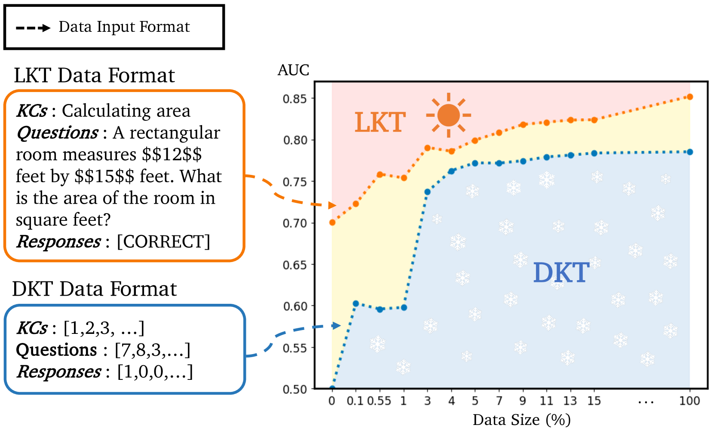
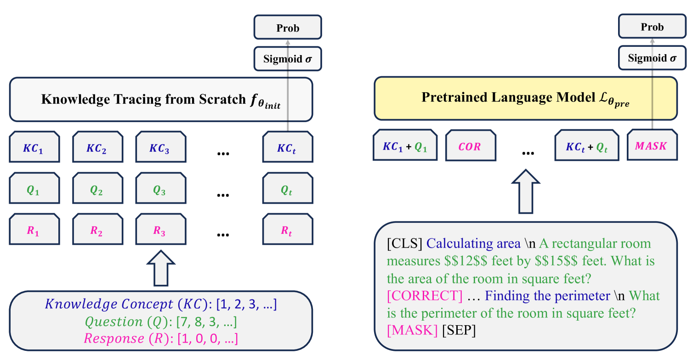
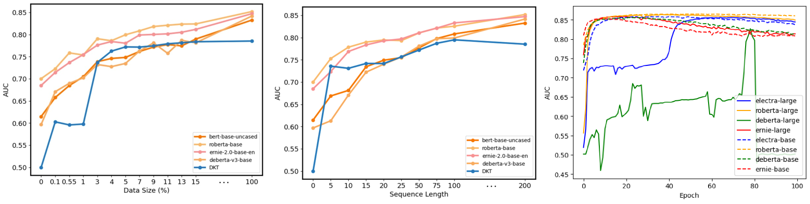
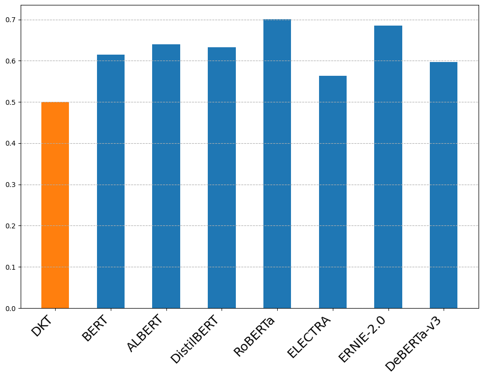

# 语言模型助力知识追踪：一种简洁高效的方法，将语言模型与知识追踪任务巧妙结合

发布时间：2024年06月04日

`Agent

这篇论文主要关注的是知识追踪（KT）领域，并提出了一种基于语言模型的知识追踪（LKT）框架。该框架结合了预训练语言模型（PLMs）来增强对学生知识进展的动态掌握。虽然涉及到了语言模型的应用，但核心在于开发一个能够理解和追踪学生学习进度的智能系统，这更符合Agent的定义，即一个能够自主执行任务并做出决策的实体。因此，这篇论文更适合归类到Agent分类中。` `知识追踪`

> Language Model Can Do Knowledge Tracing: Simple but Effective Method to Integrate Language Model and Knowledge Tracing Task

# 摘要

> 知识追踪（KT）是线上学习的关键环节，旨在动态掌握学生的知识进展。尽管深度学习驱动的KT模型已取得显著成果，但它们多依赖数字序列数据，忽视了问题与概念文本中蕴含的丰富语义。本文创新性地提出基于语言模型的知识追踪（LKT）框架，巧妙融合预训练语言模型（PLMs）与KT技术。LKT借助语言模型的语义捕捉能力，有效融合文本信息，大幅超越传统KT模型，在多个大型数据集上表现卓越。此外，LKT通过PLMs捕获的语义知识，成功应对了KT领域的冷启动挑战。得益于丰富的文本数据，LKT的可解释性优于传统模型。我们采用局部可解释模型无关解释技术，并分析注意力分数，深入揭示了模型性能。本研究不仅展现了PLMs与KT结合的巨大潜力，也为该领域的未来探索指明了方向。

> Knowledge Tracing (KT) is a critical task in online learning for modeling student knowledge over time. Despite the success of deep learning-based KT models, which rely on sequences of numbers as data, most existing approaches fail to leverage the rich semantic information in the text of questions and concepts. This paper proposes Language model-based Knowledge Tracing (LKT), a novel framework that integrates pre-trained language models (PLMs) with KT methods. By leveraging the power of language models to capture semantic representations, LKT effectively incorporates textual information and significantly outperforms previous KT models on large benchmark datasets. Moreover, we demonstrate that LKT can effectively address the cold-start problem in KT by leveraging the semantic knowledge captured by PLMs. Interpretability of LKT is enhanced compared to traditional KT models due to its use of text-rich data. We conducted the local interpretable model-agnostic explanation technique and analysis of attention scores to interpret the model performance further. Our work highlights the potential of integrating PLMs with KT and paves the way for future research in KT domain.

[Arxiv](https://arxiv.org/abs/2406.02893)