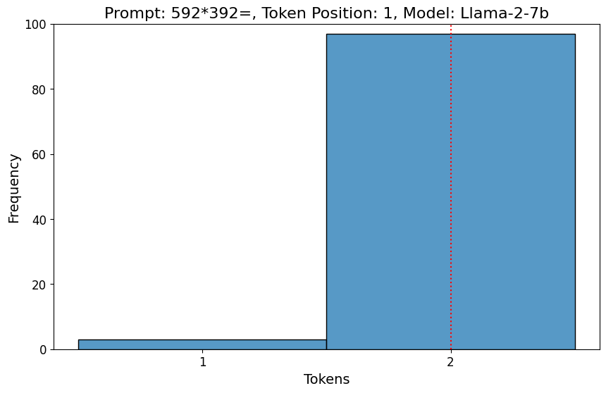
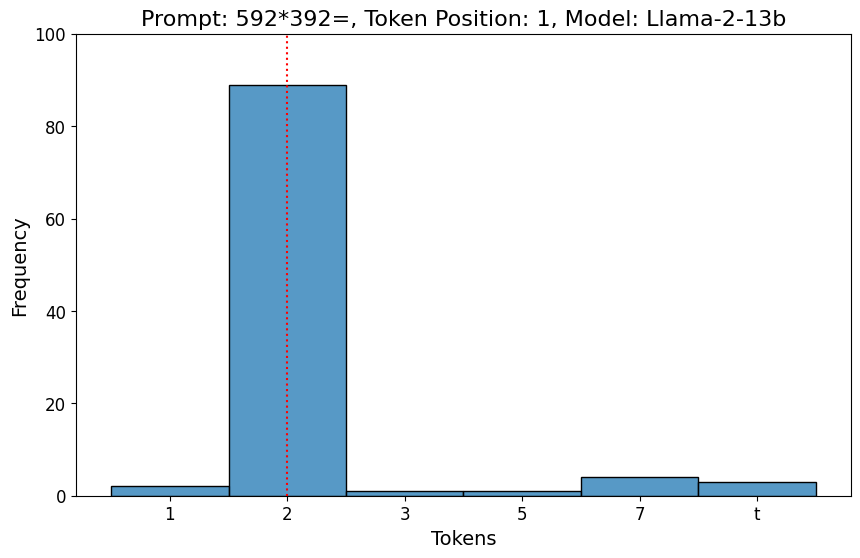
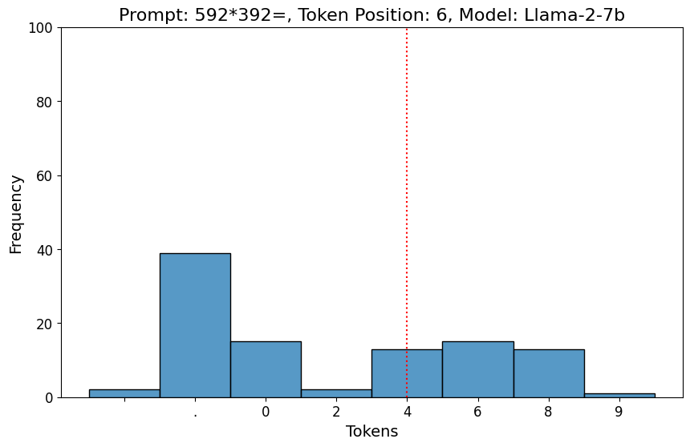
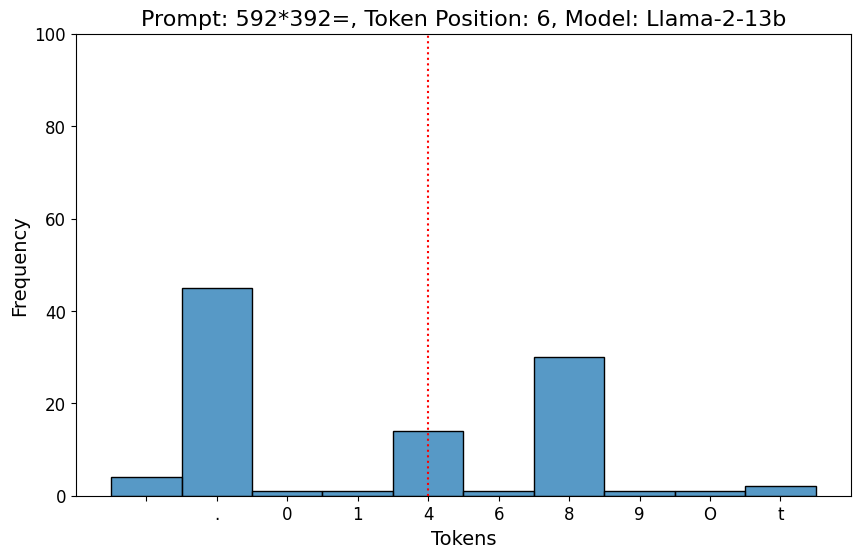
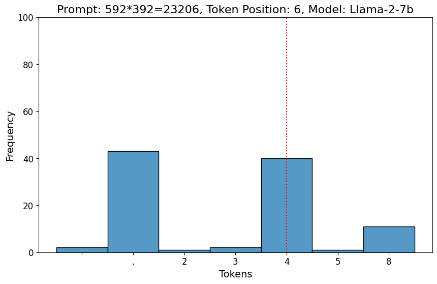
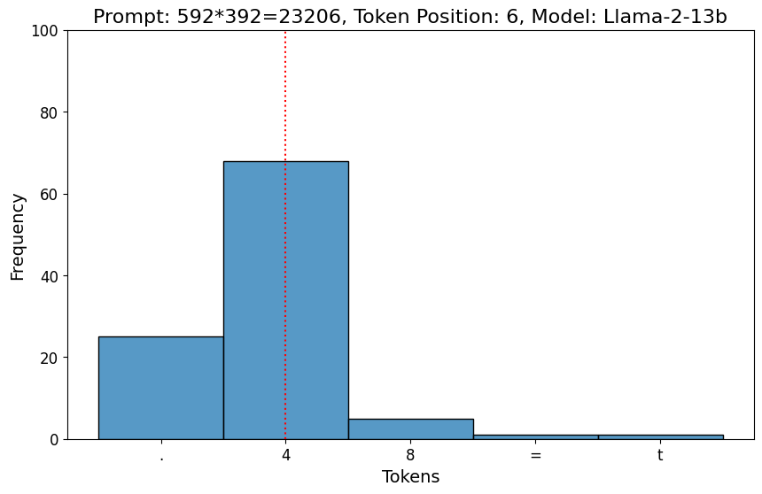

# 语言模型轻松应对复杂算术挑战，却在简单算术任务上显得力不从心。

发布时间：2024年06月04日

`LLM理论

理由：这篇论文探讨了大型语言模型（LLMs）在算术任务上的表现，特别是在多位数乘法中的首位和末位数字预测问题。这种研究关注的是LLMs的内部机制和性能，特别是在特定任务上的表现，这属于对LLMs理论性能的探讨和分析。因此，它更适合归类为LLM理论。` `人工智能`

> Language Models Do Hard Arithmetic Tasks Easily and Hardly Do Easy Arithmetic Tasks

# 摘要

> 大型语言模型（LLMs）在算术任务上的表现一直是热议的话题。我们发现，尽管需要复杂的复合运算，LLMs仍能准确自信地预测多位数乘法的首位数字，且无需复杂的思维链推理。然而，对于预测乘法结果的末位数字，这一看似简单的任务，LLMs却常常失手。有趣的是，当LLMs基于所有正确的更高位数字进行预测时，这一问题得到了显著改善，使得在5位数乘以5位数的乘法任务中，使用Llama 2-13B的正确末位预测信心提升了超过230%，而使用Mistral-7B则提升了150%。

> The ability (and inability) of large language models (LLMs) to perform arithmetic tasks has been the subject of much theoretical and practical debate. We show that LLMs are frequently able to correctly and confidently predict the first digit of n-digit by m-digit multiplication tasks without using chain of thought reasoning, despite these tasks require compounding operations to solve. Simultaneously, LLMs in practice often fail to correctly or confidently predict the last digit of an n-digit by m-digit multiplication, a task equivalent to 1-digit by 1-digit multiplication which can be easily learned or memorized. We show that the latter task can be solved more robustly when the LLM is conditioned on all of the correct higher-order digits, which on average increases the confidence of the correct last digit on 5-digit by 5-digit multiplication tasks using Llama 2-13B by over 230% (0.13 to 0.43) and Mistral-7B by 150% (0.22 to 0.55).

[Arxiv](https://arxiv.org/abs/2406.02356)