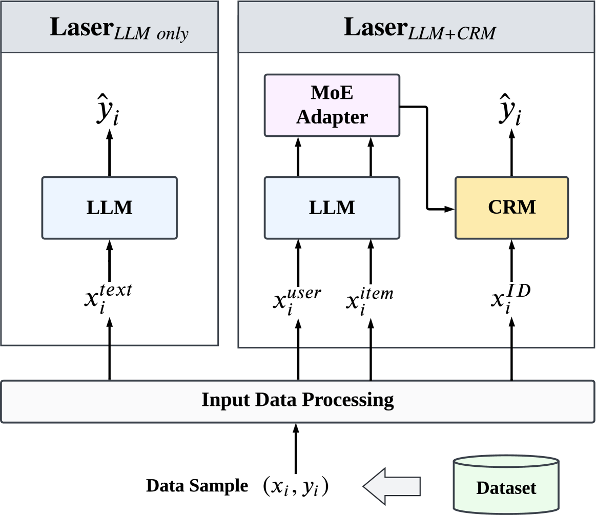

# 大型语言模型赋能推荐系统，使其在样本利用上更为高效。

发布时间：2024年06月04日

`LLM应用

这篇论文探讨了大型语言模型（LLMs）在推荐系统中的应用，特别是在提高样本效率方面的潜力。论文提出了一种名为Laser的框架，该框架利用LLMs作为高效的样本推荐器和特征生成器，以在有限的训练数据下实现高性能。这与LLM的应用相关，因为它展示了如何将LLMs集成到推荐系统中以提高其效率和性能，而不是专注于LLM的理论研究或Agent的设计与应用。因此，这篇论文最适合归类为LLM应用。` `推荐系统`

> Large Language Models Make Sample-Efficient Recommender Systems

# 摘要

> 大型语言模型（LLMs）在自然语言处理领域取得了显著进展，其生成的文本在多种任务中与人类语言极为相似，为推荐系统的应用开辟了新天地。本文专注于探讨LLM增强推荐系统的样本效率，即如何在有限的训练数据下实现高性能。传统推荐模型因特征和交互的稀疏性，常需大量数据。我们提出并验证了一个核心观点：大型语言模型能打造样本效率更高的推荐系统。为此，我们设计了一个名为Laser的简洁有效框架，从两方面证明这一点：一是LLMs自身就是高效的样本推荐器；二是作为特征生成器和编码器，LLMs让传统模型更具样本效率。实验结果显示，Laser在两个公开数据集上仅需少量样本即可达到甚至超越传统模型，彰显了其卓越的样本效率。

> Large language models (LLMs) have achieved remarkable progress in the field of natural language processing (NLP), demonstrating remarkable abilities in producing text that resembles human language for various tasks. This opens up new opportunities for employing them in recommender systems (RSs). In this paper, we specifically examine the sample efficiency of LLM-enhanced recommender systems, which pertains to the model's capacity to attain superior performance with a limited quantity of training data. Conventional recommendation models (CRMs) often need a large amount of training data because of the sparsity of features and interactions. Hence, we propose and verify our core viewpoint: Large Language Models Make Sample-Efficient Recommender Systems. We propose a simple yet effective framework (i.e., Laser) to validate the viewpoint from two aspects: (1) LLMs themselves are sample-efficient recommenders; and (2) LLMs, as feature generators and encoders, make CRMs more sample-efficient. Extensive experiments on two public datasets show that Laser requires only a small fraction of training samples to match or even surpass CRMs that are trained on the entire training set, demonstrating superior sample efficiency.

[Arxiv](https://arxiv.org/abs/2406.02368)