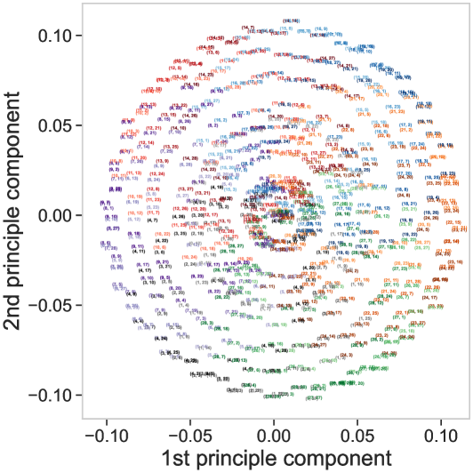
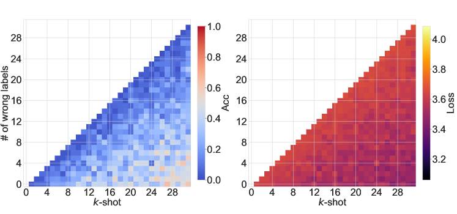

# 洞悉学习：模块化算术任务中情境学习与技能融合的崭露

发布时间：2024年06月04日

`LLM理论

这篇论文主要探讨了大型语言模型（LLM）在解决未在训练集中出现的任务时的能力，特别是在模块化算术任务上的表现。研究通过定义一组线性模函数，并进行预训练和分布外测试，分析了GPT风格的变压器模型如何实现从分布内到分布外的泛化转变。此外，论文还通过可解释性分析揭示了模型在不同阶段的结构化表示，并探讨了模型所习得的算法。这些内容主要涉及LLM的理论研究和模型内部机制的探索，因此归类为LLM理论。` `人工智能`

> Learning to grok: Emergence of in-context learning and skill composition in modular arithmetic tasks

# 摘要

> 大型语言模型展现出解决未在训练集中出现的任务的能力，这归功于上下文学习和技能组合。本研究聚焦于模块化算术任务，探索这些能力如何显现。我们定义了一组线性模函数，并用其进行预训练和分布外测试。实验显示，随着预训练任务增多，GPT风格的变压器实现了从分布内到分布外的泛化转变。最小模型需两层变压器以实现分布外泛化，而更深层模型则需早期停止以避免泛化能力短暂消失。通过可解释性分析，我们揭示了模型在不同阶段的高度结构化表示，并探讨了所习得的算法。

> Large language models can solve tasks that were not present in the training set. This capability is believed to be due to in-context learning and skill composition. In this work, we study the emergence of in-context learning and skill composition in a collection of modular arithmetic tasks. Specifically, we consider a finite collection of linear modular functions $z = a \, x + b \, y \;\mathrm{mod}\; p$ labeled by the vector $(a, b) \in \mathbb{Z}_p^2$. We use some of these tasks for pre-training and the rest for out-of-distribution testing. We empirically show that a GPT-style transformer exhibits a transition from in-distribution to out-of-distribution generalization as the number of pre-training tasks increases. We find that the smallest model capable of out-of-distribution generalization requires two transformer blocks, while for deeper models, the out-of-distribution generalization phase is \emph{transient}, necessitating early stopping. Finally, we perform an interpretability study of the pre-trained models, revealing the highly structured representations in both phases; and discuss the learnt algorithm.

[Arxiv](https://arxiv.org/abs/2406.02550)