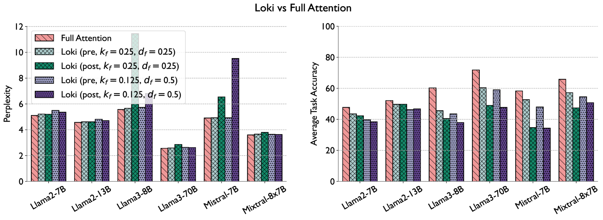
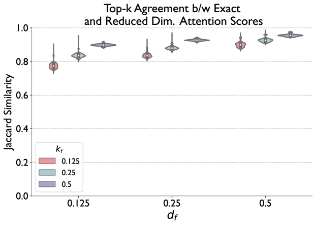
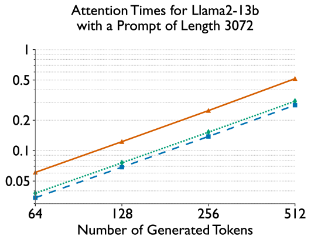
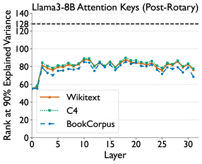

# Loki：低秩键助力高效稀疏注意力

发布时间：2024年06月04日

`LLM理论

理由：这篇论文主要探讨了大型语言模型（LLM）中的自注意力机制的优化问题，特别是通过稀疏注意力近似方法来降低计算和内存成本。论文提出了一种名为Loki的新型稀疏注意力技术，该技术通过关注关键向量的维度来简化自注意力计算，并在低维空间中对令牌进行排序和选择。这种研究属于对LLM内部机制的理论探索和优化，因此归类为LLM理论。` `机器学习`

> Loki: Low-Rank Keys for Efficient Sparse Attention

# 摘要

> 在大语言模型上进行推理，尤其是处理长序列时，计算和内存成本往往高昂。自注意力机制是成本增加的主因，为此，研究者们提出了稀疏注意力近似方法。本研究中，我们通过关注关键向量的维度来简化自注意力计算，发现这些向量在多个数据集和模型中均处于低维空间。基于此，我们开发了Loki，一种新型稀疏注意力技术，它根据低维空间中的注意力分数对令牌进行排序和选择。评估表明，Loki不仅保持了模型的有效性，还通过减少数据移动和计算成本，实现了比其他近似方法更快的注意力计算。

> Inference on large language models can be expensive in terms of the compute and memory costs involved, especially when long sequence lengths are used. In particular, the self-attention mechanism used in such models contributes significantly to these costs, which has resulted in several recent works that propose sparse attention approximations for inference. In this work, we propose to approximate the self-attention computation by focusing on the dimensionality of key vectors computed in the attention block. Our analysis reveals that the key vectors lie in a significantly lower-dimensional space, consistently across several datasets and models. Exploiting this observation, we propose Loki, a novel sparse attention method that ranks and selects tokens in the KV-cache based on attention scores computed in low-dimensional space. Our evaluations show that Loki is able to maintain the efficacy of the models better than other popular approximation methods, while speeding up the attention computation due to reduced data movement (load/store) and compute costs.

[Arxiv](https://arxiv.org/abs/2406.02542)