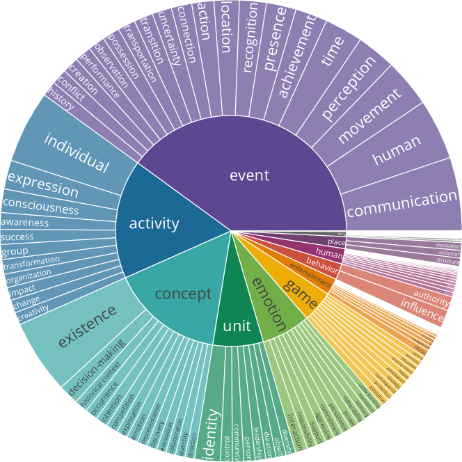

# MARS：通过多任务评估数据集，衡量语言模型在形而上学推理上的能力

发布时间：2024年06月04日

`Agent

这篇论文主要探讨了如何赋予大型语言模型（LLMs）以意识主体的身份，并具备泛化推理能力，特别是在理解环境因素或其他主体行动引发的分布变化（过渡）的能力。论文提出了一种新的判别过程（MARS），并推出了相应的基准数据集来评估LLMs在这方面的能力。这一研究方向更偏向于Agent的范畴，因为它关注的是模型作为智能主体如何理解和适应环境变化，以及如何进行推理。因此，这篇论文应归类于Agent。` `人工智能` `推理能力`

> MARS: Benchmarking the Metaphysical Reasoning Abilities of Language Models with a Multi-task Evaluation Dataset

# 摘要

> 为了赋予大型语言模型（LLMs）以意识主体的身份，具备泛化推理能力，关键在于它们需要拥有理解环境因素或其他主体行动引发的分布变化（过渡）的推理能力。尽管这一能力至关重要，但由于建模无限可能变化及其分布的复杂性，以及缺乏包含情境过渡的基准数据，这一领域仍未得到充分探索。为此，我们提出了一种新颖的三步判别过程，称为MetAphysical ReaSoning（MARS），用以形式化分布变化推理。我们随之推出了首个此类基准MARS，包含三个任务，分别评估LLMs在推理行动变化、变化行动引起的态以及行动变化驱动的情境过渡的可行性。对20种不同规模和技术的（L）LMs的广泛评估显示，这些任务对最先进的LLMs和微调后的LMs都构成了挑战。进一步分析揭示了LLMs表现不佳的原因，并指出在大型概念分类法上预训练可能有助于提升其形而上推理能力。我们的数据和模型已在https://github.com/HKUST-KnowComp/MARS公开发布。

> To enable Large Language Models (LLMs) to function as conscious agents with generalizable reasoning capabilities, it is crucial that they possess the reasoning ability to comprehend situational changes (transitions) in distribution triggered by environmental factors or actions from other agents. Despite its fundamental significance, this ability remains underexplored due to the complexity of modeling infinite possible changes in an event and their associated distributions, coupled with the lack of benchmark data with situational transitions. Addressing these gaps, we propose a novel formulation of reasoning with distributional changes as a three-step discriminative process, termed as MetAphysical ReaSoning. We then introduce the first-ever benchmark, MARS, comprising three tasks corresponding to each step. These tasks systematically assess LLMs' capabilities in reasoning the plausibility of (i) changes in actions, (ii) states caused by changed actions, and (iii) situational transitions driven by changes in action. Extensive evaluations with 20 (L)LMs of varying sizes and methods indicate that all three tasks in this process pose significant challenges, even for state-of-the-art LLMs and LMs after fine-tuning. Further analyses reveal potential causes for the underperformance of LLMs and demonstrate that pre-training them on large-scale conceptualization taxonomies can potentially enhance their metaphysical reasoning capabilities. Our data and models are publicly accessible at https://github.com/HKUST-KnowComp/MARS.

[Arxiv](https://arxiv.org/abs/2406.02106)