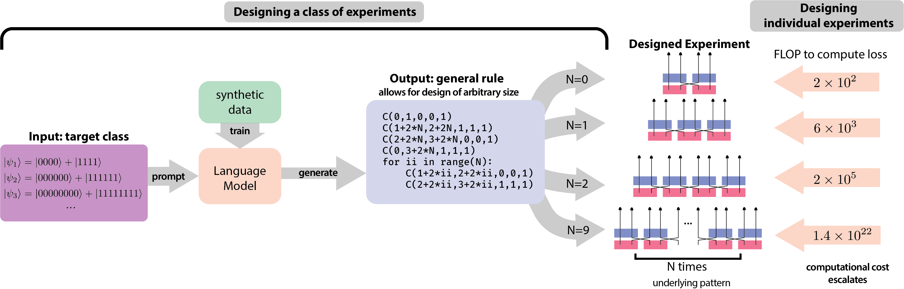
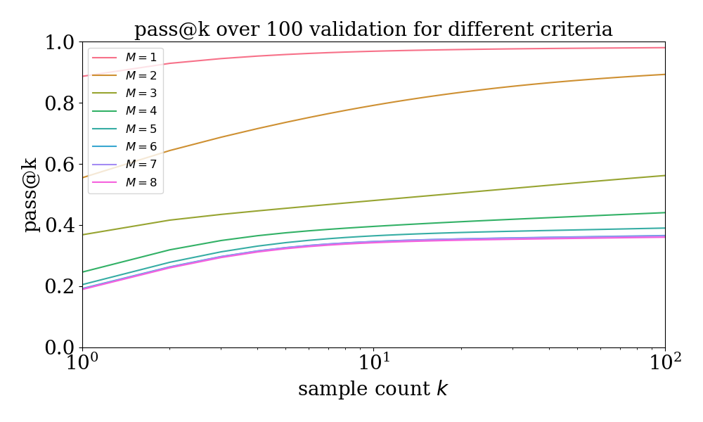
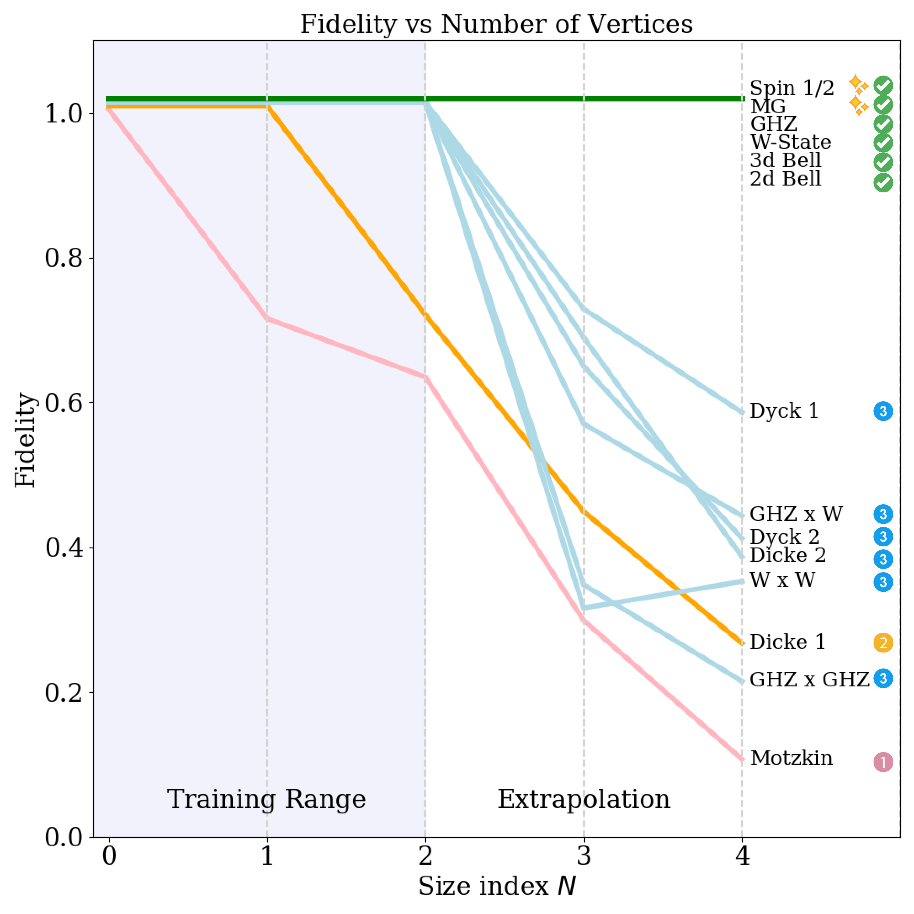
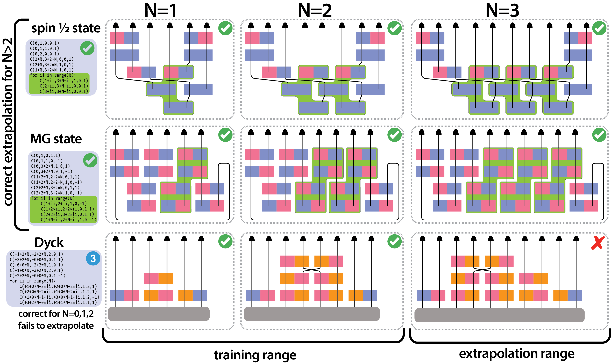

# 语言模型助力量子实验的元设计探索

发布时间：2024年06月04日

`Agent

这篇论文探讨了如何使用合成数据训练的代码生成语言模型来解决科学问题，并揭示背后的设计原则。它特别关注了量子物理实验设计领域，并展示了模型如何生成可解释的Python代码来描述整个量子系统类别的实验蓝图。这种方法不仅解决了特定问题，还创造了解决整个问题类别的元解决方案，并揭示了新的通用设计规则。这与Agent的分类相符，因为论文描述了一个智能系统（Agent）如何通过生成代码来辅助科学发现，并探索了其背后的原理。` `量子物理` `科学发现`

> Meta-Designing Quantum Experiments with Language Models

# 摘要

> 人工智能（AI）通过探索人类难以触及的解决方案，正推动着科学发现的边界。然而，这些超越常人的解决方案往往深奥难懂，揭示其背后的原理更是难上加难。本文展示了如何利用合成数据训练的代码生成语言模型，不仅解决特定问题，更能创造出一次性解决整个问题类别的元解决方案，并揭示其背后的设计原则。特别是在量子物理实验设计领域，我们的序列到序列转换器架构生成了描述整个量子系统类别实验蓝图的可解释Python代码。我们揭示了适用于无限量子状态类别的全新通用设计规则。这一自动生成可读计算机代码中通用模式的能力，是实现机器辅助科学发现的关键一步，也是物理学的核心追求之一。

> Artificial Intelligence (AI) has the potential to significantly advance scientific discovery by finding solutions beyond human capabilities. However, these super-human solutions are often unintuitive and require considerable effort to uncover underlying principles, if possible at all. Here, we show how a code-generating language model trained on synthetic data can not only find solutions to specific problems but can create meta-solutions, which solve an entire class of problems in one shot and simultaneously offer insight into the underlying design principles. Specifically, for the design of new quantum physics experiments, our sequence-to-sequence transformer architecture generates interpretable Python code that describes experimental blueprints for a whole class of quantum systems. We discover general and previously unknown design rules for infinitely large classes of quantum states. The ability to automatically generate generalized patterns in readable computer code is a crucial step toward machines that help discover new scientific understanding -- one of the central aims of physics.

[Arxiv](https://arxiv.org/abs/2406.02470)