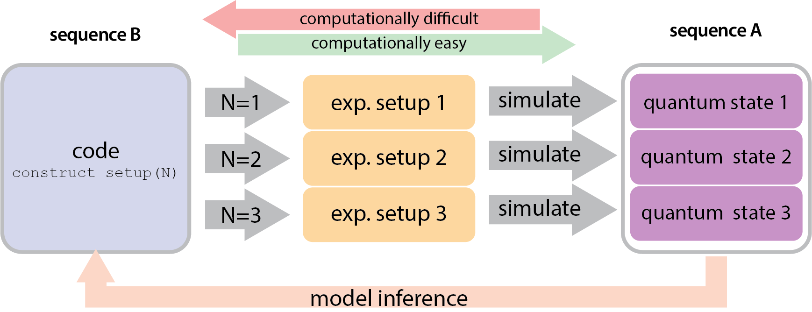

# 语言模型助力量子实验的元设计探索

发布时间：2024年06月04日

`Agent

这篇论文探讨了如何利用基于合成数据训练的代码生成语言模型来解决科学问题，并创造出元解决方案，揭示问题背后的设计原则。这种方法不仅限于解决单一问题，而是能够一次性解决整个问题类别，这在设计新型量子物理实验时尤为突出。通过生成可读的Python代码，该模型能够描绘出整个量子系统类别的实验蓝图，并揭示新的设计规则。这种能力是实现机器辅助科学发现的关键，因此，这篇论文更符合Agent分类，因为它描述了一个能够自主解决问题并辅助科学发现的智能系统。` `量子物理` `科学发现`

> Meta-Designing Quantum Experiments with Language Models

# 摘要

> 人工智能（AI）通过发现超越人类能力的解决方案，有望大幅推动科学进步。然而，这些超人解决方案往往难以直观理解，揭示其背后的原理更是难上加难。本文展示了如何利用基于合成数据训练的代码生成语言模型，不仅解决特定问题，还能创造出元解决方案，一次性解决整个问题类别，并揭示其背后的设计原则。特别是在设计新型量子物理实验时，我们的序列到序列转换器架构能生成可读的Python代码，描绘出整个量子系统类别的实验蓝图，揭示了无限大量量子状态的全新设计规则。这种自动生成可读代码中通用模式的能力，是实现机器辅助科学发现的关键一步，也是物理学的核心追求之一。

> Artificial Intelligence (AI) has the potential to significantly advance scientific discovery by finding solutions beyond human capabilities. However, these super-human solutions are often unintuitive and require considerable effort to uncover underlying principles, if possible at all. Here, we show how a code-generating language model trained on synthetic data can not only find solutions to specific problems but can create meta-solutions, which solve an entire class of problems in one shot and simultaneously offer insight into the underlying design principles. Specifically, for the design of new quantum physics experiments, our sequence-to-sequence transformer architecture generates interpretable Python code that describes experimental blueprints for a whole class of quantum systems. We discover general and previously unknown design rules for infinitely large classes of quantum states. The ability to automatically generate generalized patterns in readable computer code is a crucial step toward machines that help discover new scientific understanding -- one of the central aims of physics.

[Arxiv](https://arxiv.org/abs/2406.02470)