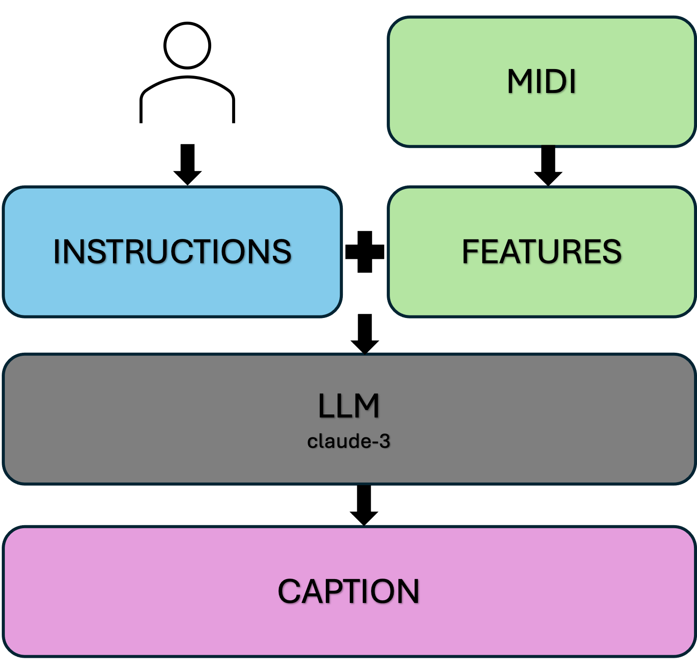
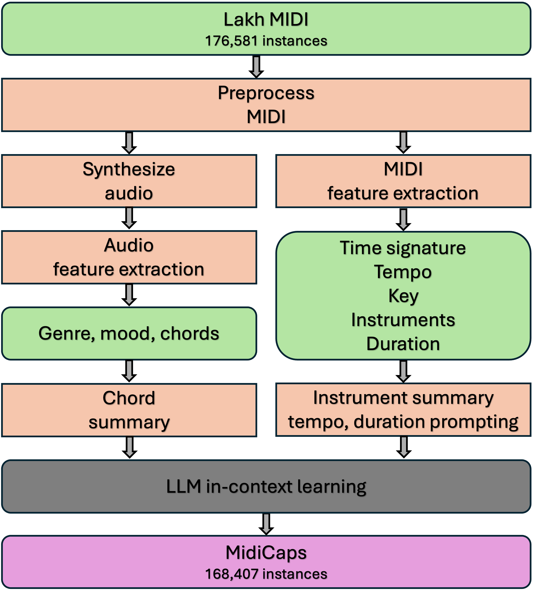
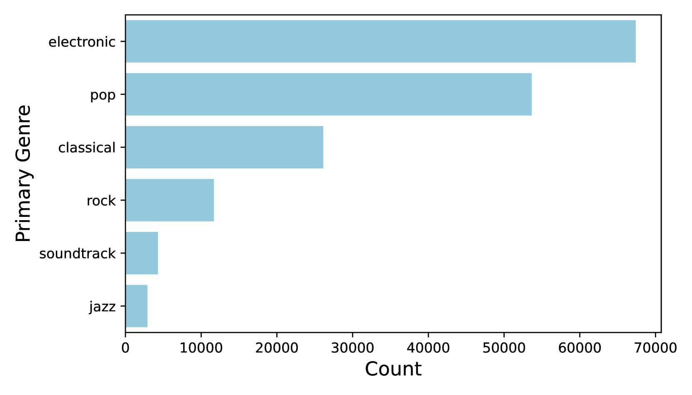
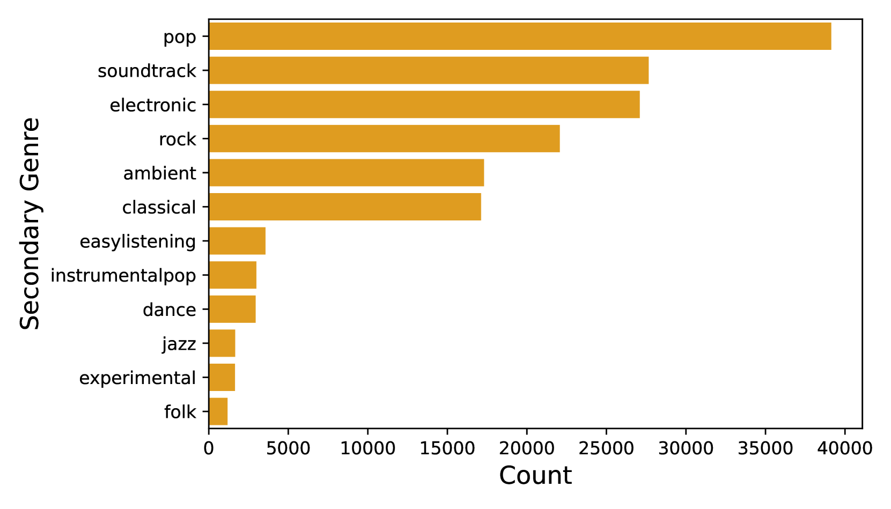
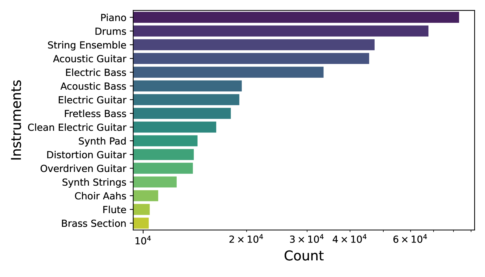
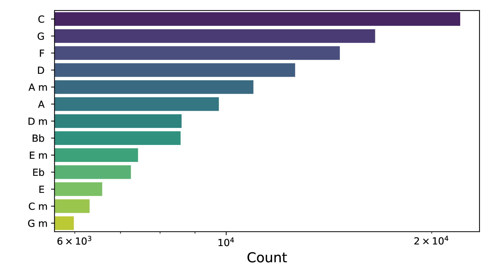
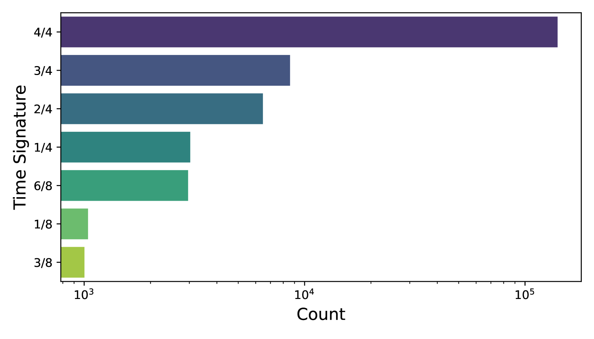
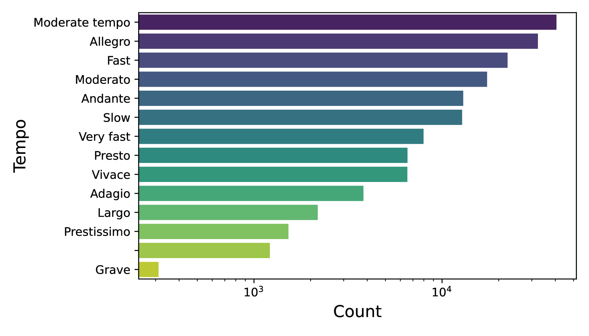

# MidiCaps - 大型MIDI数据集，附带文本描述，为音乐与文本的结合研究提供了丰富的资源。

发布时间：2024年06月04日

`RAG

理由：这篇论文主要介绍了首个大规模、公开的带文本标注的MIDI数据集——MidiCaps，旨在推动大型语言模型（LLMs）与符号音乐的结合研究。这个数据集的创建是为了支持多模态研究，特别是在文本引导的生成模型领域，这与RAG（Retrieval-Augmented Generation）模型的应用场景相吻合，因为RAG模型是一种结合了检索和生成能力的模型，适用于处理多模态数据和跨领域的任务。因此，这篇论文更适合归类于RAG。`

> MidiCaps -- A large-scale MIDI dataset with text captions

# 摘要

> 文本引导的生成模型日益流行，但文本到MIDI的转换模型尚不存在，主要原因是缺乏带标注的MIDI数据集。为此，我们推出了首个大规模、公开的带文本标注的MIDI数据集——MidiCaps，旨在推动LLMs与符号音乐的结合研究。MIDI文件因其结构化格式能捕捉音乐细节，被广泛应用于音乐创作与分析。借鉴跨领域的标注技术进展，我们精选了超过168,000个MIDI文件，每个都配有详尽的文本描述，涵盖速度、和弦、拍号、乐器、风格及情绪等要素，支持多模态研究。该数据集涵盖多样风格与复杂度，为音乐信息检索、理解和跨模态翻译等任务提供丰富资源。我们详细统计了数据集，并通过听觉研究确保标注质量。期待这一资源能激发音乐与自然语言处理领域的深入研究，促进双方技术的发展。

> Generative models guided by text prompts are increasingly becoming more popular. However, no text-to-MIDI models currently exist, mostly due to the lack of a captioned MIDI dataset. This work aims to enable research that combines LLMs with symbolic music by presenting the first large-scale MIDI dataset with text captions that is openly available: MidiCaps. MIDI (Musical Instrument Digital Interface) files are a widely used format for encoding musical information. Their structured format captures the nuances of musical composition and has practical applications by music producers, composers, musicologists, as well as performers. Inspired by recent advancements in captioning techniques applied to various domains, we present a large-scale curated dataset of over 168k MIDI files accompanied by textual descriptions. Each MIDI caption succinctly describes the musical content, encompassing tempo, chord progression, time signature, instruments present, genre and mood; thereby facilitating multi-modal exploration and analysis. The dataset contains a mix of various genres, styles, and complexities, offering a rich source for training and evaluating models for tasks such as music information retrieval, music understanding and cross-modal translation. We provide detailed statistics about the dataset and have assessed the quality of the captions in an extensive listening study. We anticipate that this resource will stimulate further research in the intersection of music and natural language processing, fostering advancements in both fields.

[Arxiv](https://arxiv.org/abs/2406.02255)