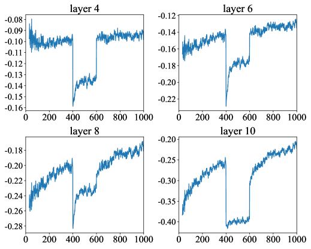

# 通过单一维度扩展，缓解大型语言模型中的位置偏差问题

发布时间：2024年06月04日

`LLM理论

这篇论文主要探讨了大型语言模型（LLMs）中的位置偏差问题，并提出了一种新的方法来缓解这一问题。论文通过分析注意力权重和因果注意力掩码对位置偏差的影响，提出了一种调整位置隐藏状态的方法来改善模型的性能。这一研究聚焦于LLMs的理论层面，特别是在模型内部机制和性能优化方面，因此属于LLM理论分类。` `机器学习`

> Mitigate Position Bias in Large Language Models via Scaling a Single Dimension

# 摘要

> 大型语言模型（LLMs）凭借其出色的泛化与生成能力，在多个实际应用场景中大放异彩。但它们存在“中间迷失”的位置偏差问题，尤其在处理长上下文时更为突出，揭示了关键信息在提示中的位置对准确性有着重大影响。本文深入分析了位置偏差的微观表现，指出注意力权重是其微观体现，并发现因果注意力掩码通过生成特定位置的隐藏状态，也是位置偏差的成因之一。据此，我们提出了一种通过调整位置隐藏状态来缓解位置偏差的新方法。在多个任务和模型上的实验验证了该方法的有效性，最高可提升性能15.2%。相关代码已公开，详情请访问https://aka.ms/PositionalHidden。

> Large Language Models (LLMs) are increasingly applied in various real-world scenarios due to their excellent generalization capabilities and robust generative abilities. However, they exhibit position bias, also known as "lost in the middle", a phenomenon that is especially pronounced in long-context scenarios, which indicates the placement of the key information in different positions of a prompt can significantly affect accuracy. This paper first explores the micro-level manifestations of position bias, concluding that attention weights are a micro-level expression of position bias. It further identifies that, in addition to position embeddings, causal attention mask also contributes to position bias by creating position-specific hidden states. Based on these insights, we propose a method to mitigate position bias by scaling this positional hidden states. Experiments on the NaturalQuestions Multi-document QA, KV retrieval, LongBench and timeline reorder tasks, using various models including RoPE models, context windowextended models, and Alibi models, demonstrate the effectiveness and generalizability of our approach. Our method can improve performance by up to 15.2% by modifying just one dimension of hidden states. Our code is available at https://aka.ms/PositionalHidden.

[Arxiv](https://arxiv.org/abs/2406.02536)