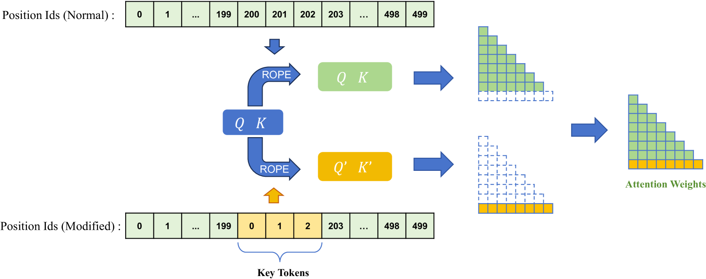

# 通过单一维度扩展，缓解大型语言模型中的位置偏差

发布时间：2024年06月04日

`LLM应用

这篇论文主要探讨了大型语言模型（LLMs）在处理长上下文时存在的位置偏差问题，并提出了一种通过调整位置隐藏状态来缓解这种偏差的方法。论文通过实验验证了该方法在多文档问答、KV检索、LongBench和时间线重排等多项任务中的有效性，并公开了相关代码。因此，这篇论文更偏向于LLM在实际应用中的问题解决和优化，属于LLM应用分类。` `问答系统` `信息检索`

> Mitigate Position Bias in Large Language Models via Scaling a Single Dimension

# 摘要

> 大型语言模型（LLMs）凭借其卓越的泛化与生成能力，在众多实际应用中大放异彩。但它们存在“中间迷失”的位置偏差，尤其在处理长上下文时，关键信息的位置对准确性影响显著。本文深入分析了位置偏差的微观表现，揭示了注意力权重是其微观体现，并指出因果注意力掩码通过生成特定位置的隐藏状态加剧了这一偏差。为此，我们提出了一种通过调整位置隐藏状态来缓解偏差的新方法。实验涵盖了多文档问答、KV检索、LongBench和时间线重排等多项任务，使用了RoPE、上下文窗口扩展及Alibi等多种模型，结果显示我们的方法能将性能提升高达15.2%，且代码已公开于https://aka.ms/PositionalHidden。

> Large Language Models (LLMs) are increasingly applied in various real-world scenarios due to their excellent generalization capabilities and robust generative abilities. However, they exhibit position bias, also known as "lost in the middle", a phenomenon that is especially pronounced in long-context scenarios, which indicates the placement of the key information in different positions of a prompt can significantly affect accuracy. This paper first explores the micro-level manifestations of position bias, concluding that attention weights are a micro-level expression of position bias. It further identifies that, in addition to position embeddings, causal attention mask also contributes to position bias by creating position-specific hidden states. Based on these insights, we propose a method to mitigate position bias by scaling this positional hidden states. Experiments on the NaturalQuestions Multi-document QA, KV retrieval, LongBench and timeline reorder tasks, using various models including RoPE models, context windowextended models, and Alibi models, demonstrate the effectiveness and generalizability of our approach. Our method can improve performance by up to 15.2% by modifying just one dimension of hidden states. Our code is available at https://aka.ms/PositionalHidden.

[Arxiv](https://arxiv.org/abs/2406.02536)