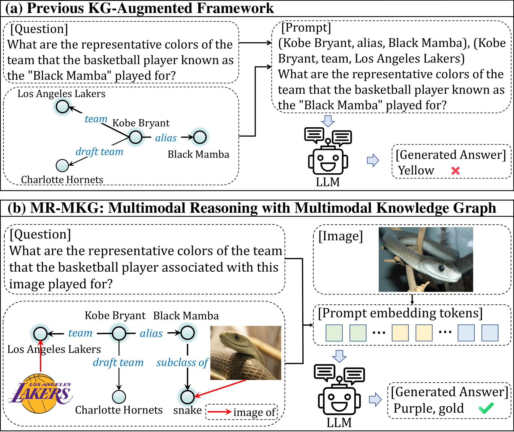
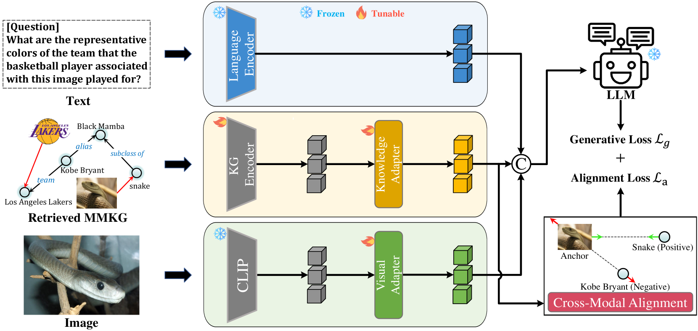
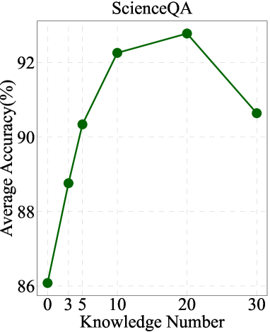
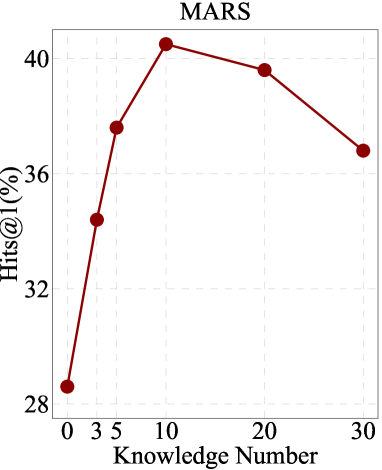
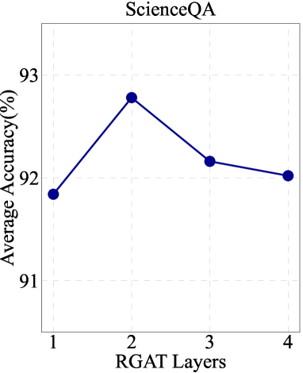
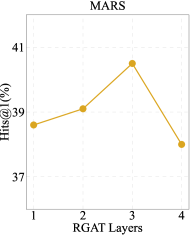
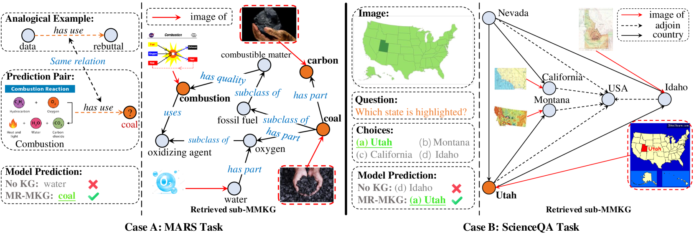
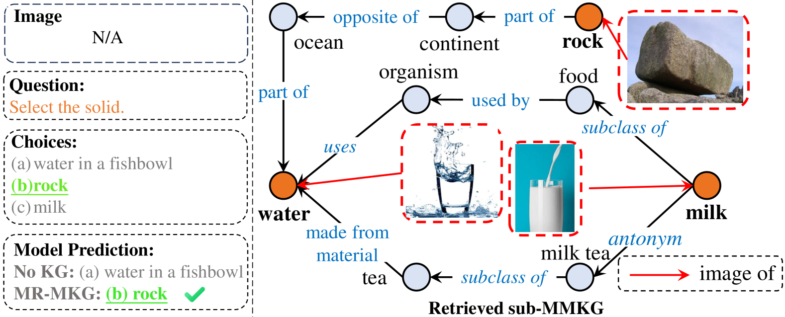
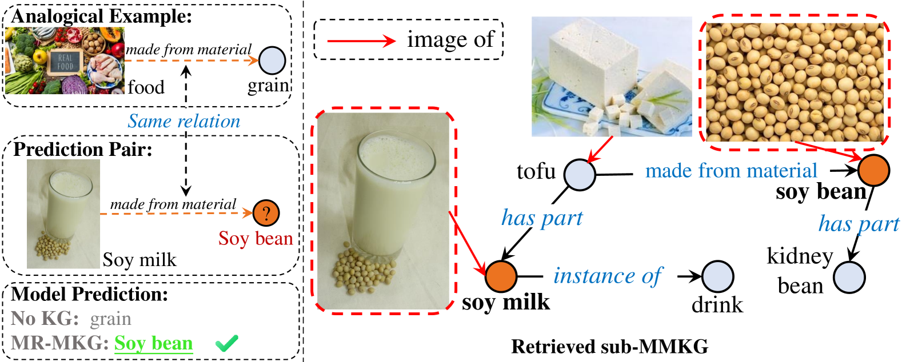
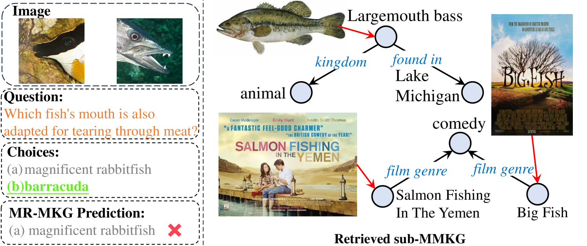

# 融合多模态知识图谱的推理探索

发布时间：2024年06月04日

`LLM应用

这篇论文摘要描述了一种新的方法——多模态推理与多模态知识图谱（MR-MKG），旨在通过利用多模态知识图谱（MMKGs）来增强大型语言模型（LLMs）在多模态推理中的能力。这种方法通过关系图注意力网络编码MMKGs，并设计了跨模态对齐模块来优化图像与文本的匹配。论文中提到，通过预训练基于MMKG的数据集，LLMs在多模态推理方面取得了显著的进步。这种方法的应用性质明显，因为它专注于提升LLMs在特定任务（如多模态问答和类比推理）中的性能，而不是探讨LLMs的理论基础或Agent的设计。因此，这篇论文最适合归类为LLM应用。` `多模态推理` `问答系统`

> Multimodal Reasoning with Multimodal Knowledge Graph

# 摘要

> 大型语言模型（LLMs）在多模态推理中常受幻觉和知识陈旧之苦。尽管有方法尝试通过文本知识图谱来缓解，但单一模态的知识限制了跨模态理解的深度。为此，我们提出了多模态推理与多模态知识图谱（MR-MKG）方法，利用多模态知识图谱（MMKGs）深化跨模态知识学习，大幅提升LLMs的多模态推理能力。我们采用关系图注意力网络编码MMKGs，并设计跨模态对齐模块优化图像与文本的匹配。通过预训练基于MMKG的数据集，LLMs获得了多模态推理的初步能力。令人瞩目的是，MR-MKG在仅训练了极小部分参数（约2.25%）的情况下，便在多模态问答和类比推理任务中超越了现有最佳模型。

> Multimodal reasoning with large language models (LLMs) often suffers from hallucinations and the presence of deficient or outdated knowledge within LLMs. Some approaches have sought to mitigate these issues by employing textual knowledge graphs, but their singular modality of knowledge limits comprehensive cross-modal understanding. In this paper, we propose the Multimodal Reasoning with Multimodal Knowledge Graph (MR-MKG) method, which leverages multimodal knowledge graphs (MMKGs) to learn rich and semantic knowledge across modalities, significantly enhancing the multimodal reasoning capabilities of LLMs. In particular, a relation graph attention network is utilized for encoding MMKGs and a cross-modal alignment module is designed for optimizing image-text alignment. A MMKG-grounded dataset is constructed to equip LLMs with initial expertise in multimodal reasoning through pretraining. Remarkably, MR-MKG achieves superior performance while training on only a small fraction of parameters, approximately 2.25% of the LLM's parameter size. Experimental results on multimodal question answering and multimodal analogy reasoning tasks demonstrate that our MR-MKG method outperforms previous state-of-the-art models.

[Arxiv](https://arxiv.org/abs/2406.02030)