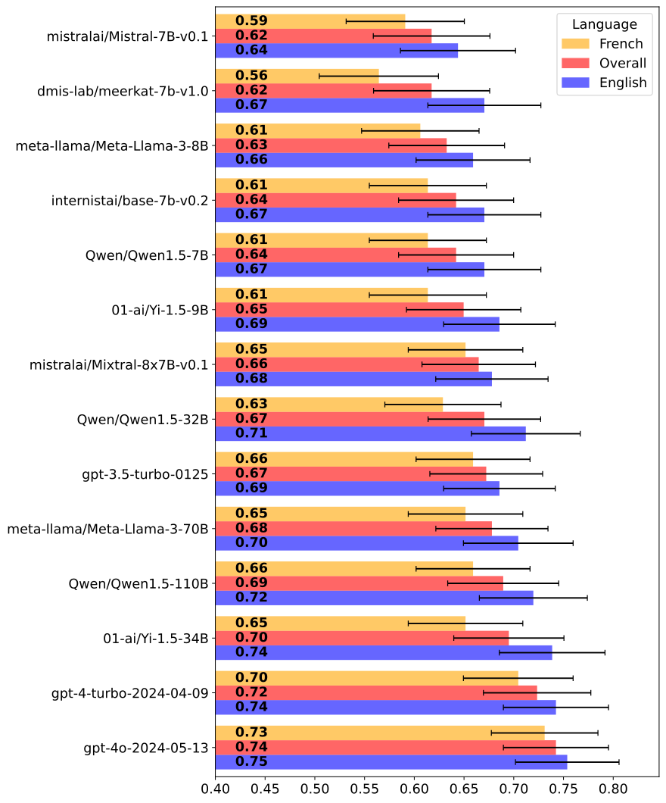
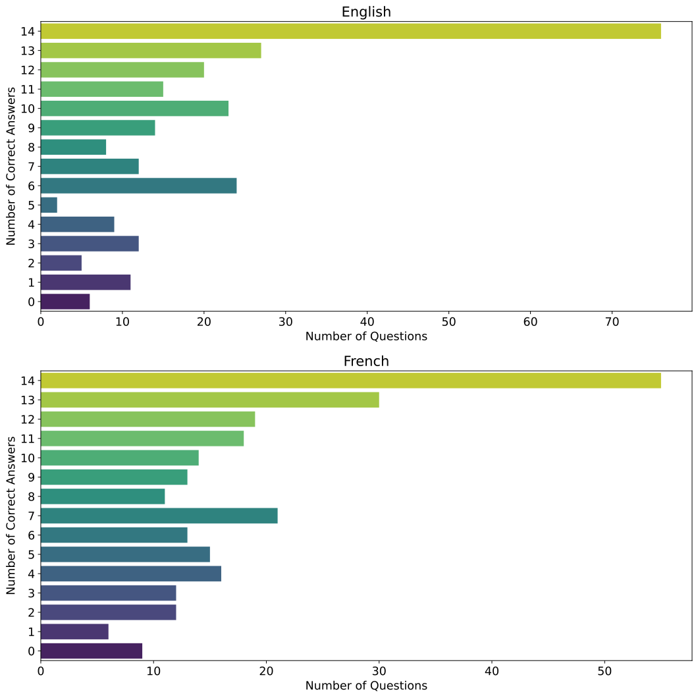

# 大型语言模型在多项选择题中的应用：一项虚构医疗数据的案例研究

发布时间：2024年06月04日

`LLM应用

这篇论文探讨了大型语言模型（LLMs）在医疗领域的应用，特别是在通过虚构的医学基准来评估这些模型的知识和应试技巧。研究通过创建一个关于非真实腺体Glianorex的英法双语教科书和相应的多项选择题（MCQs），来评估不同LLMs的表现。这种方法旨在区分LLM的知识与应试技巧，并揭示了传统MCQ基准可能无法准确反映LLMs的临床知识和推理能力，而是突显了其模式识别能力。因此，这项工作属于LLM应用的范畴，因为它关注的是LLMs在特定领域（医疗）的应用和评估方法的改进。`

> Multiple Choice Questions and Large Languages Models: A Case Study with Fictional Medical Data

# 摘要

> ChatGPT等大型语言模型（LLMs）在医疗领域的潜力巨大，常通过类似USMLE的多项选择题（MCQs）进行评估。尽管MCQs在医学教育中普遍，但在评估LLMs时，其局限性可能更为显著。为此，我们创造了一个虚构的医学基准，专注于一个名为Glianorex的非真实腺体，以此来区分LLM的知识与应试技巧。我们利用GPT-4编写了关于Glianorex的英法双语教科书，并设计了相应的双语MCQs。在零-shot环境下，我们评估了多种LLMs，包括开源、专有及特定领域的模型，平均得分约67%，英语表现略优于法语。经过医学微调的模型在英语中有所提升，但在法语中未见明显改进。所有模型的高分表明，传统MCQ基准可能无法准确反映LLMs的临床知识和推理能力，而是突显了其模式识别能力。这提示我们需要更精准的评估方法，以深入了解LLMs在医疗领域的实际能力。

> Large Language Models (LLMs) like ChatGPT demonstrate significant potential in the medical field, often evaluated using multiple-choice questions (MCQs) similar to those found on the USMLE. Despite their prevalence in medical education, MCQs have limitations that might be exacerbated when assessing LLMs. To evaluate the effectiveness of MCQs in assessing the performance of LLMs, we developed a fictional medical benchmark focused on a non-existent gland, the Glianorex. This approach allowed us to isolate the knowledge of the LLM from its test-taking abilities. We used GPT-4 to generate a comprehensive textbook on the Glianorex in both English and French and developed corresponding multiple-choice questions in both languages. We evaluated various open-source, proprietary, and domain-specific LLMs using these questions in a zero-shot setting. The models achieved average scores around 67%, with minor performance differences between larger and smaller models. Performance was slightly higher in English than in French. Fine-tuned medical models showed some improvement over their base versions in English but not in French. The uniformly high performance across models suggests that traditional MCQ-based benchmarks may not accurately measure LLMs' clinical knowledge and reasoning abilities, instead highlighting their pattern recognition skills. This study underscores the need for more robust evaluation methods to better assess the true capabilities of LLMs in medical contexts.

[Arxiv](https://arxiv.org/abs/2406.02394)