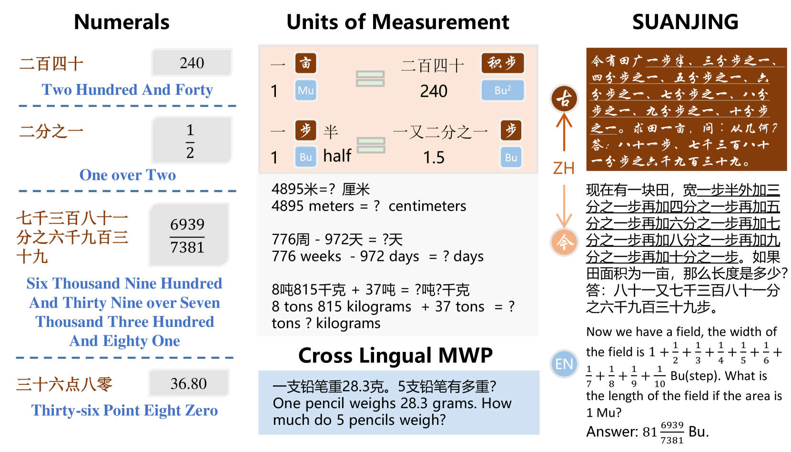
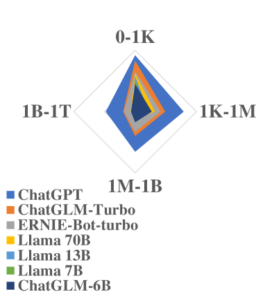
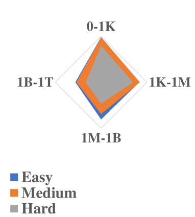
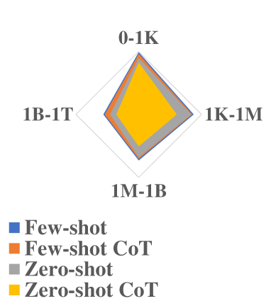
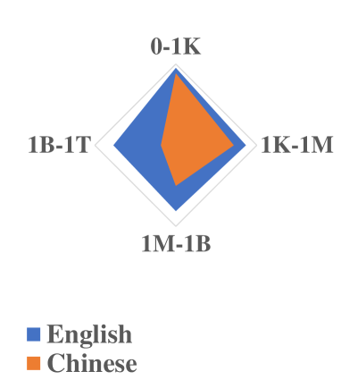
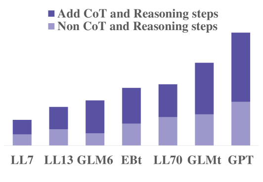
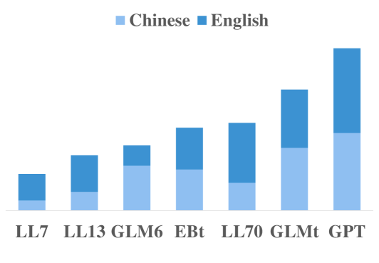
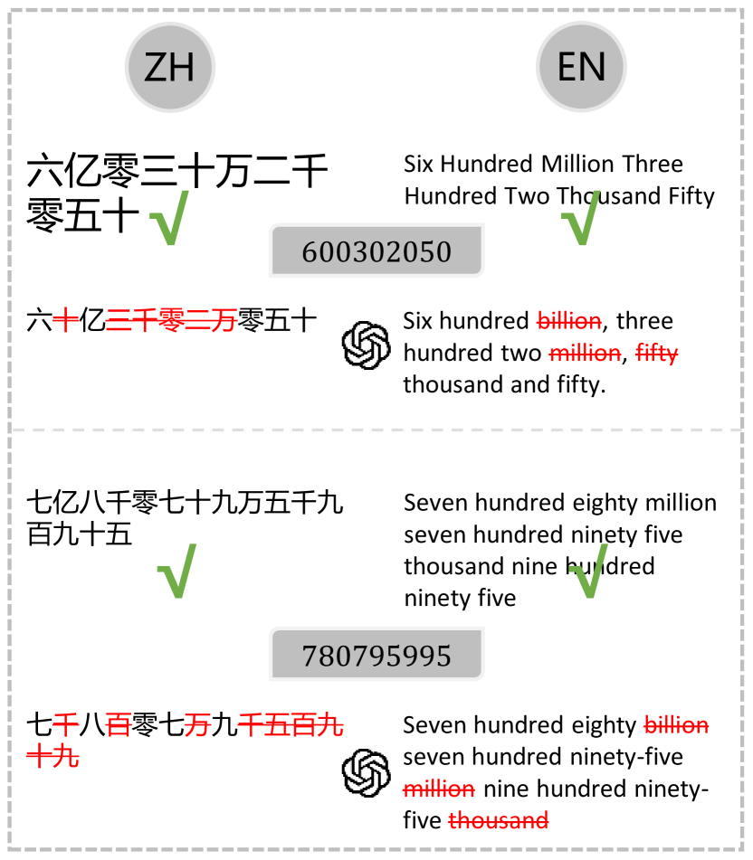
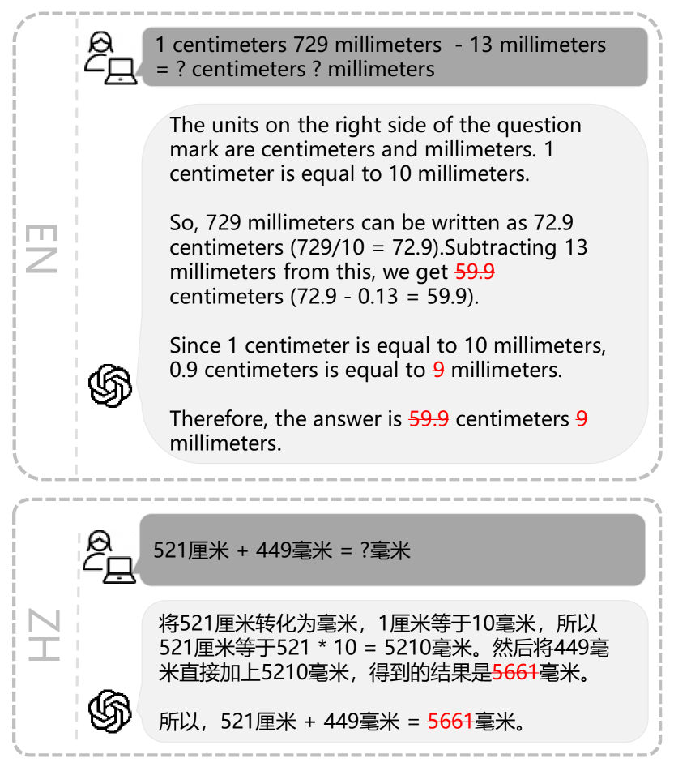
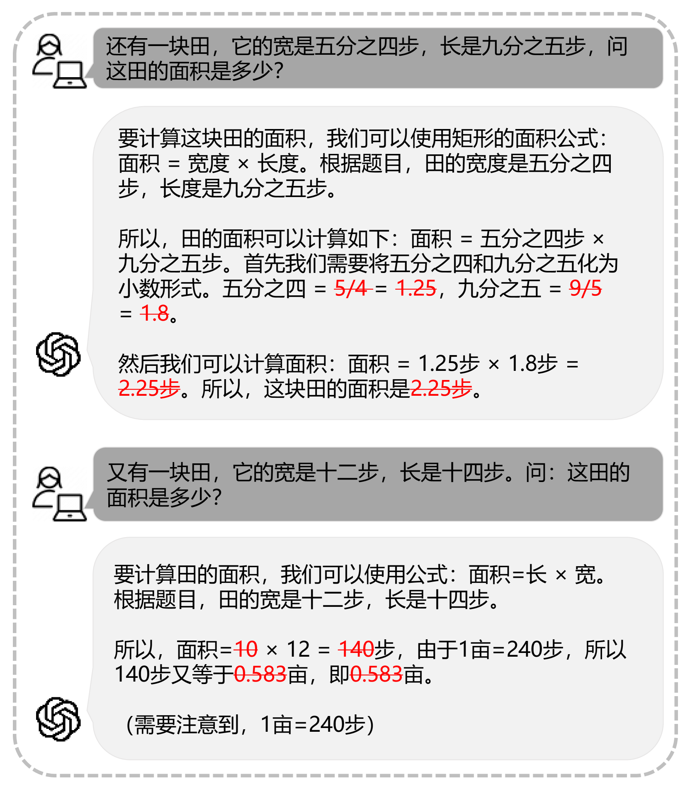

# NUMCoT：大型语言模型在思维链推理中处理数字与测量单位的应用

发布时间：2024年06月04日

`LLM理论

这篇论文主要关注大型语言模型（LLMs）在处理数字和测量单位时的性能和挑战，特别是在数学推理任务中。论文通过构建扰动数据集和分析模型在特定类型问题上的表现，深入探讨了LLMs的理论性能和局限性。这种研究属于对LLM理论层面的探讨，因为它不仅评估了模型的实际应用表现，还分析了模型在特定任务上的理论处理能力和限制，这对于理解LLMs的内部机制和改进模型设计具有重要意义。因此，将其归类为LLM理论是合适的。` `人工智能`

> NUMCoT: Numerals and Units of Measurement in Chain-of-Thought Reasoning using Large Language Models

# 摘要

> 数字系统与测量单位，这两个主题在人类活动中紧密相连，且与表达它们的语言相互作用。当前，大型语言模型（LLMs）的评估常涉及数学推理，但鲜有人关注数字或单位微小变化如何剧烈影响问题复杂度及模型性能。本文通过构建扰动数据集，深入分析了LLMs在处理数字与测量单位时的表现。首先，我们将数学文字问题的推理细分为多个子过程，包括从语言到数字的转换及基于单位的测量转换。接着，我们特别标注了源自古代中国算术作品的难题，这些题目在数字与测量单位上颇具挑战。实验结果显示，LLMs在应对这些转换时仍显吃力。

> Numeral systems and units of measurement are two conjoined topics in activities of human beings and have mutual effects with the languages expressing them. Currently, the evaluation of Large Language Models (LLMs) often involves mathematical reasoning, yet little attention is given to how minor changes in numbers or units can drastically alter the complexity of problems and the performance of LLMs. In this paper, we scrutinize existing LLMs on processing of numerals and units of measurement by constructing datasets with perturbations. We first anatomize the reasoning of math word problems to different sub-procedures like numeral conversions from language to numbers and measurement conversions based on units. Then we further annotate math word problems from ancient Chinese arithmetic works which are challenging in numerals and units of measurement. Experiments on perturbed datasets demonstrate that LLMs still encounter difficulties in handling numeral and measurement conversions.

[Arxiv](https://arxiv.org/abs/2406.02864)