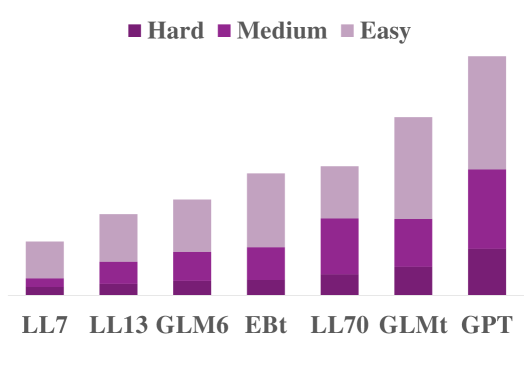

# NUMCoT：利用大型语言模型进行思维链推理，整合数字与测量单位

发布时间：2024年06月04日

`LLM理论

这篇论文主要关注大型语言模型（LLMs）在处理数字和测量单位时的表现，并通过构建扰动数据集来深入分析这些模型在特定任务上的性能。论文的研究重点在于理解LLMs在数学推理中的局限性，特别是在数字和测量单位的转换过程中的表现。这种研究属于对LLM理论的探讨，因为它旨在揭示模型在特定任务上的内在机制和限制，而不是直接应用于实际场景或讨论模型的应用。因此，将其归类为LLM理论是合适的。` `人工智能`

> NUMCoT: Numerals and Units of Measurement in Chain-of-Thought Reasoning using Large Language Models

# 摘要

> 数字系统与测量单位在人类活动中紧密相连，与表达它们的语言相互作用。尽管大型语言模型（LLMs）的评估常涉及数学推理，但鲜有人关注数字或单位微小变化对问题复杂性和模型性能的巨大影响。本文通过构建扰动数据集，深入分析了LLMs在处理数字和测量单位时的表现。我们首先将数学文字问题的推理细分为数字从语言到数字的转换和基于单位的测量转换等子过程。接着，我们特别标注了源自古代中国算术作品的难题，这些作品在数字和测量单位上颇具挑战。实验结果显示，LLMs在应对这些转换时仍显吃力。

> Numeral systems and units of measurement are two conjoined topics in activities of human beings and have mutual effects with the languages expressing them. Currently, the evaluation of Large Language Models (LLMs) often involves mathematical reasoning, yet little attention is given to how minor changes in numbers or units can drastically alter the complexity of problems and the performance of LLMs. In this paper, we scrutinize existing LLMs on processing of numerals and units of measurement by constructing datasets with perturbations. We first anatomize the reasoning of math word problems to different sub-procedures like numeral conversions from language to numbers and measurement conversions based on units. Then we further annotate math word problems from ancient Chinese arithmetic works which are challenging in numerals and units of measurement. Experiments on perturbed datasets demonstrate that LLMs still encounter difficulties in handling numeral and measurement conversions.

[Arxiv](https://arxiv.org/abs/2406.02864)