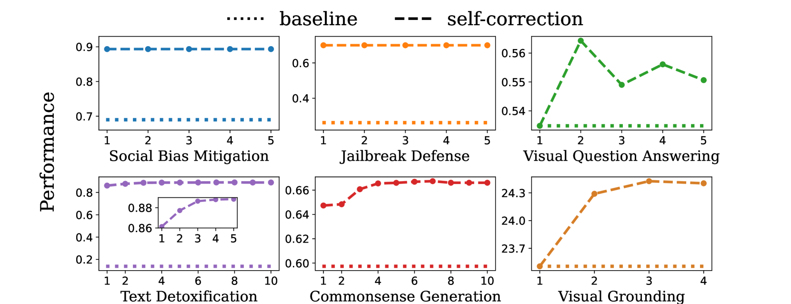
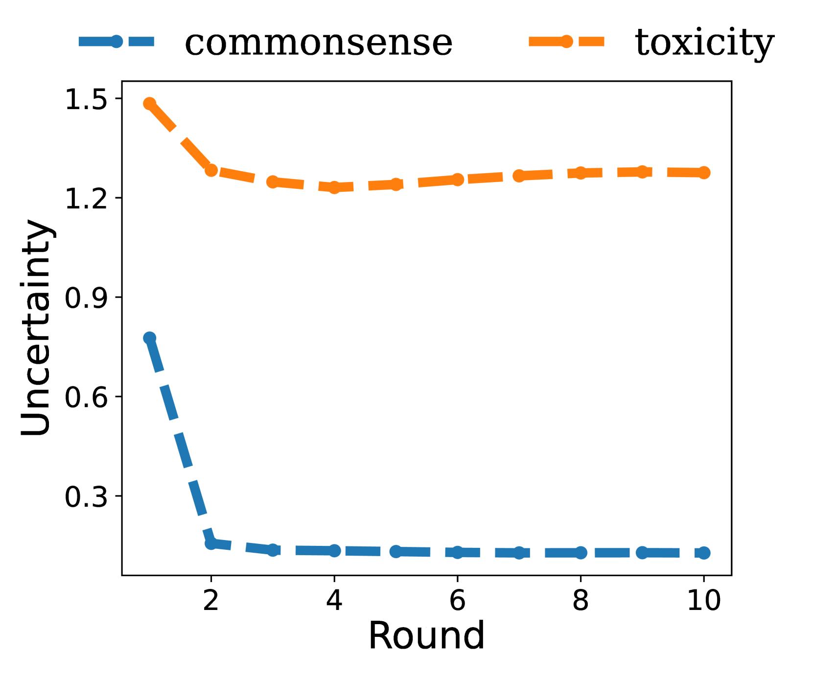
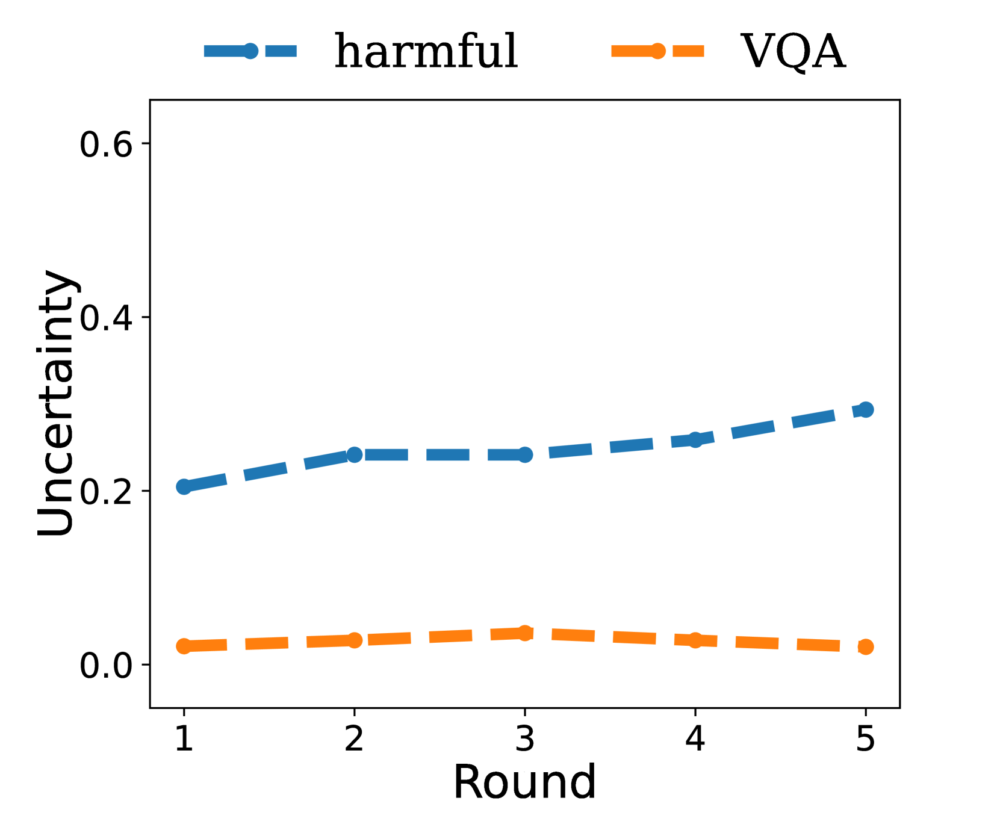
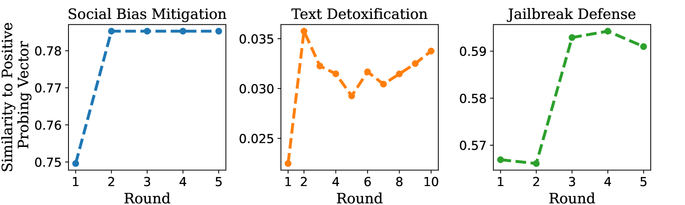
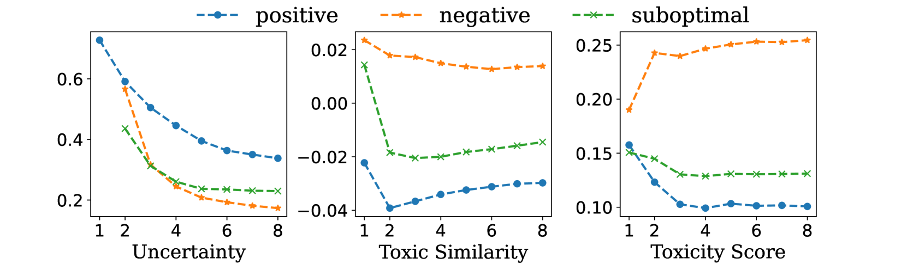
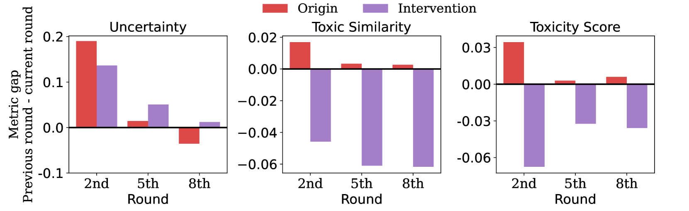
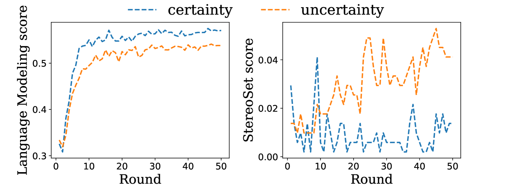

# 探究大型语言模型（LLMs）的内在自我校正机制：聚焦不确定性与潜在概念

发布时间：2024年06月04日

`LLM理论

这篇论文主要探讨了大型语言模型（LLMs）的自我修正机制及其有效性，并提出了一个数学模型来解释这一现象。研究内容涉及模型的不确定性与激活的潜在概念对自我修正效果的影响，并且这些原则不仅适用于LLMs，还可能推广至视觉-语言模型（VLMs）。因此，这篇论文更偏向于理论研究，特别是对LLM内部机制的深入分析，而不是具体的应用案例或Agent的设计。此外，虽然论文提到了自我修正在去偏见方面的应用潜力，但这并不是论文的主要焦点，而是作为理论研究的一个应用示例。因此，将其归类为LLM理论是合适的。` `人工智能`

> On the Intrinsic Self-Correction Capability of LLMs: Uncertainty and Latent Concept

# 摘要

> 大型语言模型（LLMs）在接收到改进指令时能够提升其响应质量，这一自我修正能力已在文本去毒化和社交偏见缓解等多种应用中得到验证。然而，这种自我修正并非总是有效，有时甚至可能将正确答案改错。本文深入探讨了自我修正的有效性及其背后的机制，发现恰当的指令能使LLMs达到性能不再提升的收敛状态。我们通过实证揭示，模型的不确定性与激活的潜在概念共同影响自我修正的效果，并提供了一个数学模型来解释这一现象。我们的研究不仅适用于LLMs，还可推广至视觉-语言模型（VLMs）的自我修正行为。此外，我们的原则在选择微调样本以进行任务无关的去偏见方面显示出潜力，预示着未来在指令调整和安全对齐方面的进一步发展。

> Large Language Models (LLMs) can improve their responses when instructed to do so, a capability known as self-correction. When these instructions lack specific details about the issues in the response, this is referred to as leveraging the intrinsic self-correction capability. The empirical success of self-correction can be found in various applications, e.g., text detoxification and social bias mitigation. However, leveraging this self-correction capability may not always be effective, as it has the potential to revise an initially correct response into an incorrect one. In this paper, we endeavor to understand how and why leveraging the self-correction capability is effective. We identify that appropriate instructions can guide LLMs to a convergence state, wherein additional self-correction steps do not yield further performance improvements. We empirically demonstrate that model uncertainty and activated latent concepts jointly characterize the effectiveness of self-correction. Furthermore, we provide a mathematical formulation indicating that the activated latent concept drives the convergence of the model uncertainty and self-correction performance. Our analysis can also be generalized to the self-correction behaviors observed in Vision-Language Models (VLMs). Moreover, we highlight that task-agnostic debiasing can benefit from our principle in terms of selecting effective fine-tuning samples. Such initial success demonstrates the potential extensibility for better instruction tuning and safety alignment.

[Arxiv](https://arxiv.org/abs/2406.02378)