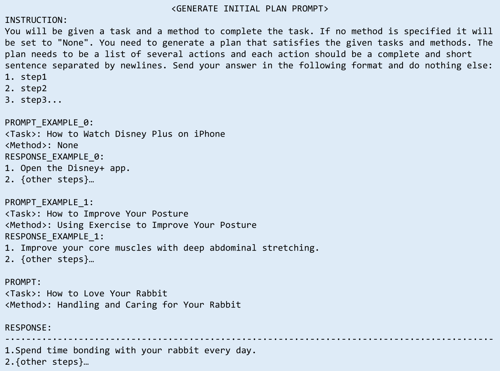
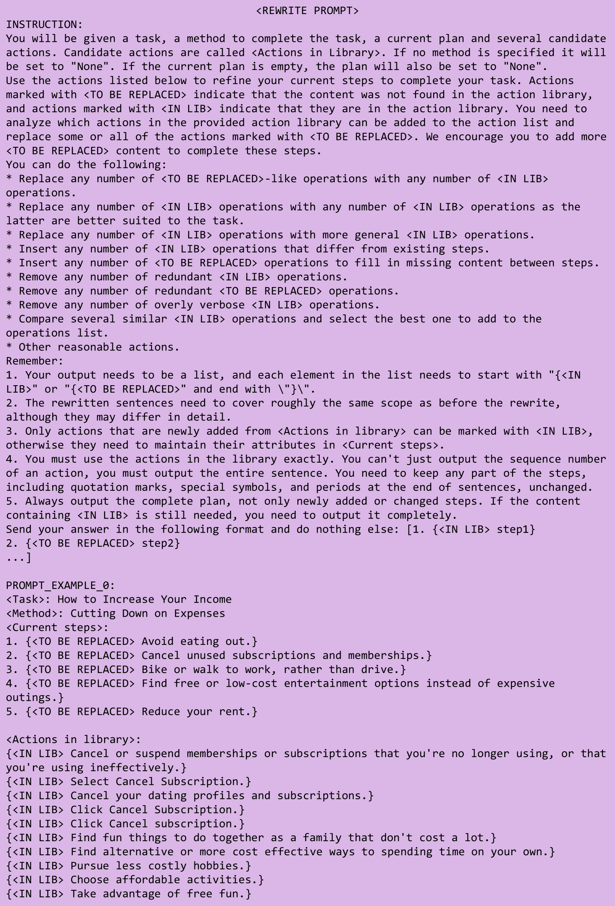

# 开放式基础规划：面临的挑战与基准建设

发布时间：2024年06月04日

`Agent

理由：这篇论文主要探讨了如何利用大型语言模型（LLMs）进行类人规划，特别是在开放性和执行性要求下的规划问题。它提出了一个新的挑战——开放基础规划，并为此设立了基准，测试了不同的规划策略。这个研究方向更偏向于构建能够进行自主规划和决策的智能Agent，因此归类为Agent。` `人工智能` `规划系统`

> Open Grounded Planning: Challenges and Benchmark Construction

# 摘要

> 随着大型语言模型（LLMs）的兴起，人们越来越关注如何利用这些模型进行类人规划。目前，基于LLM的规划研究主要集中在两个方向：一是利用LLMs的语言生成能力自由制定计划，二是通过强化学习在特定环境中优化决策。然而，这两种方法都未能完全满足现实世界规划的开放性和执行性要求。为此，本文提出了一项新的挑战——开放基础规划，旨在让模型根据可变的动作集生成切实可行的计划。我们为此任务设立了一个跨越多领域的基准，并测试了当前顶尖的LLMs及五种规划策略，发现它们在开放领域的基础规划上仍面临挑战。本文不仅为开放基础规划奠定了数据基础，也为未来LLM规划研究指明了方向。

> The emergence of large language models (LLMs) has increasingly drawn attention to the use of LLMs for human-like planning. Existing work on LLM-based planning either focuses on leveraging the inherent language generation capabilities of LLMs to produce free-style plans, or employs reinforcement learning approaches to learn decision-making for a limited set of actions within restricted environments. However, both approaches exhibit significant discrepancies from the open and executable requirements in real-world planning. In this paper, we propose a new planning task--open grounded planning. The primary objective of open grounded planning is to ask the model to generate an executable plan based on a variable action set, thereby ensuring the executability of the produced plan. To this end, we establishes a benchmark for open grounded planning spanning a wide range of domains. Then we test current state-of-the-art LLMs along with five planning approaches, revealing that existing LLMs and methods still struggle to address the challenges posed by grounded planning in open domains. The outcomes of this paper define and establish a foundational dataset for open grounded planning, and shed light on the potential challenges and future directions of LLM-based planning.

[Arxiv](https://arxiv.org/abs/2406.02903)