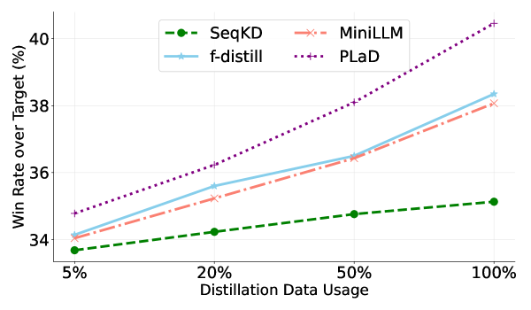

# PLaD：利用伪偏好对进行基于偏好的大型语言模型蒸馏

发布时间：2024年06月04日

`LLM应用

这篇论文探讨了大型语言模型（LLMs）在资源有限环境中的应用限制，并提出了一种新的知识蒸馏（KD）方法——PLaD框架，以解决传统KD在LLMs上应用时遇到的问题。该研究专注于通过蒸馏技术优化LLMs的性能，使其更适合在资源受限的环境中使用，这直接关联到LLMs的实际应用层面。因此，这篇论文应归类于LLM应用。` `人工智能` `模型优化`

> PLaD: Preference-based Large Language Model Distillation with Pseudo-Preference Pairs

# 摘要

> 大型语言模型（LLMs）虽在多任务中表现出色，但其庞大的参数规模限制了其在资源有限环境中的应用。知识蒸馏（KD）技术通过将大型模型的知识转移至小型模型，提供了解决方案。但传统KD在LLMs上应用时，面临输出访问受限、模型容量差距大及校准误差等挑战。为此，我们开发了PLaD框架，一种基于偏好的LLM蒸馏新方法。PLaD巧妙利用模型间的容量差异，生成偏好对，并通过排序损失调整学生模型对序列可能性的评估，使其关注输出质量而非单纯模仿。PLaD无需访问教师模型的内部状态，有效解决了学生模型的表达限制和校准问题。实验证明，PLaD在多个LLMs和序列生成任务上均表现出色。

> Large Language Models (LLMs) have exhibited impressive capabilities in various tasks, yet their vast parameter sizes restrict their applicability in resource-constrained settings. Knowledge distillation (KD) offers a viable solution by transferring expertise from large teacher models to compact student models. However, traditional KD techniques face specific challenges when applied to LLMs, including restricted access to LLM outputs, significant teacher-student capacity gaps, and the inherited mis-calibration issue. In this work, we present PLaD, a novel preference-based LLM distillation framework. PLaD exploits the teacher-student capacity discrepancy to generate pseudo-preference pairs where teacher outputs are preferred over student outputs. Then, PLaD leverages a ranking loss to re-calibrate student's estimation of sequence likelihood, which steers the student's focus towards understanding the relative quality of outputs instead of simply imitating the teacher. PLaD bypasses the need for access to teacher LLM's internal states, tackles the student's expressivity limitations, and mitigates the student mis-calibration issue. Through extensive experiments on two sequence generation tasks and with various LLMs, we demonstrate the effectiveness of our proposed PLaD framework.

[Arxiv](https://arxiv.org/abs/2406.02886)