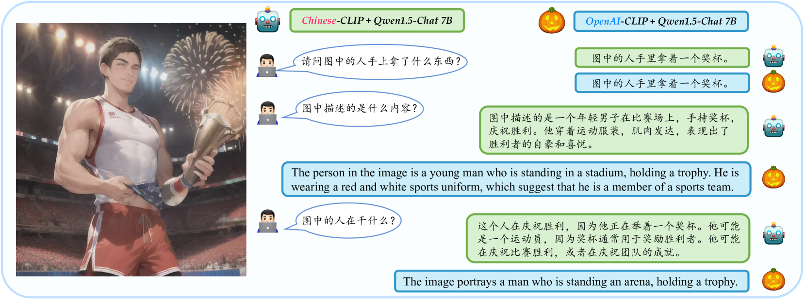
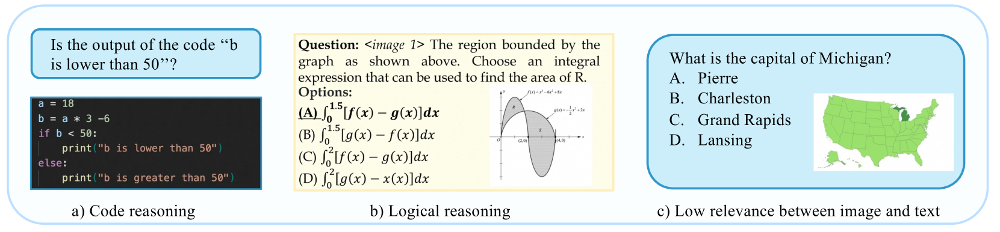
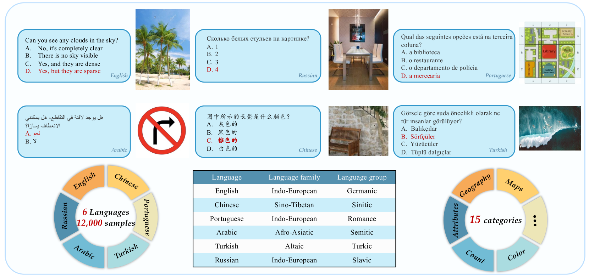
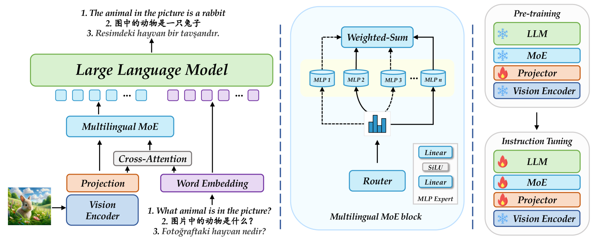
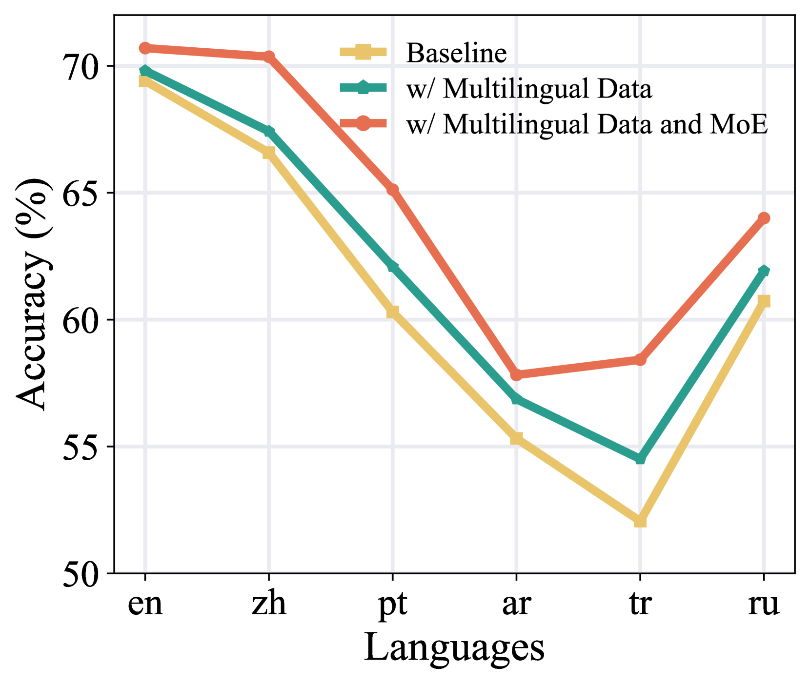
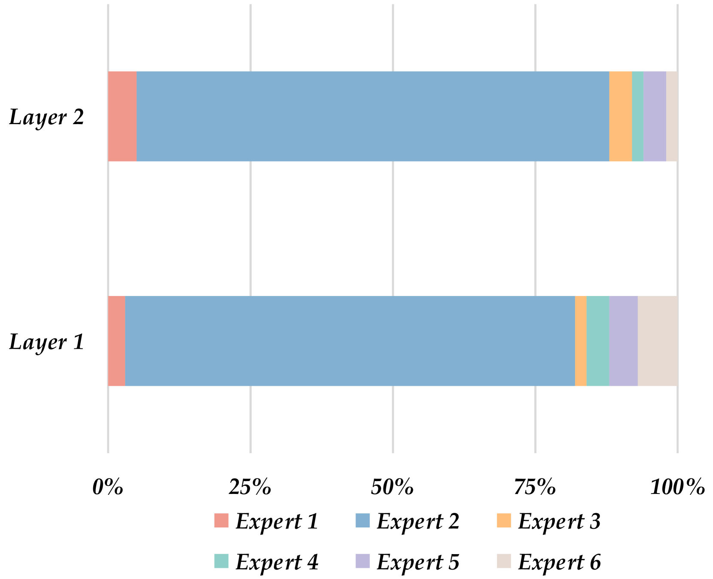
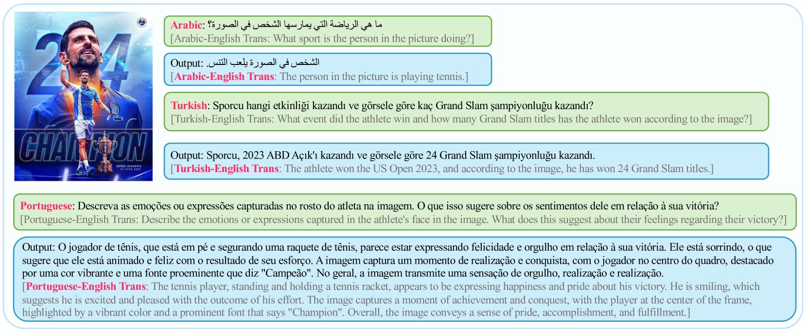
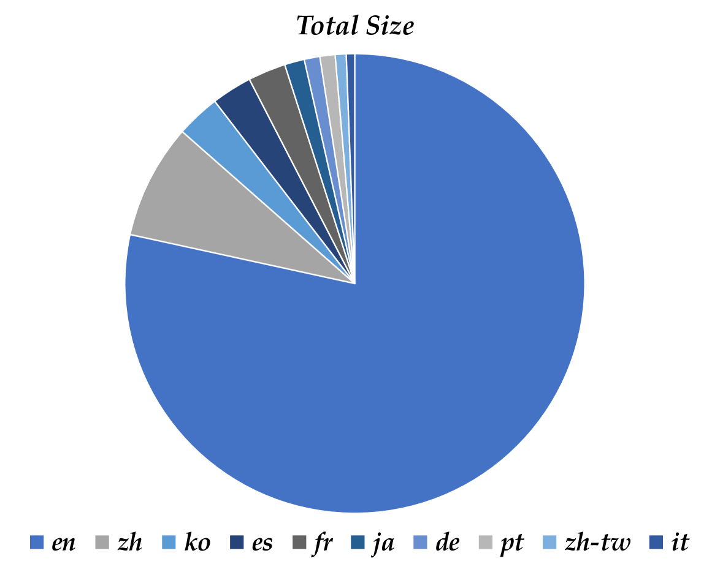
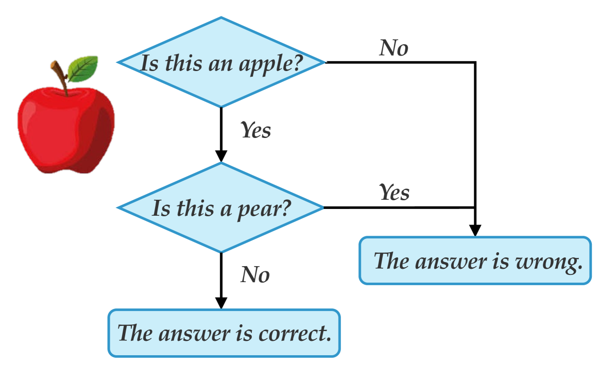

# 鹦鹉计划：多语言视觉指令调优

发布时间：2024年06月04日

`LLM应用

这篇论文主要讨论了如何通过Parrot方法改进多语言大型语言模型（MLLMs）的性能，特别是在多模态任务中对多语言的处理。论文提出了一种新的方法来实现视觉编码器与LLM的多语言令牌对齐，并通过创建一个新的多语言评估基准来评估这些改进。这些内容主要涉及LLM的实际应用，特别是在多模态和多语言环境下的应用，因此将其归类为LLM应用。` `多模态学习` `人工智能`

> Parrot: Multilingual Visual Instruction Tuning

# 摘要

> GPT-4V等MLLMs的迅猛发展，标志着通用人工智能的一大步进。现有技术多通过监督微调（SFT）使视觉编码器与LLMs协同，赋予其多模态能力，但此过程中MLLMs对多语言的适应性却逐渐减弱。我们发现，以英语为主的SFT数据集导致非英语语言性能大打折扣，原因在于SFT阶段未能实现视觉编码器与LLM的多语言令牌对齐。为此，我们提出Parrot方法，通过文本引导实现视觉令牌在语言层面的精准对齐，利用MoE技术优化多语言令牌的协调。具体而言，我们通过交叉注意力机制，结合初始视觉特征与文本嵌入，由MoE路由器挑选最匹配的专家，进而将视觉令牌转化为特定语言的形式。此外，鉴于当前缺乏评估多语言能力的基准，我们创建了包含6种语言、15个类别、12,000个问题的MMMB基准。Parrot不仅在多语言MMBench和MMMB上表现卓越，更在众多多模态任务中大放异彩。Parrot的源代码及训练数据集将公之于众。

> The rapid development of Multimodal Large Language Models (MLLMs) like GPT-4V has marked a significant step towards artificial general intelligence. Existing methods mainly focus on aligning vision encoders with LLMs through supervised fine-tuning (SFT) to endow LLMs with multimodal abilities, making MLLMs' inherent ability to react to multiple languages progressively deteriorate as the training process evolves. We empirically find that the imbalanced SFT datasets, primarily composed of English-centric image-text pairs, lead to significantly reduced performance in non-English languages. This is due to the failure of aligning the vision encoder and LLM with multilingual tokens during the SFT process. In this paper, we introduce Parrot, a novel method that utilizes textual guidance to drive visual token alignment at the language level. Parrot makes the visual tokens condition on diverse language inputs and uses Mixture-of-Experts (MoE) to promote the alignment of multilingual tokens. Specifically, to enhance non-English visual tokens alignment, we compute the cross-attention using the initial visual features and textual embeddings, the result of which is then fed into the MoE router to select the most relevant experts. The selected experts subsequently convert the initial visual tokens into language-specific visual tokens. Moreover, considering the current lack of benchmarks for evaluating multilingual capabilities within the field, we collect and make available a Massive Multilingual Multimodal Benchmark which includes 6 languages, 15 categories, and 12,000 questions, named as MMMB. Our method not only demonstrates state-of-the-art performance on multilingual MMBench and MMMB, but also excels across a broad range of multimodal tasks. Both the source code and the training dataset of Parrot will be made publicly available.

[Arxiv](https://arxiv.org/abs/2406.02539)