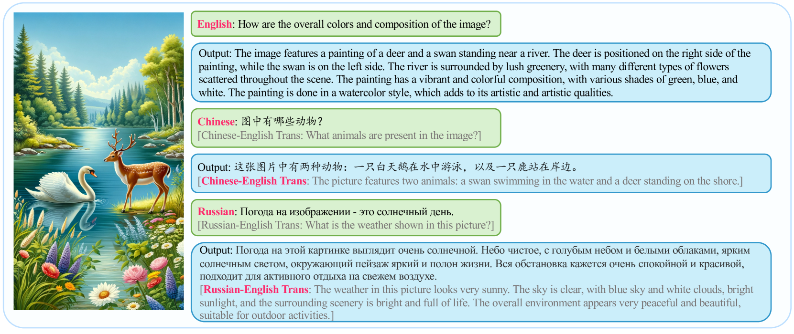

# 鹦鹉计划：多语言视觉指令调优

发布时间：2024年06月04日

`LLM应用

理由：这篇论文主要讨论了如何通过一种名为Parrot的新方法来解决大型语言模型（LLMs）在监督微调（SFT）过程中对非英语语言响应能力下降的问题。这种方法通过文本引导实现语言级别的视觉令牌对齐，并利用混合专家（MoE）机制来促进多语言令牌的对齐。此外，论文还介绍了创建的多语言能力评估基准MMMB，并承诺公开Parrot的源代码及训练数据集。这些内容主要关注于LLM的实际应用，特别是在多语言环境下的性能改进和评估，因此属于LLM应用分类。` `人工智能` `多语言处理`

> Parrot: Multilingual Visual Instruction Tuning

# 摘要

> GPT-4V等MLLMs的迅猛发展，标志着通用人工智能的一大步进。现有技术通过监督微调（SFT）使视觉编码器与大型语言模型（LLMs）对齐，赋予其多模态能力，但这一过程却逐渐削弱了MLLMs对多种语言的响应能力。我们发现，以英语为主的SFT数据集导致非英语语言性能大幅下降，原因在于SFT过程中未能实现视觉编码器与LLMs的多语言令牌对齐。为此，我们提出了一种名为Parrot的新方法，它通过文本引导实现语言级别的视觉令牌对齐，利用混合专家（MoE）机制促进多语言令牌的对齐。具体而言，Parrot通过计算初始视觉特征与文本嵌入的交叉注意力，选择最相关的专家，将视觉令牌转换为特定语言的视觉令牌。此外，鉴于当前缺乏评估多语言能力的基准，我们创建了包含6种语言、15个类别和12,000个问题的MMMB基准。Parrot不仅在多语言MMBench和MMMB上取得了顶尖成绩，还在众多多模态任务中表现卓越。我们承诺将公开Parrot的源代码及训练数据集。

> The rapid development of Multimodal Large Language Models (MLLMs) like GPT-4V has marked a significant step towards artificial general intelligence. Existing methods mainly focus on aligning vision encoders with LLMs through supervised fine-tuning (SFT) to endow LLMs with multimodal abilities, making MLLMs' inherent ability to react to multiple languages progressively deteriorate as the training process evolves. We empirically find that the imbalanced SFT datasets, primarily composed of English-centric image-text pairs, lead to significantly reduced performance in non-English languages. This is due to the failure of aligning the vision encoder and LLM with multilingual tokens during the SFT process. In this paper, we introduce Parrot, a novel method that utilizes textual guidance to drive visual token alignment at the language level. Parrot makes the visual tokens condition on diverse language inputs and uses Mixture-of-Experts (MoE) to promote the alignment of multilingual tokens. Specifically, to enhance non-English visual tokens alignment, we compute the cross-attention using the initial visual features and textual embeddings, the result of which is then fed into the MoE router to select the most relevant experts. The selected experts subsequently convert the initial visual tokens into language-specific visual tokens. Moreover, considering the current lack of benchmarks for evaluating multilingual capabilities within the field, we collect and make available a Massive Multilingual Multimodal Benchmark which includes 6 languages, 15 categories, and 12,000 questions, named as MMMB. Our method not only demonstrates state-of-the-art performance on multilingual MMBench and MMMB, but also excels across a broad range of multimodal tasks. Both the source code and the training dataset of Parrot will be made publicly available.

[Arxiv](https://arxiv.org/abs/2406.02539)