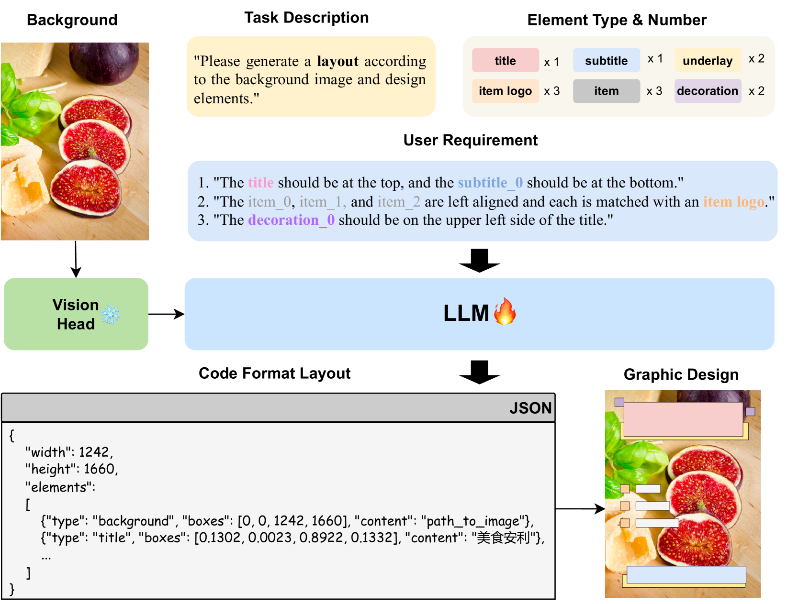
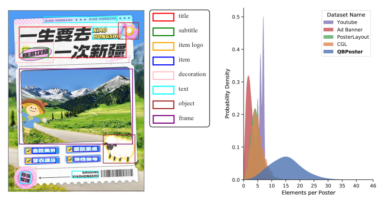

# PosterLLaVa：利用大型语言模型打造统一的多模态布局生成器

发布时间：2024年06月04日

`LLM应用

这篇论文介绍了一种基于多模态大型语言模型（MLLM）的统一框架，用于自动化图形设计中的布局生成。该框架通过使用结构化文本和视觉指令调优，能够在特定的视觉和文本约束下生成布局，包括用户自定义的自然语言规范。论文还提到了实验结果在公共多模态布局生成基准上达到了顶尖水平，并推出了两个新数据集来进一步验证模型的实际应用价值。这些内容表明该论文主要关注于LLM在实际应用中的使用，特别是在图形设计领域的应用，因此属于LLM应用分类。` `图形设计` `自动化设计`

> PosterLLaVa: Constructing a Unified Multi-modal Layout Generator with LLM

# 摘要

> 布局生成是自动化图形设计的核心，它要求以美观且符合约束的方式安排多模态设计元素的位置和大小。传统方法或效率低下，或缺乏应对多样化需求的灵活性。我们的研究提出了一种基于多模态大型语言模型（MLLM）的统一框架，旨在灵活应对各种设计任务。通过使用结构化文本（JSON格式）和视觉指令调优，我们的数据驱动方法能在特定视觉和文本约束下，包括用户自定义的自然语言规范，生成布局。实验结果在公共多模态布局生成基准上达到了顶尖水平，验证了我们方法的效力。鉴于现有数据集难以全面反映真实世界设计的复杂性，我们推出了两个新数据集，专注于更具挑战性的任务（如用户约束生成和复杂海报设计），进一步证明了我们模型在实际应用中的价值。此方法以其高度的可访问性和适应性，极大地推动了大规模图形设计任务的自动化进程。相关代码和数据集将在https://github.com/posterllava/PosterLLaVA公开发布。

> Layout generation is the keystone in achieving automated graphic design, requiring arranging the position and size of various multi-modal design elements in a visually pleasing and constraint-following manner. Previous approaches are either inefficient for large-scale applications or lack flexibility for varying design requirements. Our research introduces a unified framework for automated graphic layout generation, leveraging the multi-modal large language model (MLLM) to accommodate diverse design tasks. In contrast, our data-driven method employs structured text (JSON format) and visual instruction tuning to generate layouts under specific visual and textual constraints, including user-defined natural language specifications. We conducted extensive experiments and achieved state-of-the-art (SOTA) performance on public multi-modal layout generation benchmarks, demonstrating the effectiveness of our method. Moreover, recognizing existing datasets' limitations in capturing the complexity of real-world graphic designs, we propose two new datasets for much more challenging tasks (user-constrained generation and complicated poster), further validating our model's utility in real-life settings. Marking by its superior accessibility and adaptability, this approach further automates large-scale graphic design tasks. The code and datasets will be publicly available on https://github.com/posterllava/PosterLLaVA.

[Arxiv](https://arxiv.org/abs/2406.02884)