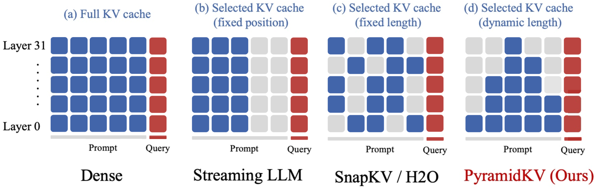
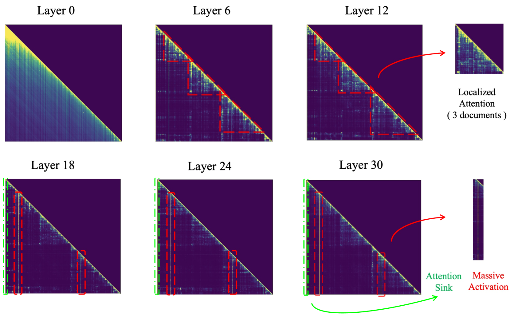
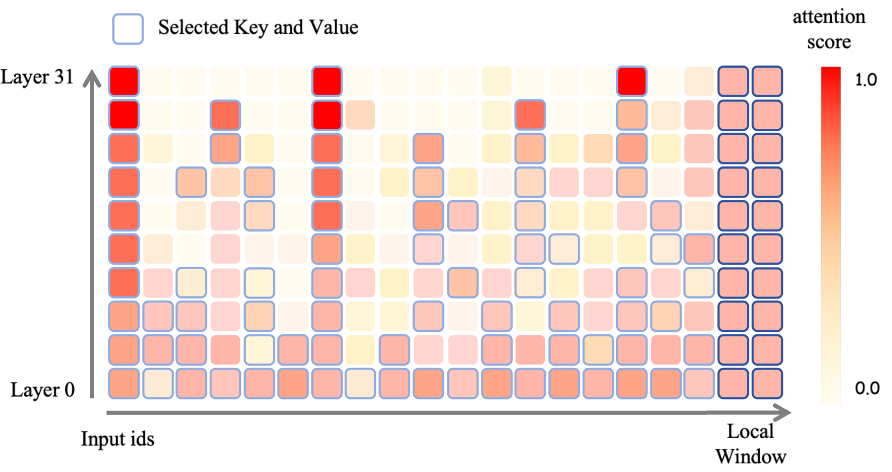
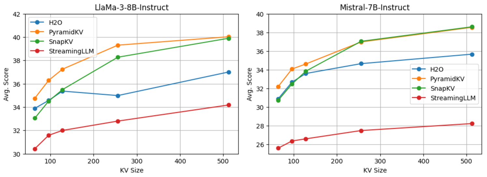
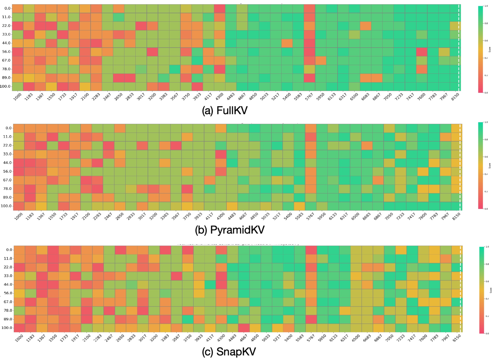

# PyramidKV：利用金字塔信息汇聚实现动态KV缓存的高效压缩

发布时间：2024年06月04日

`LLM理论

这篇论文主要探讨了大型语言模型（LLMs）内部的信息处理机制，特别是基于注意力的信息流如何通过金字塔信息汇聚机制进行长上下文处理的信息聚合。此外，论文还提出了一种新的KV缓存压缩方法——PyramidKV，并展示了其在内存效率和性能上的优势。这些内容主要涉及LLM的理论研究和内部机制的优化，因此归类为LLM理论。` `内存优化`

> PyramidKV: Dynamic KV Cache Compression based on Pyramidal Information Funneling

# 摘要

> 本研究探讨了大型语言模型（LLMs）内部基于注意力的信息流是否通过显著模式进行长上下文处理的信息聚合。研究发现，LLMs通过金字塔信息汇聚机制聚合信息，注意力在低层广泛分散，逐渐在特定上下文中聚焦，最终在高层集中于关键令牌。基于此，我们开发了PyramidKV，一种创新的KV缓存压缩方法，它动态调整缓存大小，低层多、高层少，与传统统一大小的方法不同。实验结果显示，PyramidKV在保持12%缓存的情况下，性能与全缓存模型相当，大幅节省内存。在内存效率优先的场景中，即使只保留0.7%的缓存，PyramidKV仍超越其他技术，在TREC测试中精度提升高达20.5。

> In this study, we investigate whether attention-based information flow inside large language models (LLMs) is aggregated through noticeable patterns for long context processing. Our observations reveal that LLMs aggregate information through Pyramidal Information Funneling where attention is scattering widely in lower layers, progressively consolidating within specific contexts, and ultimately focusin on critical tokens (a.k.a massive activation or attention sink) in higher layers. Motivated by these insights, we developed PyramidKV, a novel and effective KV cache compression method. This approach dynamically adjusts the KV cache size across different layers, allocating more cache in lower layers and less in higher ones, diverging from traditional methods that maintain a uniform KV cache size. Our experimental evaluations, utilizing the LongBench benchmark, show that PyramidKV matches the performance of models with a full KV cache while retaining only 12% of the KV cache, thus significantly reducing memory usage. In scenarios emphasizing memory efficiency, where only 0.7% of the KV cache is maintained, PyramidKV surpasses other KV cache compression techniques achieving up to a 20.5 absolute accuracy improvement on TREC.

[Arxiv](https://arxiv.org/abs/2406.02069)