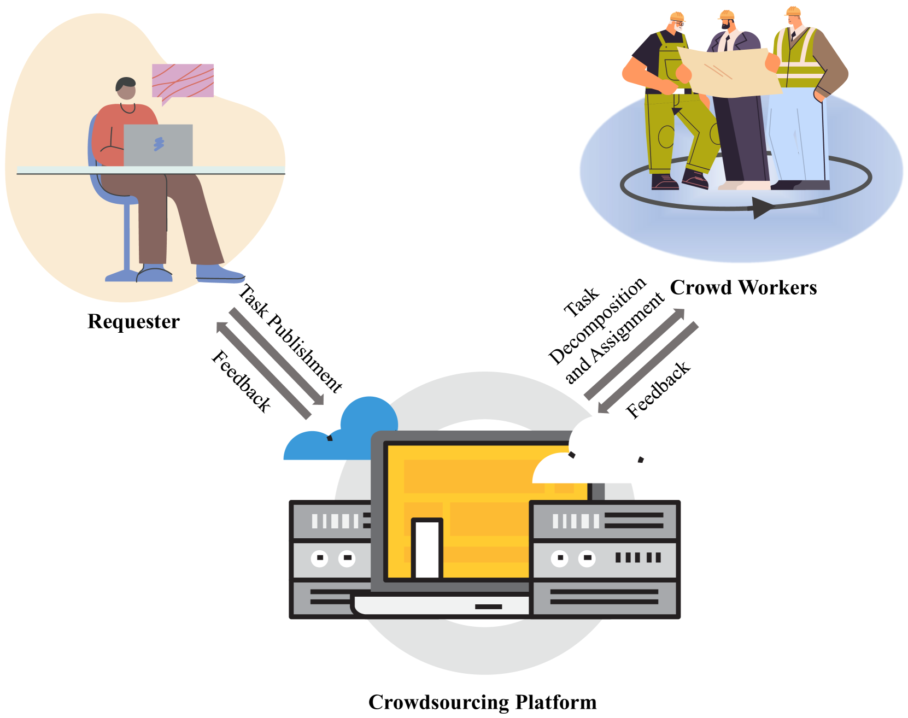
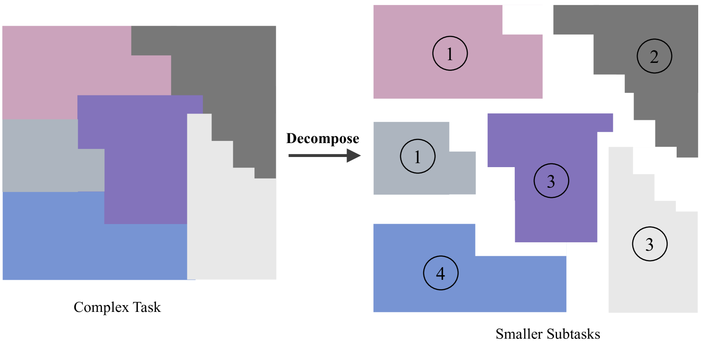
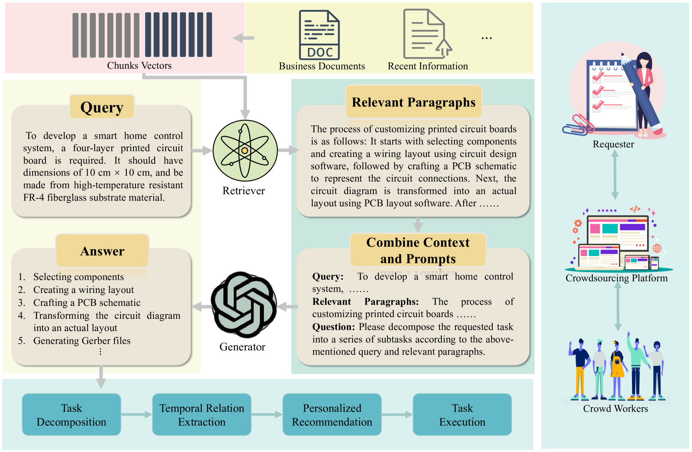
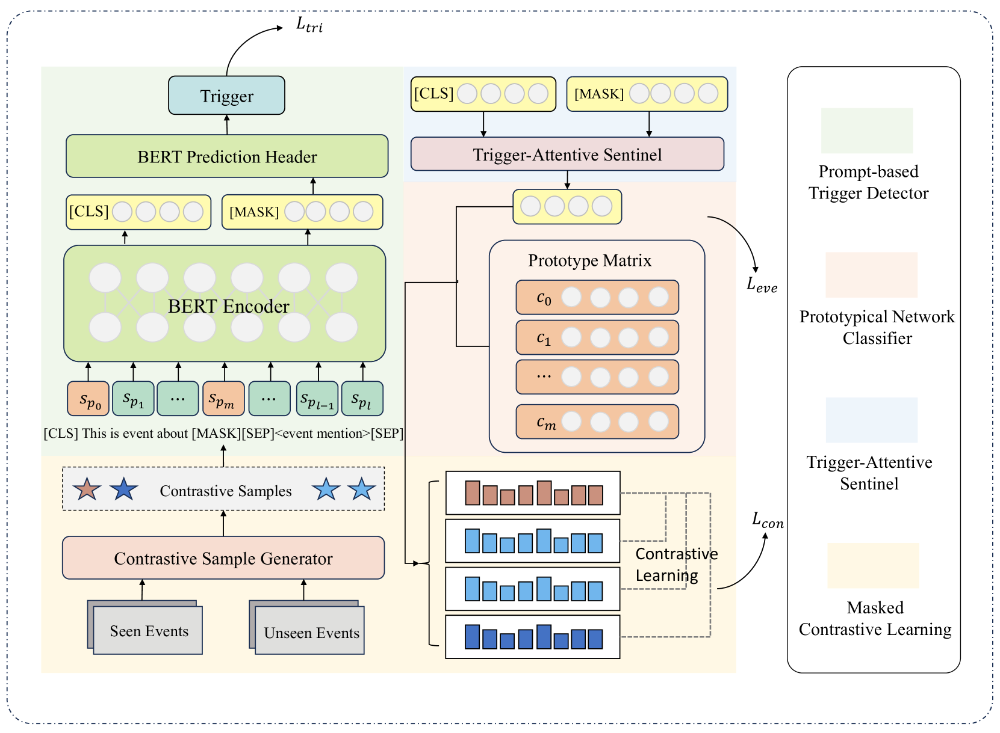
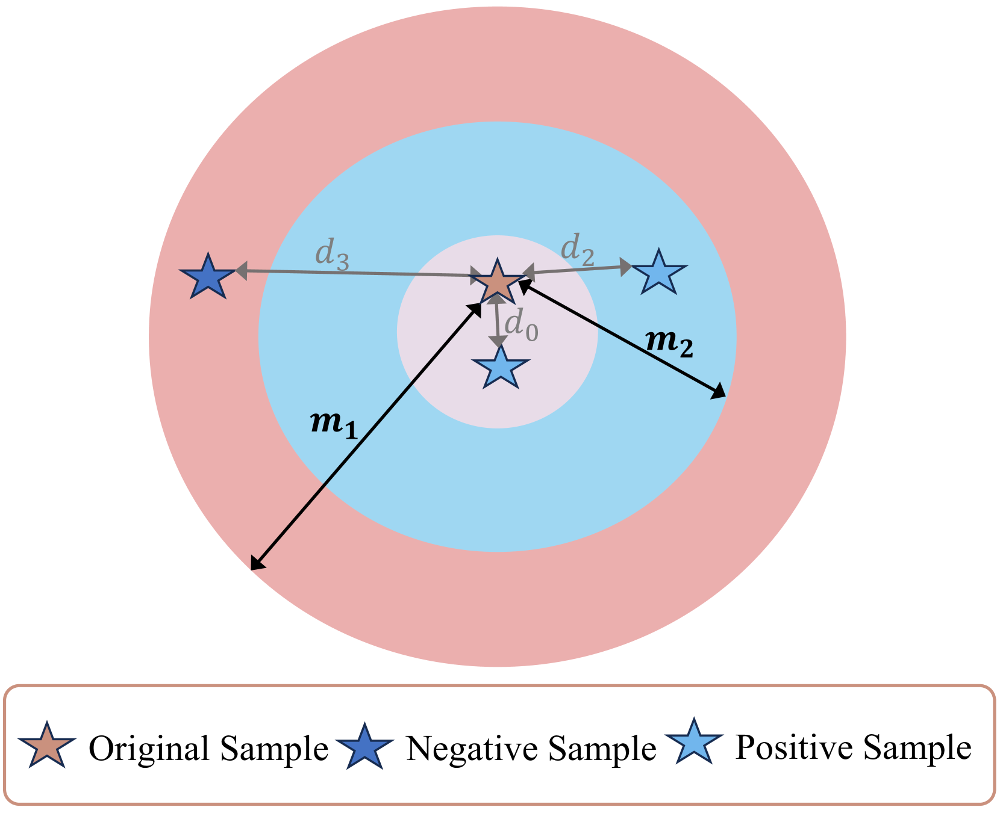
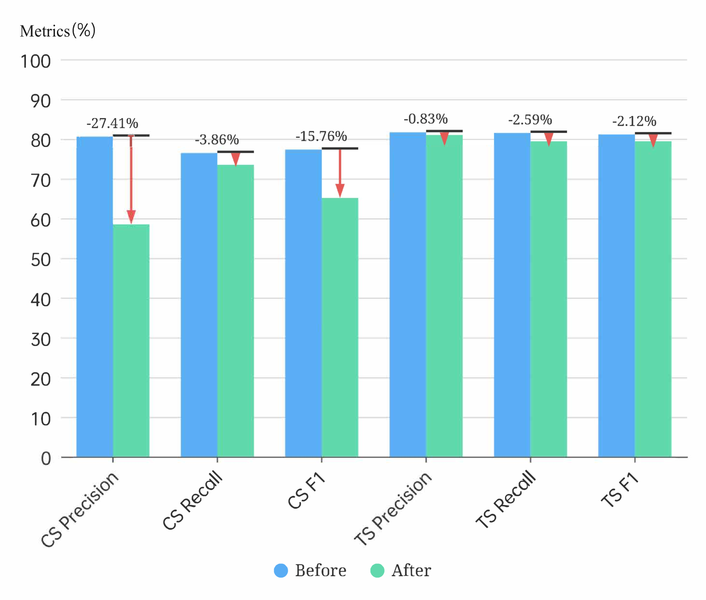

# 利用RAG模型，结合掩码对比学习与提示技术，实现众包任务的高效分解在

发布时间：2024年06月04日

`RAG

理由：这篇论文介绍了一种基于检索增强生成的众包框架，用于任务分解（TD）和分配，这在社会制造中是关键的。论文中提到的“基于提示的对比学习框架（PBCT）”和“触发器注意力哨兵和掩码对比学习”等技术，都是为了改进事件检测的准确性和适应性。这些技术与检索增强生成（RAG）的概念相符，即通过结合检索和生成技术来提高模型的性能和适应性。因此，这篇论文更适合归类于RAG。` `制造业`

> RAG-based Crowdsourcing Task Decomposition via Masked Contrastive Learning with Prompts

# 摘要

> 众包技术在社会制造中扮演着关键角色，它通过调动庞大的人力资源来应对多样化的复杂任务。任务分解（TD）和分配是确保这些任务成功执行的关键，其中任务分解是基础。近期，基于预训练语言模型（PLMs）的方法备受瞩目，但受限于知识更新困难和幻觉问题，它们主要适用于处理简单的常识任务。为此，我们开发了一种基于检索增强生成的众包框架，将TD视为自然语言理解中的事件检测。然而，现有方法难以区分事件类型，且过度依赖启发式规则和外部工具。因此，我们提出了基于提示的对比学习框架（PBCT），通过集成提示驱动的触发器检测器来减少依赖。同时，引入触发器注意力哨兵和掩码对比学习，根据事件类型动态调整对触发器和上下文特征的关注。实验证明，我们的方法在监督和零样本检测中均表现出色。通过印刷电路板制造的案例研究，验证了其在未知专业领域的适应性。

> Crowdsourcing is a critical technology in social manufacturing, which leverages an extensive and boundless reservoir of human resources to handle a wide array of complex tasks. The successful execution of these complex tasks relies on task decomposition (TD) and allocation, with the former being a prerequisite for the latter. Recently, pre-trained language models (PLMs)-based methods have garnered significant attention. However, they are constrained to handling straightforward common-sense tasks due to their inherent restrictions involving limited and difficult-to-update knowledge as well as the presence of hallucinations. To address these issues, we propose a retrieval-augmented generation-based crowdsourcing framework that reimagines TD as event detection from the perspective of natural language understanding. However, the existing detection methods fail to distinguish differences between event types and always depend on heuristic rules and external semantic analyzing tools. Therefore, we present a Prompt-Based Contrastive learning framework for TD (PBCT), which incorporates a prompt-based trigger detector to overcome dependence. Additionally, trigger-attentive sentinel and masked contrastive learning are introduced to provide varying attention to trigger and contextual features according to different event types. Experiment results demonstrate the competitiveness of our method in both supervised and zero-shot detection. A case study on printed circuit board manufacturing is showcased to validate its adaptability to unknown professional domains.

[Arxiv](https://arxiv.org/abs/2406.06577)