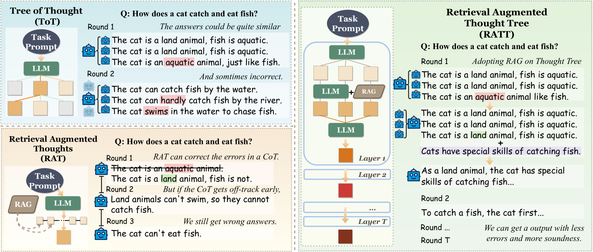
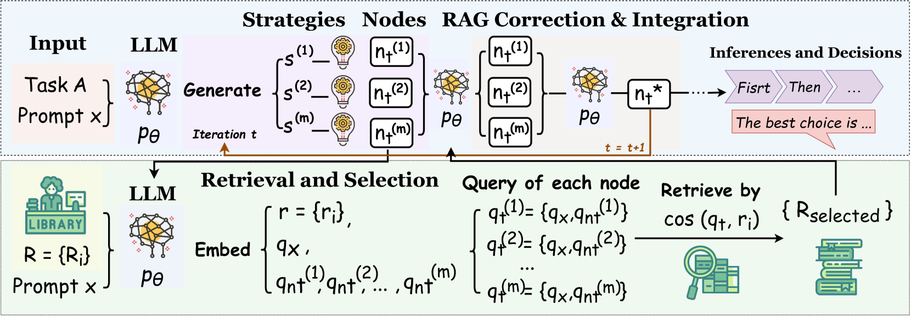
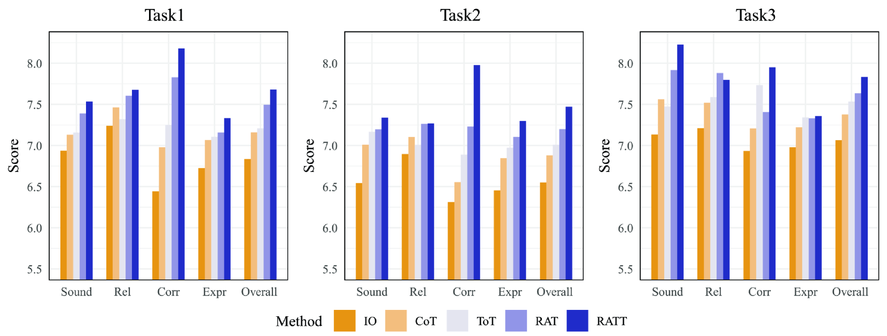
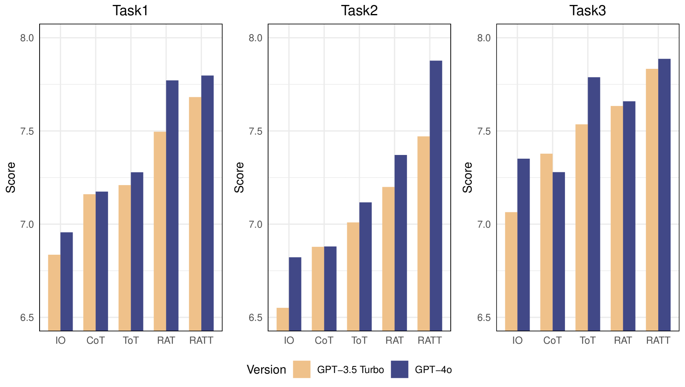
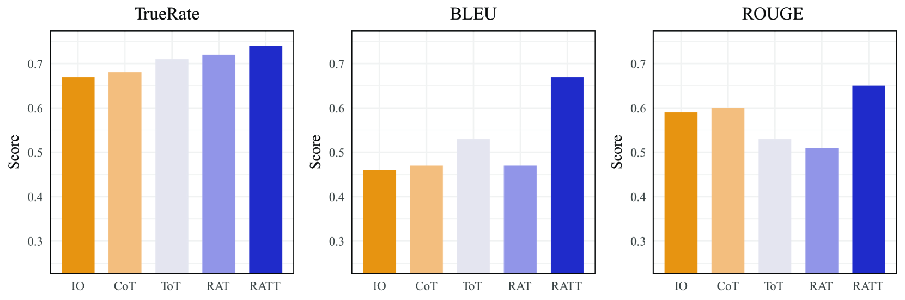

# RATT：构建大型语言模型连贯且正确推理的思维框架

发布时间：2024年06月04日

`RAG

理由：该论文摘要主要介绍了检索增强思维树（RATT）这一创新思维结构，它通过结合检索增强生成（RAG）的事实核查与LLM的策略评估能力，优化了思维树结构，提升了模型在逻辑推理中的连贯性和决策效率。因此，该论文更符合RAG分类，因为它聚焦于RAG技术的应用和改进，以增强大型语言模型在推理和决策方面的能力。` `人工智能` `逻辑推理`

> RATT: AThought Structure for Coherent and Correct LLMReasoning

# 摘要

> 大型语言模型（LLMs）通过思维结构大幅提升了推理与决策能力。然而，诸如思维树和检索增强思维等现有方法，在处理复杂任务时，因事实知识检索不足和策略选择不全面而显得力不从心。这使得它们难以在事实准确性与逻辑全面优化之间找到平衡点。为此，我们推出了检索增强思维树（RATT），这一创新思维结构在思考的每一步都兼顾逻辑的完整性与事实的准确性。在思维分支的每个节点，RATT通过规划与预见，评估多种推理路径，并结合检索增强生成（RAG）的事实核查与LLM的策略评估能力。通过融合事实知识与策略可行性，RATT优化思维树结构，以在广阔的搜索空间中探寻最佳路径。这一结构极大地提升了模型在逻辑推理中的连贯性和决策效率，从而拓展了LLM基于思维结构生成可靠推理与决策的能力边界。广泛的任务实验证明，RATT在事实正确性与逻辑连贯性上均显著超越了现有方法。

> Large Language Models (LLMs) gain substantial reasoning and decision-making capabilities from thought structures. However, existing methods such as Tree of Thought and Retrieval Augmented Thoughts often fall short in complex tasks due to the limitations of insufficient local retrieval of factual knowledge and inadequate global selection of strategies. These limitations make it challenging for these methods to balance factual accuracy and comprehensive logical optimization effectively. To address these limitations, we introduce the Retrieval Augmented Thought Tree (RATT), a novel thought structure that considers both overall logical soundness and factual correctness at each step of the thinking process. Specifically, at every point of a thought branch, RATT performs planning and lookahead to explore and evaluate multiple potential reasoning steps, and integrate the fact-checking ability of Retrieval-Augmented Generation (RAG) with LLM's ability to assess overall strategy. Through this combination of factual knowledge and strategic feasibility, the RATT adjusts and integrates the thought tree structure to search for the most promising branches within the search space. This thought structure significantly enhances the model's coherence in logical inference and efficiency in decision-making, and thus increases the limit of the capacity of LLM to generate reliable inferences and decisions based on thought structures. A broad range of experiments on different types of tasks showcases that the RATT structure significantly outperforms existing methods in factual correctness and logical coherence.

[Arxiv](https://arxiv.org/abs/2406.02746)