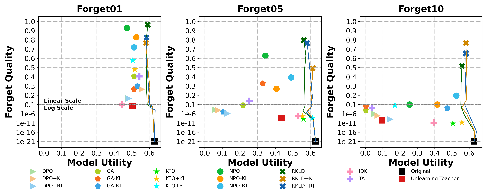

# RKLD：利用反向KL散度进行知识蒸馏，助力大语言模型遗忘个人敏感信息

发布时间：2024年06月04日

`LLM应用

这篇论文摘要讨论了大型语言模型（LLM）中的模型遗忘问题，特别是在处理个人数据时的挑战。它提出了一种新的算法（RKLD），用于从大型语言模型中移除个人信息，同时保持模型的有效性。这个研究直接应用于LLM的实际问题，即如何在保护个人隐私的同时维持模型的性能，因此属于LLM应用分类。` `数据隐私` `人工智能`

> RKLD: Reverse KL-Divergence-based Knowledge Distillation for Unlearning Personal Information in Large Language Models

# 摘要

> 随着遗忘权法规的实施和语言模型训练数据集的扩展，大型语言模型中的模型遗忘研究变得尤为重要。过去，机器遗忘研究主要集中在参数较小的模型分类任务上，这些任务中遗忘与保留的内容明确直接。但随着模型参数的增加，任务复杂度提升，特别是在处理个人数据而非简单分类结果时，如何平衡遗忘质量与模型效用成为一大挑战。现有的基于梯度上升的方法往往难以妥善处理这一平衡，导致不必要的信息损失或遗忘不完全。为此，我们开发了RKLD算法，一种基于反向KL散度的知识蒸馏遗忘技术，专门用于从大型语言模型中移除个人信息。实验证明，RKLD不仅显著提高了遗忘质量，还保持了模型的有效性。

> With the passage of the Right to Be Forgotten (RTBF) regulations and the scaling up of language model training datasets, research on model unlearning in large language models (LLMs) has become more crucial. Before the era of LLMs, machine unlearning research focused mainly on classification tasks in models with small parameters. In these tasks, the content to be forgotten or retained is clear and straightforward. However, as parameter sizes have grown and tasks have become more complex, balancing forget quality and model utility has become more challenging, especially in scenarios involving personal data instead of classification results. Existing methods based on gradient ascent and its variants often struggle with this balance, leading to unintended information loss or partial forgetting. To address this challenge, we propose RKLD, a novel \textbf{R}everse \textbf{KL}-Divergence-based Knowledge \textbf{D}istillation unlearning algorithm for LLMs targeting the unlearning of personal information. Through RKLD, we achieve significant forget quality and effectively maintain the model utility in our experiments.

[Arxiv](https://arxiv.org/abs/2406.01983)