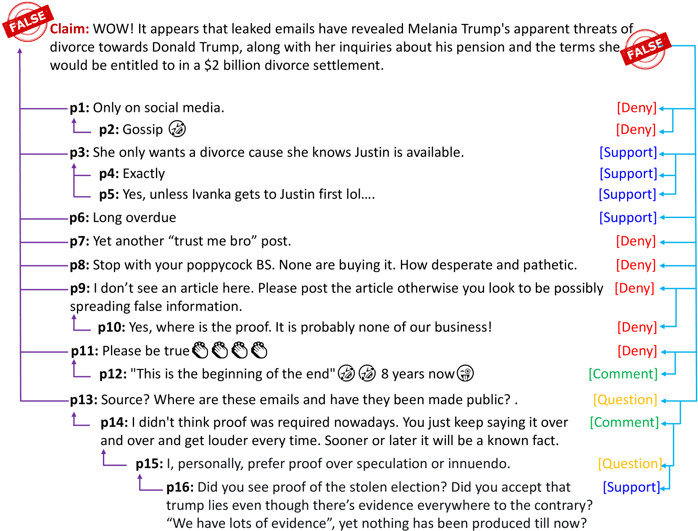
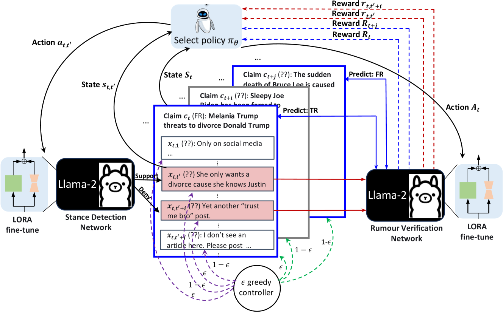
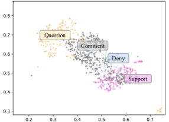
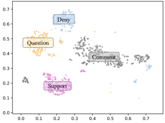
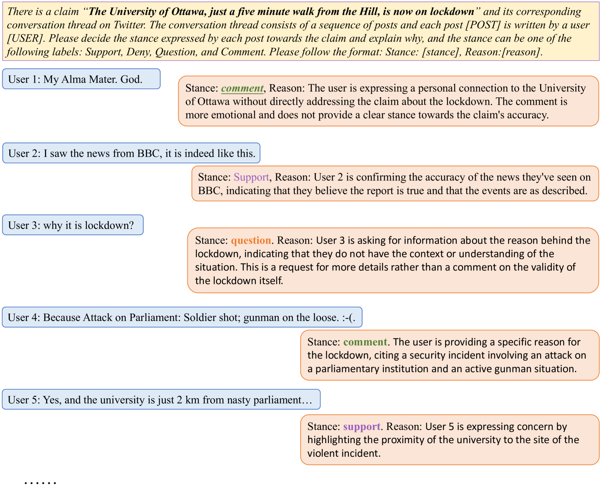
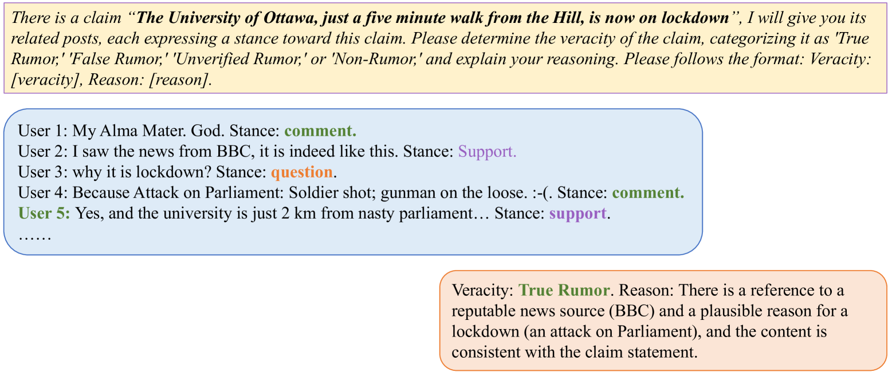
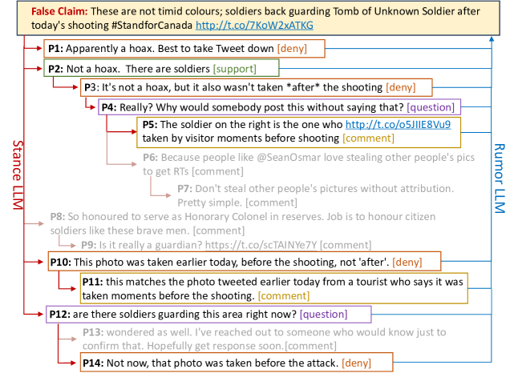
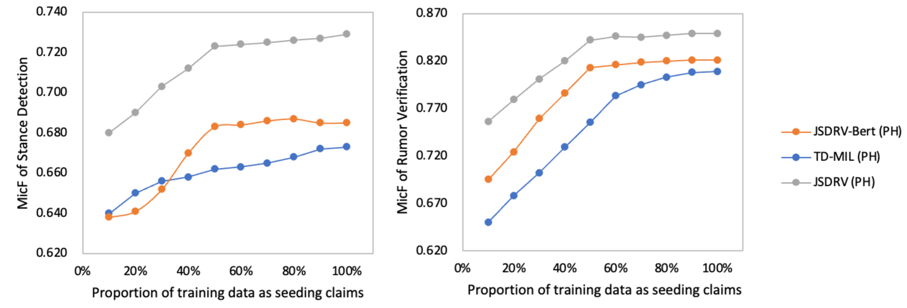
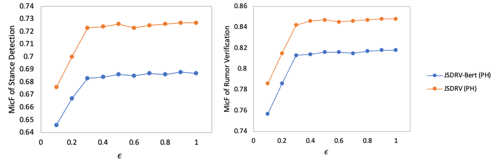

# 大型语言模型中的强化调整：同时检测立场与揭穿谣言

发布时间：2024年06月04日

`Agent

理由：这篇论文介绍了一个基于大型语言模型（LLMs）的系统JSDRV，该系统被设计用于联合检测立场和验证谣言的多任务学习。这个系统通过创新的强化调整框架和混合奖励机制来优化LLM的微调效果，从而提升其在特定任务上的性能。这种系统可以被视为一个智能Agent，因为它能够执行特定的任务（立场检测和谣言验证），并且通过强化学习机制进行自我优化。因此，这篇论文更适合归类为Agent，而不是RAG、LLM应用或LLM理论。` `社交媒体` `谣言检测`

> Reinforcement Tuning for Detecting Stances and Debunking Rumors Jointly with Large Language Models

# 摘要

> 在联合检测立场和验证谣言的多任务学习中，由于缺乏帖子级别的立场数据和声明级别的谣言真实性数据，这一挑战尤为突出。为此，我们开发了基于大型语言模型（LLMs）的JSDRV系统，作为这两个任务的基础标注工具。通过创新的强化调整框架，我们提升了LLM在SD和RV任务中的联合预测能力。具体而言，我们设计了一种策略，利用混合奖励机制精选高质量标签，以优化LLM在两项任务上的微调效果。实验结果显示，JSDRV不仅超越了现有技术，还展现了良好的泛化能力，适用于非LLM作为任务模型的场景。

> Learning multi-task models for jointly detecting stance and verifying rumors poses challenges due to the need for training data of stance at post level and rumor veracity at claim level, which are difficult to obtain. To address this issue, we leverage large language models (LLMs) as the foundation annotators for the joint stance detection (SD) and rumor verification (RV) tasks, dubbed as JSDRV. We introduce a novel reinforcement tuning framework to enhance the joint predictive capabilities of LLM-based SD and RV components. Specifically, we devise a policy for selecting LLM-annotated data at the two levels, employing a hybrid reward mechanism to choose high-quality labels for effective LLM fine-tuning on both tasks. Results demonstrate that JSDRV improves the capabilities of LLMs in the joint tasks, not only outperforming state-of-the-art methods but also generalizing to non-LLMs accommodated as task models.

[Arxiv](https://arxiv.org/abs/2406.02143)