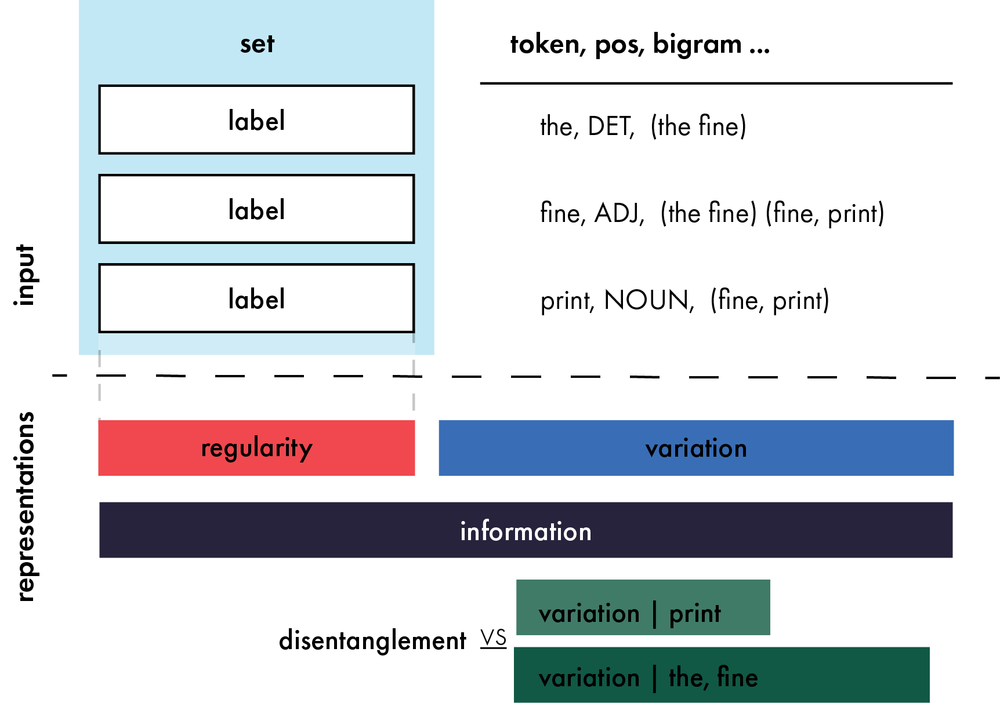
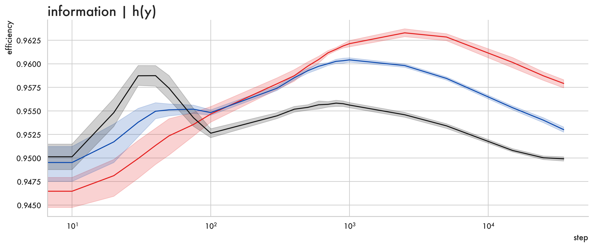
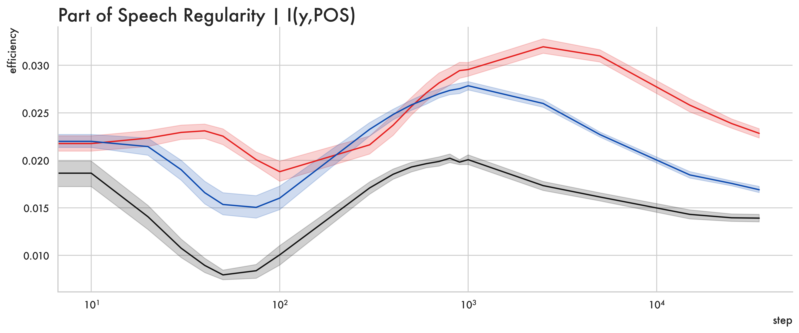
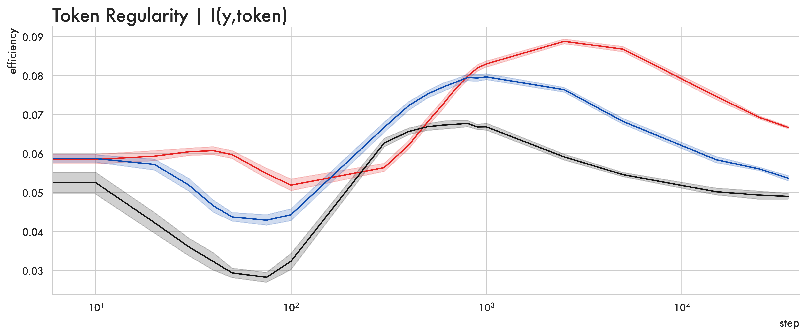
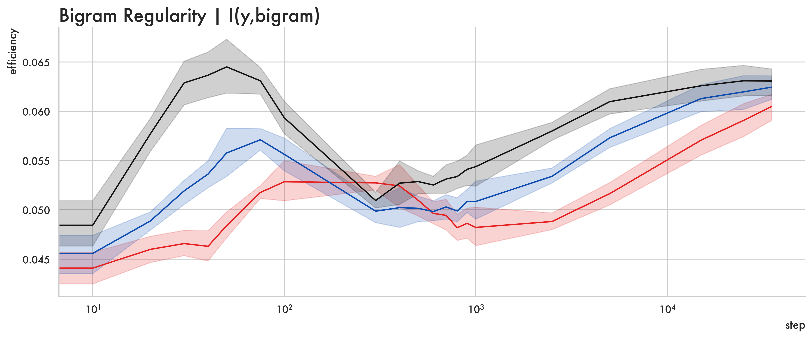
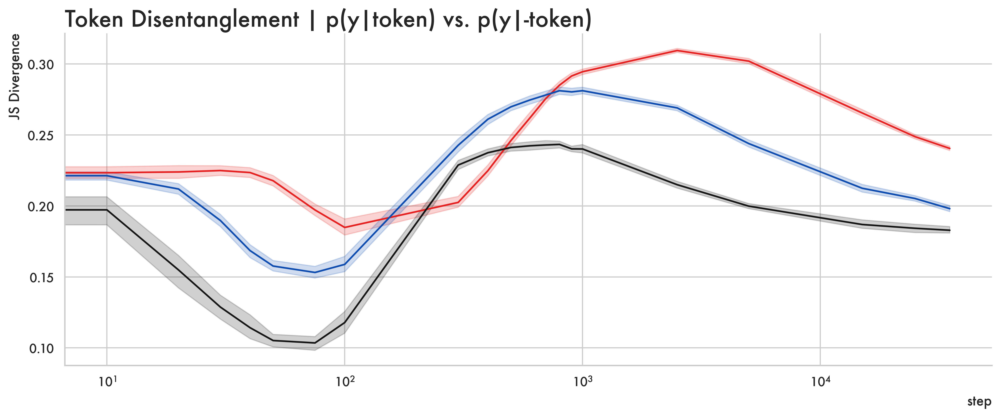
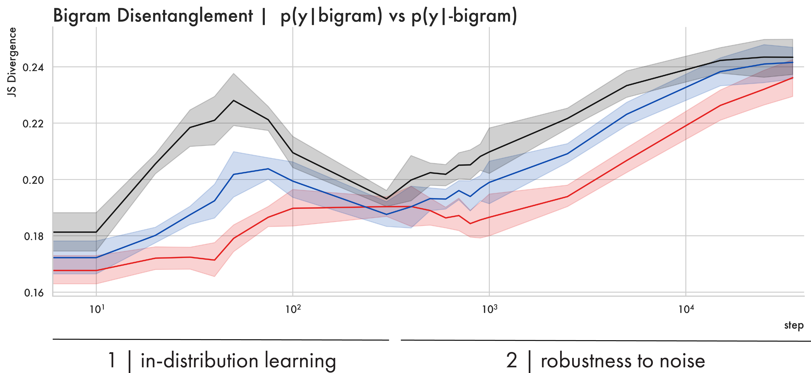
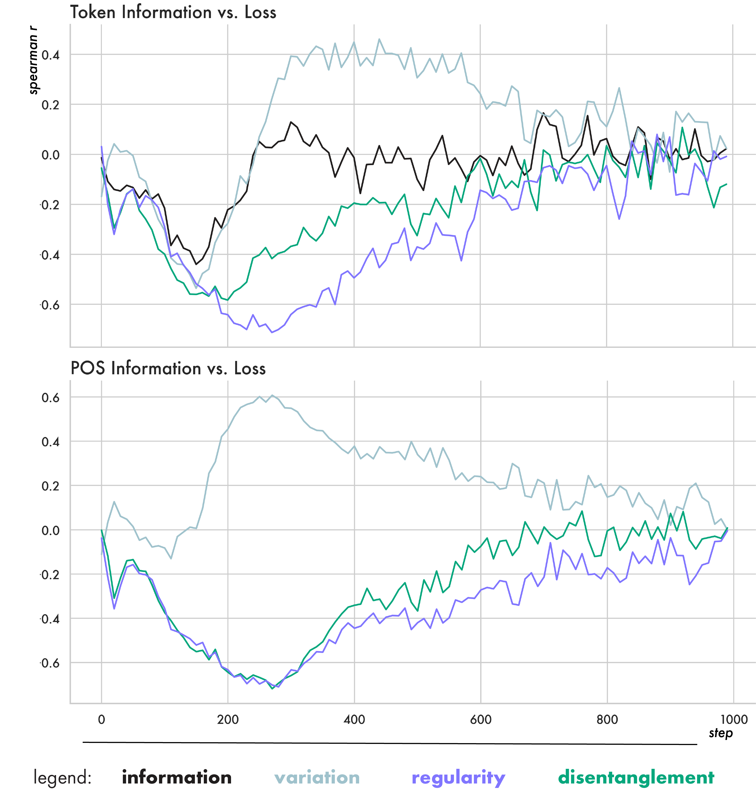

# 语言化表示：基于信息理论的解释性框架

发布时间：2024年06月04日

`LLM理论

这篇论文主要探讨了大型语言模型（LLM）的学习过程和表示的可解释性，提出了一种基于信息理论的度量标准来分析模型表示的结构化程度及其形成时机。这些研究内容属于对LLM理论层面的深入分析，因此应归类于LLM理论。` `机器学习`

> Representations as Language: An Information-Theoretic Framework for Interpretability

# 摘要

> 大规模神经模型在众多语言任务中表现卓越，但它们大多仍是难以解读的黑盒子，生成的输入向量表示晦涩难懂。这阻碍了我们理解其学习内容和时机，以及哪些表示能在分布外良好泛化的能力。为此，我们提出了一种创新的可解释性方法，将模型从句子到表示的学习过程视为一种独特的语言。我们引入了一套基于信息理论的度量标准，用以衡量模型表示的结构化程度及其在训练中的形成时机。这些度量不仅计算迅速，而且扎根于语言学理论，能够预测哪些模型的表示将泛化得最好。通过这些度量，我们揭示了变压器训练的两个阶段：首先是减少任务损失的分布内学习阶段，随后是表示对噪声变得鲁棒的阶段。泛化性能在这一阶段开始提升，暗示了泛化与对噪声的鲁棒性之间的关联。最后，我们分析了模型大小对表示空间结构的影响，发现较大的模型最终比小型模型更能压缩其表示。

> Large scale neural models show impressive performance across a wide array of linguistic tasks. Despite this they remain, largely, black-boxes - inducing vector-representations of their input that prove difficult to interpret. This limits our ability to understand what they learn, and when the learn it, or describe what kinds of representations generalise well out of distribution. To address this we introduce a novel approach to interpretability that looks at the mapping a model learns from sentences to representations as a kind of language in its own right. In doing so we introduce a set of information-theoretic measures that quantify how structured a model's representations are with respect to its input, and when during training that structure arises. Our measures are fast to compute, grounded in linguistic theory, and can predict which models will generalise best based on their representations. We use these measures to describe two distinct phases of training a transformer: an initial phase of in-distribution learning which reduces task loss, then a second stage where representations becoming robust to noise. Generalisation performance begins to increase during this second phase, drawing a link between generalisation and robustness to noise. Finally we look at how model size affects the structure of the representational space, showing that larger models ultimately compress their representations more than their smaller counterparts.

[Arxiv](https://arxiv.org/abs/2406.02449)