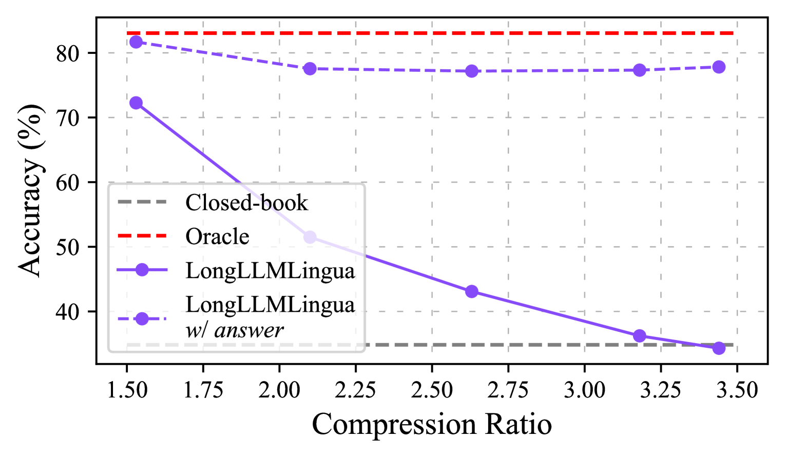
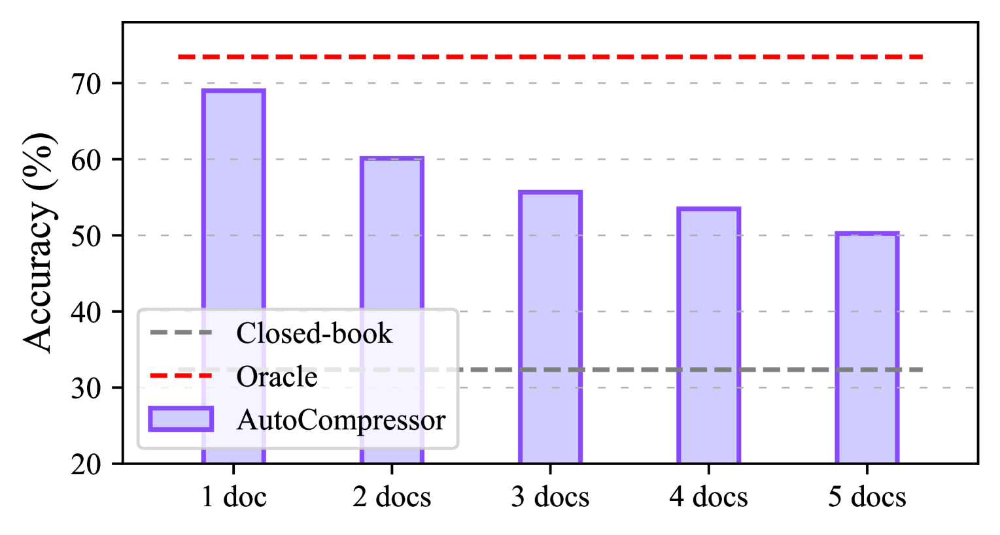
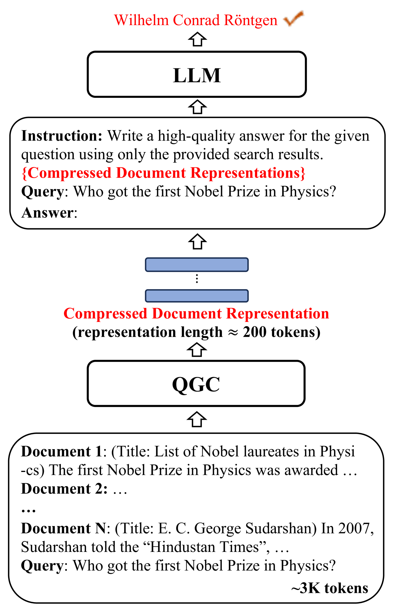
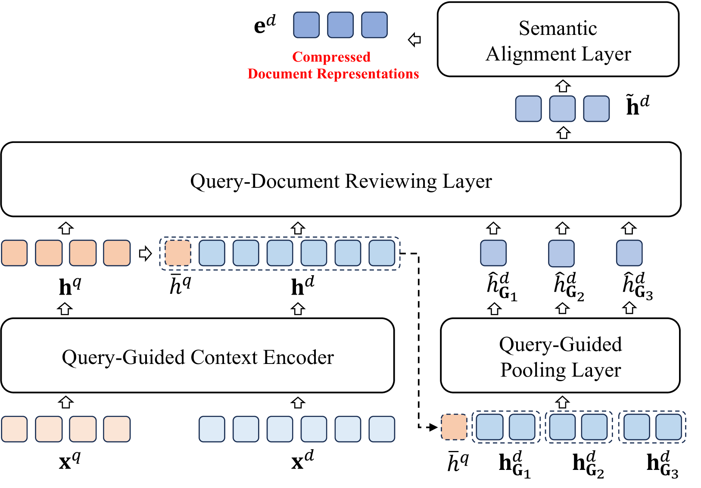
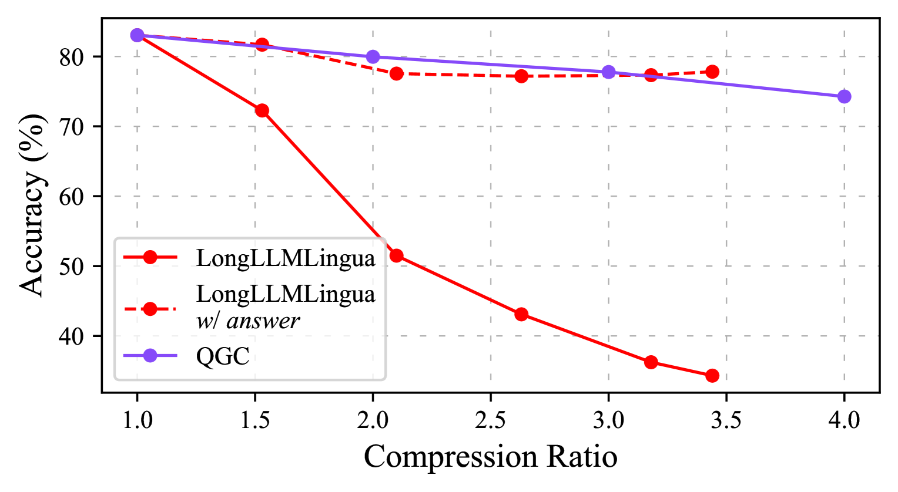
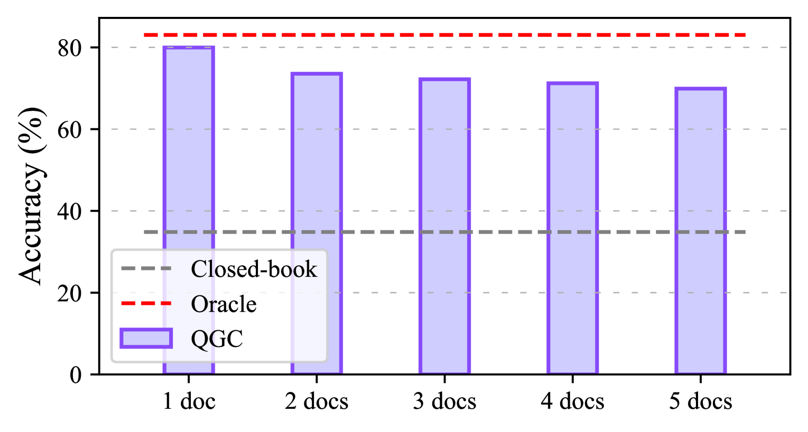
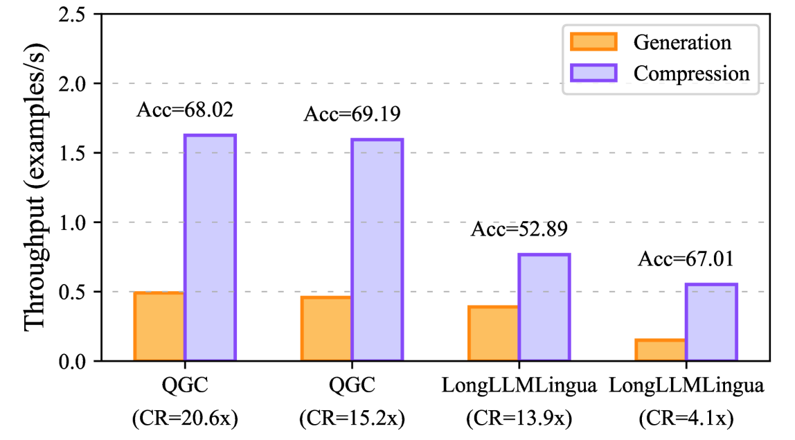
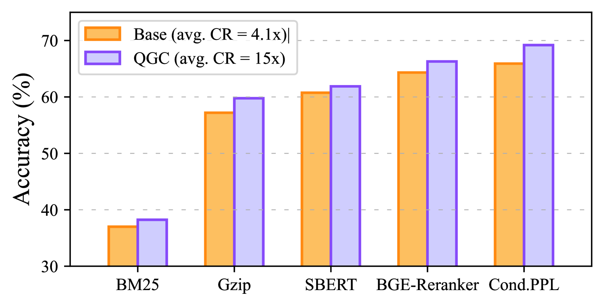

# 在极高压缩比下，如何确保关键信息不丢失？针对大型语言模型，我们提出了一种查询引导的压缩方法，旨在精简数据的同时，保持信息的完整性。

发布时间：2024年06月04日

`LLM应用

理由：这篇论文主要讨论了大型语言模型（LLMs）中的上下文压缩技术，并提出了一种新的方法——查询引导压缩器（QGC），以优化压缩过程并保留关键信息。这种技术直接应用于LLM的实际操作中，以提高性能和效率，特别是在问答任务上的应用。因此，它属于LLM应用类别，因为它关注的是LLM在实际任务中的应用和改进。` `问答系统`

> Retaining Key Information under High Compression Ratios: Query-Guided Compressor for LLMs

# 摘要

> 随着大型语言模型（LLMs）的普及，上下文压缩技术备受关注。然而，以往的方法在压缩比提高时性能大幅下滑，有时甚至退化至闭卷水平，这主要是因为压缩过程中丢失了关键信息。我们的初步研究证实了这一点，强调了在高压缩比下保留关键信息对维持模型性能的重要性。为此，我们开发了查询引导压缩器（QGC），通过查询来优化上下文压缩，确保关键信息在压缩后依然保留。我们还采用了动态压缩策略。在问答任务上，包括NaturalQuestions、TriviaQA和HotpotQA数据集，QGC的性能得到了验证。实验显示，即使在极高的压缩比下，QGC也能保持优异表现，同时大幅降低了推理成本和提高了吞吐量。

> The growing popularity of Large Language Models has sparked interest in context compression for Large Language Models (LLMs). However, the performance of previous methods degrades dramatically as compression ratios increase, sometimes even falling to the closed-book level. This decline can be attributed to the loss of key information during the compression process. Our preliminary study supports this hypothesis, emphasizing the significance of retaining key information to maintain model performance under high compression ratios. As a result, we introduce Query-Guided Compressor (QGC), which leverages queries to guide the context compression process, effectively preserving key information within the compressed context. Additionally, we employ a dynamic compression strategy. We validate the effectiveness of our proposed QGC on the Question Answering task, including NaturalQuestions, TriviaQA, and HotpotQA datasets. Experimental results show that QGC can consistently perform well even at high compression ratios, which also offers significant benefits in terms of inference cost and throughput.

[Arxiv](https://arxiv.org/abs/2406.02376)