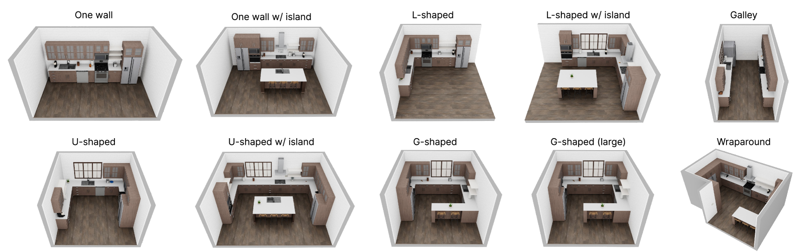
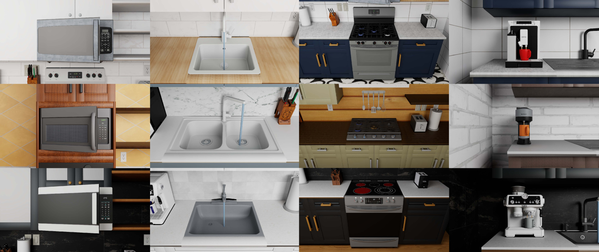
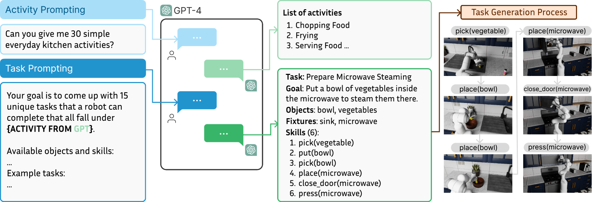
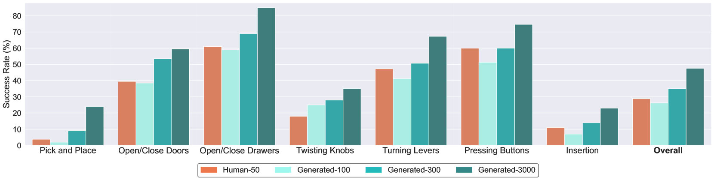
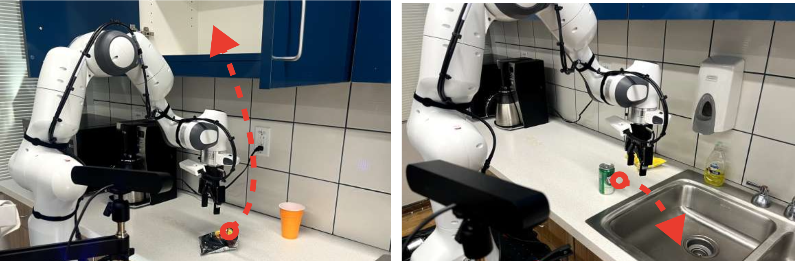

# RoboCasa：通用机器人日常任务的大规模模拟研究

发布时间：2024年06月04日

`Agent

这篇论文主要讨论了如何通过大规模的物理模拟来扩展机器人学习的环境、任务和数据集，特别强调了在日常环境中的应用，如厨房场景。论文中提到的RoboCasa框架和相关的技术发展，旨在通过模拟和生成AI工具来增强机器人的学习能力，这属于构建和优化AI代理（Agent）的范畴。因此，将其分类为Agent是合适的。` `机器人技术` `人工智能`

> RoboCasa: Large-Scale Simulation of Everyday Tasks for Generalist Robots

# 摘要

> AI的最新进展主要得益于规模化。然而，在机器人领域，由于缺乏大规模数据集，规模化进程受阻。我们建议利用现实物理模拟来扩展机器人学习的环境、任务和数据集。我们开发的RoboCasa是一个专为日常环境中的通用机器人训练设计的大规模模拟框架，特别强调厨房场景的真实性和多样性。我们提供了数千个跨150多个类别的3D对象资产和数十种可交互家具及电器。通过生成AI工具，如文本到3D模型的对象生成和文本到图像的环境纹理，我们增强了模拟的真实性和多样性。为了系统评估，我们设计了100个任务，包括由大型语言模型指导生成的复合任务。为了促进学习，我们提供了高质量的人类演示，并引入了自动化轨迹生成技术，以最小化人力投入大幅扩增数据集。实验表明，使用合成数据进行大规模模仿学习展现出明显的规模化优势，并在实际任务中利用模拟数据方面显示出巨大潜力。相关视频和开源代码已发布于https://robocasa.ai/。

> Recent advancements in Artificial Intelligence (AI) have largely been propelled by scaling. In Robotics, scaling is hindered by the lack of access to massive robot datasets. We advocate using realistic physical simulation as a means to scale environments, tasks, and datasets for robot learning methods. We present RoboCasa, a large-scale simulation framework for training generalist robots in everyday environments. RoboCasa features realistic and diverse scenes focusing on kitchen environments. We provide thousands of 3D assets across over 150 object categories and dozens of interactable furniture and appliances. We enrich the realism and diversity of our simulation with generative AI tools, such as object assets from text-to-3D models and environment textures from text-to-image models. We design a set of 100 tasks for systematic evaluation, including composite tasks generated by the guidance of large language models. To facilitate learning, we provide high-quality human demonstrations and integrate automated trajectory generation methods to substantially enlarge our datasets with minimal human burden. Our experiments show a clear scaling trend in using synthetically generated robot data for large-scale imitation learning and show great promise in harnessing simulation data in real-world tasks. Videos and open-source code are available at https://robocasa.ai/

[Arxiv](https://arxiv.org/abs/2406.02523)