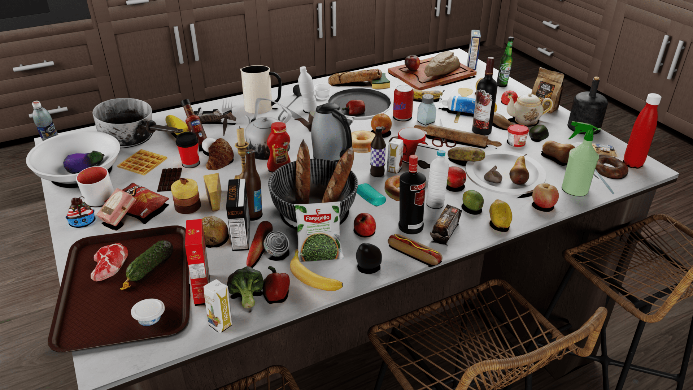

# RoboCasa：通用机器人日常任务的大规模模拟研究

发布时间：2024年06月04日

`Agent

理由：这篇论文主要讨论了如何通过创新的模拟框架（RoboCasa）来扩展机器人学习的环境、任务和数据，以及如何利用大型语言模型引导生成的复合任务来加速机器人的学习过程。这些内容主要关注的是如何构建和训练能够执行特定任务的机器人（即Agent），而不是专注于语言模型的理论研究或应用，也不是关于检索增强生成（RAG）的具体研究。因此，将其归类为Agent是最合适的。` `机器人` `人工智能`

> RoboCasa: Large-Scale Simulation of Everyday Tasks for Generalist Robots

# 摘要

> 人工智能的飞速发展得益于规模化，但在机器人领域，这一进程受限于缺乏大规模数据集。我们主张利用真实物理模拟来扩展机器人学习的环境、任务和数据。RoboCasa，我们的创新模拟框架，专为在日常环境中训练通用机器人而设计，特别聚焦于厨房场景，提供数千种3D资产，涵盖150多个对象类别及众多可交互家具和电器。通过生成AI工具，如文本转3D模型和文本转图像，我们增强了模拟的真实性与多样性。我们精心设计了100项任务进行系统评估，包括由大型语言模型引导生成的复合任务。为加速学习，我们提供高质量的人类演示，并采用自动化轨迹生成技术，大幅扩展数据集，同时减轻人力负担。实验表明，合成数据在大规模模仿学习中展现出明显的规模效应，预示着模拟数据在实际任务中的巨大应用潜力。更多详情及开源代码，请访问https://robocasa.ai/。

> Recent advancements in Artificial Intelligence (AI) have largely been propelled by scaling. In Robotics, scaling is hindered by the lack of access to massive robot datasets. We advocate using realistic physical simulation as a means to scale environments, tasks, and datasets for robot learning methods. We present RoboCasa, a large-scale simulation framework for training generalist robots in everyday environments. RoboCasa features realistic and diverse scenes focusing on kitchen environments. We provide thousands of 3D assets across over 150 object categories and dozens of interactable furniture and appliances. We enrich the realism and diversity of our simulation with generative AI tools, such as object assets from text-to-3D models and environment textures from text-to-image models. We design a set of 100 tasks for systematic evaluation, including composite tasks generated by the guidance of large language models. To facilitate learning, we provide high-quality human demonstrations and integrate automated trajectory generation methods to substantially enlarge our datasets with minimal human burden. Our experiments show a clear scaling trend in using synthetically generated robot data for large-scale imitation learning and show great promise in harnessing simulation data in real-world tasks. Videos and open-source code are available at https://robocasa.ai/

[Arxiv](https://arxiv.org/abs/2406.02523)