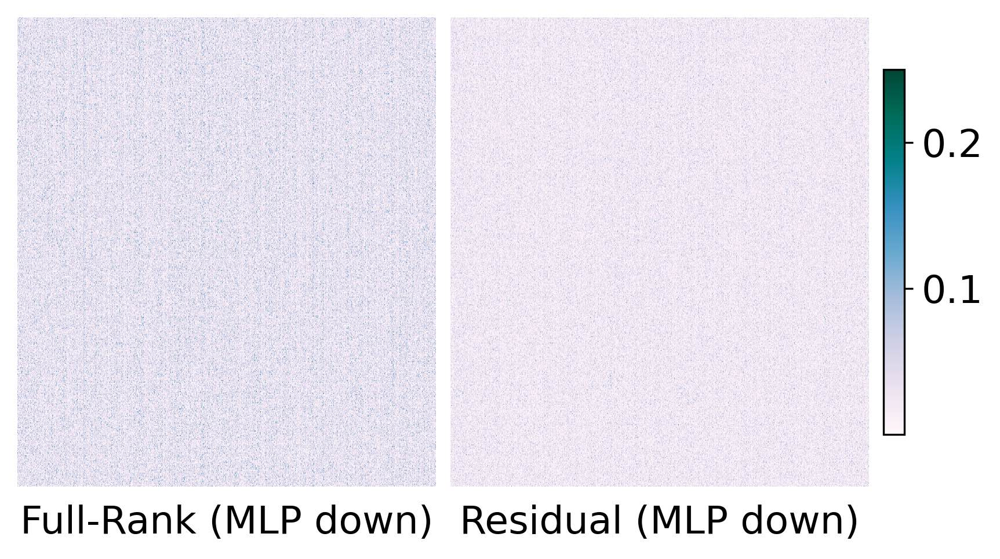
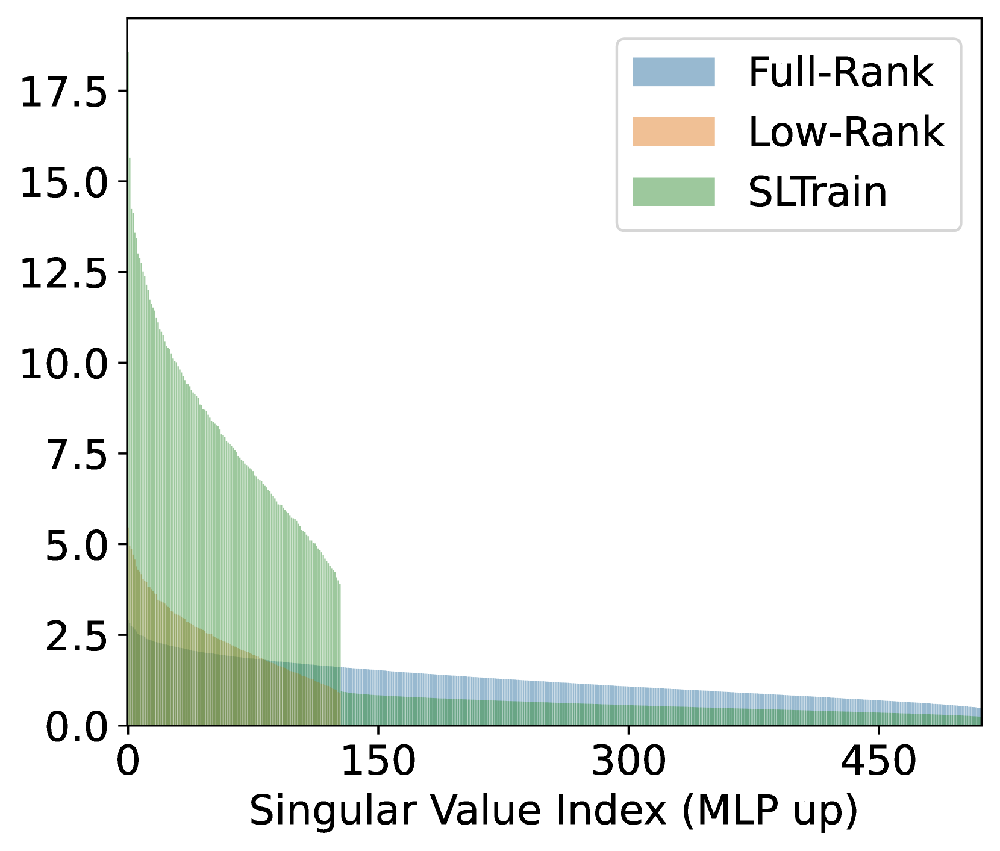
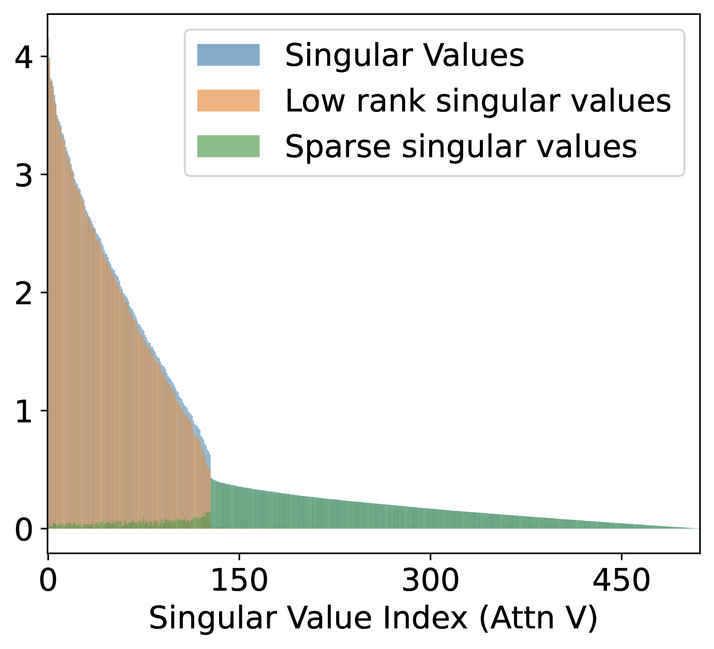

# SLTrain：采用稀疏加低秩策略，实现高效预训练，兼顾参数与内存优化

发布时间：2024年06月04日

`LLM理论

这篇论文主要探讨了大型语言模型（LLMs）的预训练方法，提出了一种名为SLTrain的新方法，通过将权重分解为低秩与稀疏矩阵的和来进行预训练。这种方法旨在提高预训练效果的同时减少计算和内存需求。因此，它属于LLM理论的范畴，因为它关注的是LLM的内部机制和优化方法，而不是具体的应用或代理行为。` `机器学习`

> SLTrain: a sparse plus low-rank approach for parameter and memory efficient pretraining

# 摘要

> 大型语言模型（LLMs）在多任务中表现出色，但训练它们需要巨大的计算力和内存。近期研究通过低秩适应或分解，探索了在权重上应用低秩结构以实现高效微调。尽管微调效果显著，低秩结构在预训练中并不理想，因其限制了参数的维度。本研究提出了一种名为SLTrain的新方法，通过将权重分解为低秩与稀疏矩阵的和来进行预训练。低秩部分通过矩阵分解学习，稀疏部分则采用随机选择固定支持的简单策略，仅学习非零项。这种简单的策略与低秩学习结合，显著提升了预训练效果。实验表明，SLTrain在几乎不增加额外成本的情况下，性能大幅提升，与全秩训练相媲美。特别地，结合量化和逐层更新，SLTrain在预训练LLaMA 7B模型时，内存需求可降低高达73%。

> Large language models (LLMs) have shown impressive capabilities across various tasks. However, training LLMs from scratch requires significant computational power and extensive memory capacity. Recent studies have explored low-rank structures on weights for efficient fine-tuning in terms of parameters and memory, either through low-rank adaptation or factorization. While effective for fine-tuning, low-rank structures are generally less suitable for pretraining because they restrict parameters to a low-dimensional subspace. In this work, we propose to parameterize the weights as a sum of low-rank and sparse matrices for pretraining, which we call SLTrain. The low-rank component is learned via matrix factorization, while for the sparse component, we employ a simple strategy of uniformly selecting the sparsity support at random and learning only the non-zero entries with the fixed support. While being simple, the random fixed-support sparse learning strategy significantly enhances pretraining when combined with low-rank learning. Our results show that SLTrain adds minimal extra parameters and memory costs compared to pretraining with low-rank parameterization, yet achieves substantially better performance, which is comparable to full-rank training. Remarkably, when combined with quantization and per-layer updates, SLTrain can reduce memory requirements by up to 73% when pretraining the LLaMA 7B model.

[Arxiv](https://arxiv.org/abs/2406.02214)