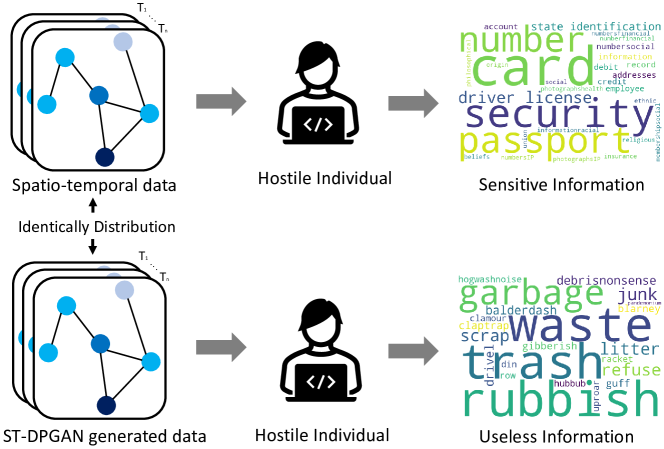
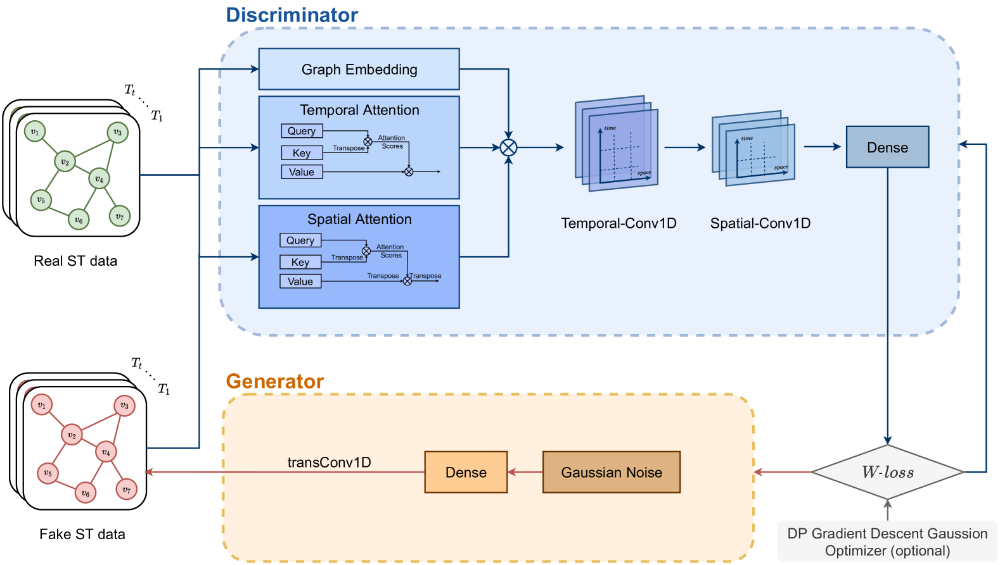

# ST-DPGAN：时空数据生成的隐私保护框架

发布时间：2024年06月04日

`Agent

理由：这篇论文主要关注的是在保护隐私的前提下处理时空数据的问题，提出了一种基于图-GAN的模型来生成隐私保护的时空数据。虽然涉及到了大规模语言模型（LLM），但其核心贡献在于开发了一个能够处理时空数据并保护隐私的模型，这更符合Agent类别的定义，即开发和应用特定技术来解决实际问题，而不是专注于LLM的理论研究或应用。此外，该模型可以被视为一个智能Agent，因为它能够自主地处理数据并执行任务（生成隐私保护的时空数据）。` `隐私保护` `时空数据分析`

> ST-DPGAN: A Privacy-preserving Framework for Spatiotemporal Data Generation

# 摘要

> 时空数据在众多边缘设备中普遍存在，例如个人通信和金融交易设备。近期，结合时空分析与大规模语言模型的技术进步，引起了广泛关注。然而，时空数据往往携带有敏感信息，不宜公开给第三方。为此，我们提出了一种基于图-GAN的模型，旨在生成隐私保护的时空数据。该模型在判别器中融合了时空注意力机制，生成器则采用了时空反卷积技术，有效提升了在加入高斯噪声条件下的训练效率，实现了差分隐私保护。通过在三个真实时空数据集上的大量实验，我们验证了该模型的有效性。此方法不仅确保了数据的隐私安全，还保持了数据的有效性，使得基于我们生成数据训练的预测模型，其性能与使用原始数据训练的模型不相上下。

> Spatiotemporal data is prevalent in a wide range of edge devices, such as those used in personal communication and financial transactions. Recent advancements have sparked a growing interest in integrating spatiotemporal analysis with large-scale language models. However, spatiotemporal data often contains sensitive information, making it unsuitable for open third-party access. To address this challenge, we propose a Graph-GAN-based model for generating privacy-protected spatiotemporal data. Our approach incorporates spatial and temporal attention blocks in the discriminator and a spatiotemporal deconvolution structure in the generator. These enhancements enable efficient training under Gaussian noise to achieve differential privacy. Extensive experiments conducted on three real-world spatiotemporal datasets validate the efficacy of our model. Our method provides a privacy guarantee while maintaining the data utility. The prediction model trained on our generated data maintains a competitive performance compared to the model trained on the original data.

[Arxiv](https://arxiv.org/abs/2406.03404)