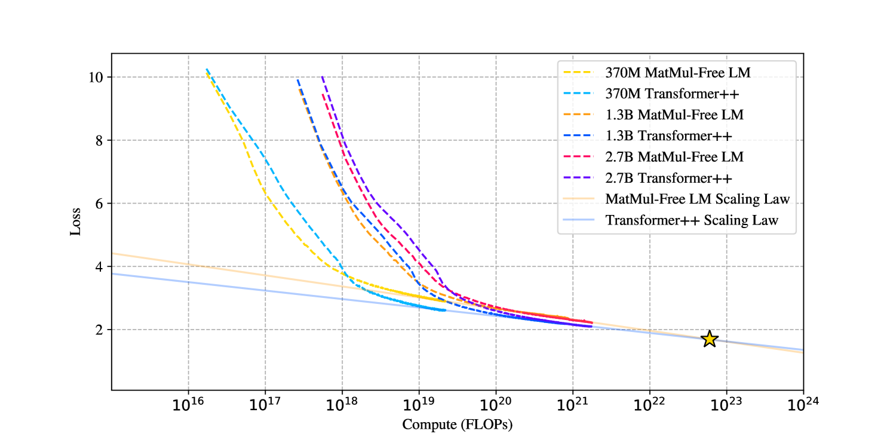

# 无需矩阵乘法的可扩展语言建模

发布时间：2024年06月04日

`LLM理论

这篇论文主要探讨了大型语言模型（LLMs）中的矩阵乘法（MatMul）操作的计算成本问题，并提出了一种新的架构，可以在不牺牲性能的情况下减少甚至移除MatMul操作。这种研究涉及到LLMs的理论优化和计算效率的提升，因此属于LLM理论分类。论文中提到的实验、性能评估以及对未来加速器设计的指导意义，都是理论研究的一部分，而非直接的应用或Agent行为。` `人工智能` `高性能计算`

> Scalable MatMul-free Language Modeling

# 摘要

> 矩阵乘法（MatMul）在大型语言模型（LLMs）的计算成本中占据主导地位，且随着模型规模的扩大，这一成本不断攀升。然而，我们的研究表明，在数十亿参数级别上，可以完全移除MatMul操作，同时保持与最先进的Transformer模型相当的性能，后者在推理时需要更多的内存。我们的实验揭示，随着模型尺寸的增长，无MatMul模型与全精度Transformer之间的性能差距逐渐缩小。此外，我们提供了一个高效的GPU实现，训练时内存使用量可减少高达61%，并通过优化推理内核，内存消耗可降低超过10倍。为了评估我们架构的效率，我们在FPGA上开发了定制硬件，利用了GPU无法实现的轻量级操作，实现了在13瓦功耗下处理数十亿参数模型的能力，超越了人类可读的吞吐量，使LLMs更接近类脑效率。这项研究不仅展示了LLMs在保持高效性能的同时可以精简到何种程度，还为未来加速器在处理下一代轻量级LLMs时应优化的操作类型提供了方向。我们的代码实现已公开在\url{https://github.com/ridgerchu/matmulfreellm}。

> Matrix multiplication (MatMul) typically dominates the overall computational cost of large language models (LLMs). This cost only grows as LLMs scale to larger embedding dimensions and context lengths. In this work, we show that MatMul operations can be completely eliminated from LLMs while maintaining strong performance at billion-parameter scales. Our experiments show that our proposed MatMul-free models achieve performance on-par with state-of-the-art Transformers that require far more memory during inference at a scale up to at least 2.7B parameters. We investigate the scaling laws and find that the performance gap between our MatMul-free models and full precision Transformers narrows as the model size increases. We also provide a GPU-efficient implementation of this model which reduces memory usage by up to 61% over an unoptimized baseline during training. By utilizing an optimized kernel during inference, our model's memory consumption can be reduced by more than 10x compared to unoptimized models. To properly quantify the efficiency of our architecture, we build a custom hardware solution on an FPGA which exploits lightweight operations beyond what GPUs are capable of. We processed billion-parameter scale models at 13W beyond human readable throughput, moving LLMs closer to brain-like efficiency. This work not only shows how far LLMs can be stripped back while still performing effectively, but also points at the types of operations future accelerators should be optimized for in processing the next generation of lightweight LLMs. Our code implementation is available at \url{https://github.com/ridgerchu/matmulfreellm}.

[Arxiv](https://arxiv.org/abs/2406.02528)